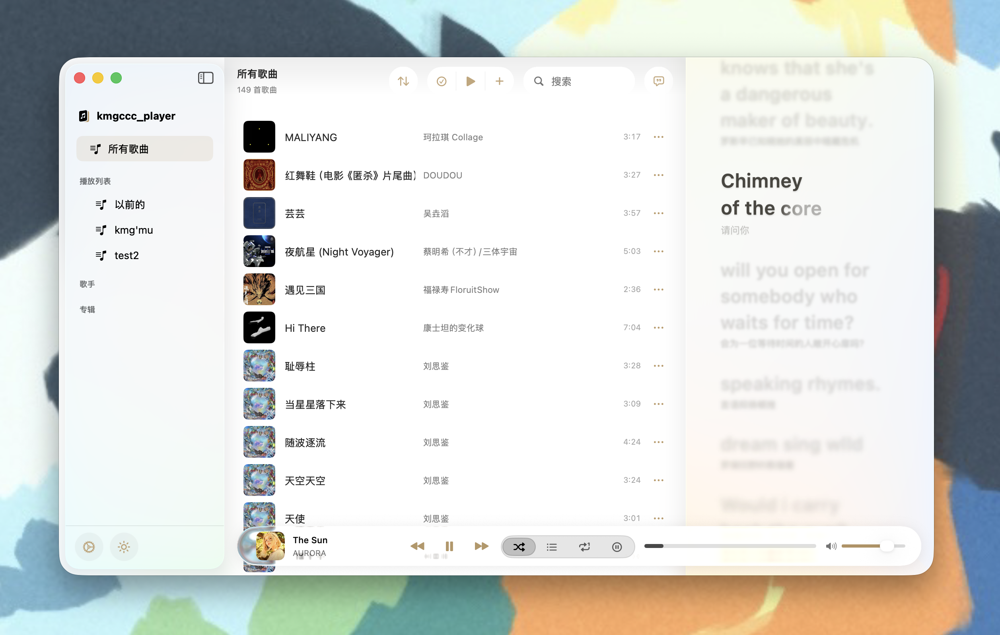
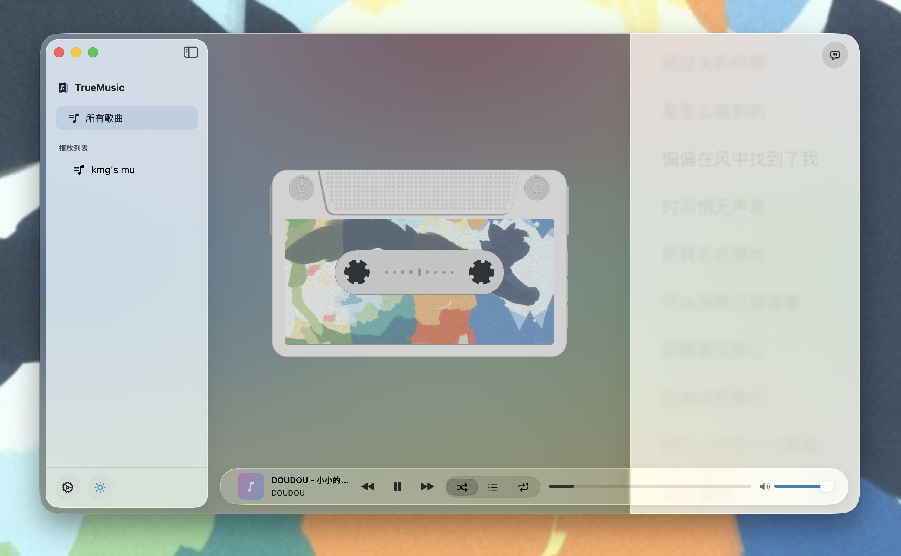
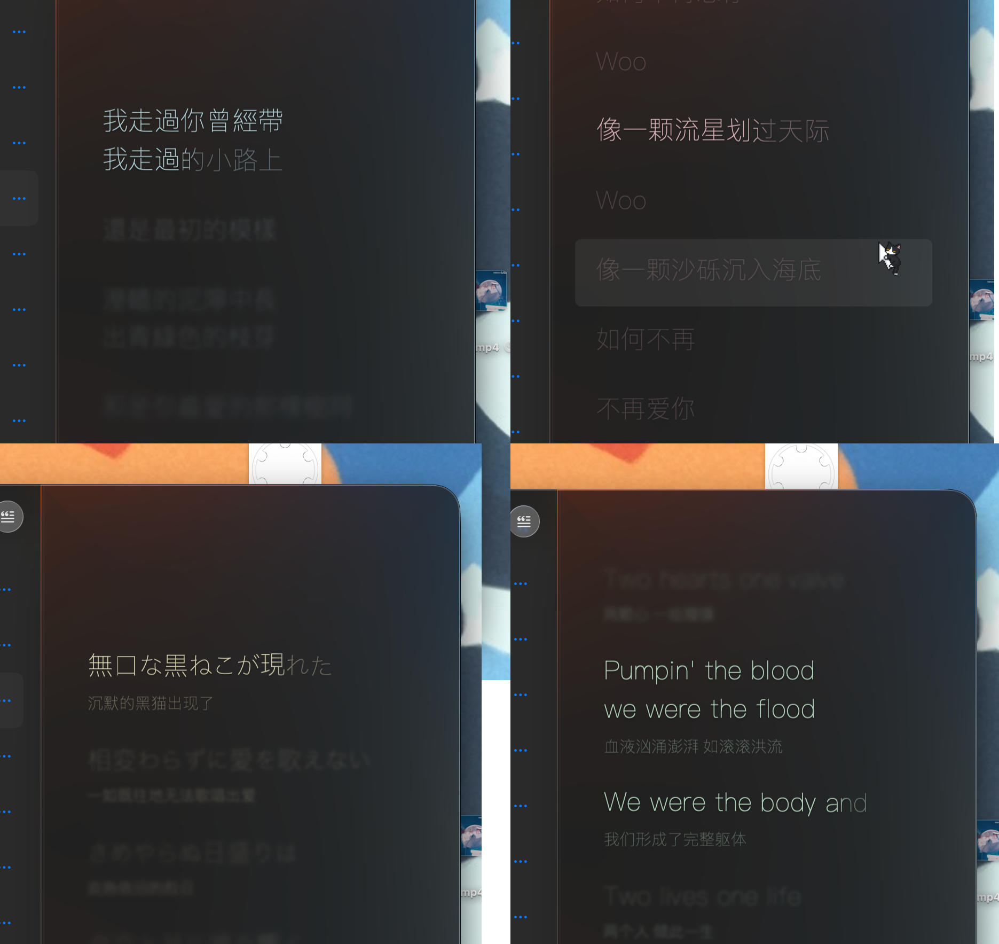
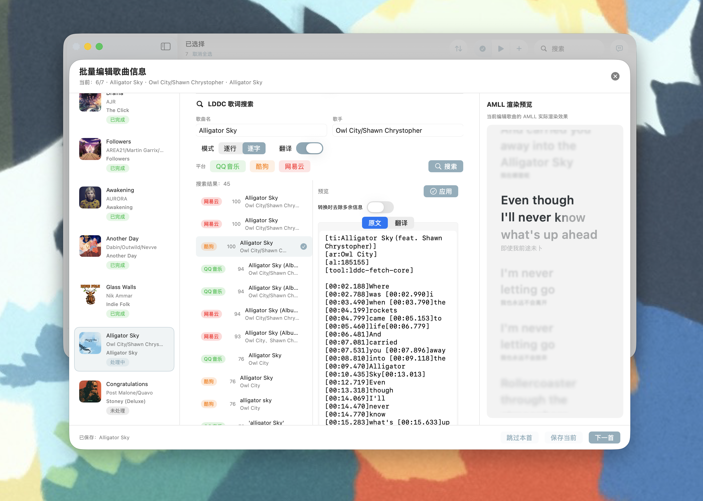
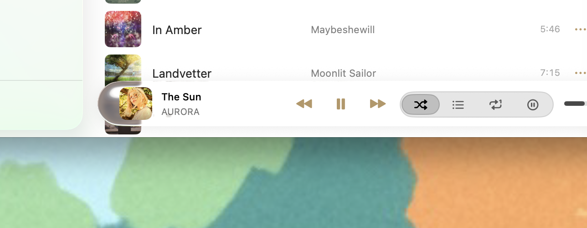

# kmgccc_player

**kmgccc_player** 是一款面向 **macOS 26** 的本地音乐播放器，专注于清晰的界面设计、沉浸式播放体验以及对本地音乐与歌词的良好支持。

> [!WARNING]
> kmgccc_player 当前仍处于 **Beta 阶段**，可能存在 Bug、未完成特性或行为变动。  
> 不建议在重要环境中作为唯一播放器使用，欢迎通过 Issue 或 Pull Request 反馈问题。

## 特性
- **Liquid Glass 风格**  
  应用整体遵循 Liquid Glass 设计语言，界面通透、克制，贴近原生系统体验，并在深色与浅色模式下保持一致的视觉表现。

- **磁带式播放界面 + 实时频谱可视化**  
  加入独立的“正在播放”视图，采用磁带外观设计。  
  磁带轮会随音乐播放实时转动，并基于音频频谱算法将音乐能量映射到磁带与指示元素上，在现代界面中保留实体播放设备的仪式感。

- **艺术背景 (Beta)**  
  将当前播放曲目的封面色彩进行风格化解析与图案拼贴展示，作为“正在播放”视图的动态背景。通过提取封面色彩特征，提供更具沉浸感的视觉反馈。

- **AMLL 歌词组件集成**  
  集成 **AppleMusic-Like Lyrics (AMLL)** 歌词渲染组件，支持高质量逐行歌词显示与平滑滚动效果。

- **LDDC 歌词获取支持**  
  集成 **LDDC (Lyrics Data Digging Core)** 相关逻辑，用于歌词的搜索、匹配与管理，提升本地音乐库的歌词完整度。在歌曲信息界面使用。

## 界面展示

## 构建与运行 (Build)

由于使用了 macOS 26 的新系统特性，构建环境要求如下：

- **系统要求**：macOS 26.0 或更新版本  
- **开发工具**：建议使用最新版本的 Xcode

**构建步骤：**

1. 克隆本仓库代码  
2. 使用 Xcode 打开 `kmgccc_player.xcodeproj`  
3. 使用 pyinstaller 打包LDDC server，结果输出到`Tools/lddc-server`
4. 选择 `kmgccc_player` Scheme 并运行

## 注意事项

- app的数据文件存放在`/Users/username/Music/kmgccc_player Library`中, 删除、替换 app 不会删除数据文件
- 演示视频：http://xhslink.com/o/91KoiKaIKKM 

### beta已知问题

1. 导入 FLAC 格式时存在元数据错误或丢失现象。
2. 歌词转换为 ttml 时有概率丢失或者不完整（目前解决方法是使用 AMLL DB的已有歌词库但歌曲数量有限、或者更换搜索结果多个平台歌词进行尝试）。这是因为各大音乐平台的歌词开头往往有很多版权信息和补充说明，我在转换时会删除这些信息，但是匹配可能出错，遇到特殊歌词会误删，后续考虑优化匹配算法或者加入手动预编辑功能。
    > 或者你也可以使用 `AMLL TTML Tool` 手动编辑 ttml 格式的歌词，操作更精准且可以启用 amll 的高级功能如背景歌词、对唱歌词。
    > 项目地址：https://github.com/amll-dev/amll-ttml-tool 
    > 在线使用：https://amll-ttml-tool.stevexmh.net/ 
也欢迎给 AMLL DB 贡献歌词。
3. 深色/浅色跟随系统设置时，有概率出现界面元素显示异常
4. 歌词英语字体设置无效
5. app 语言切换功能异常，目前仅支持中文

## 致谢

本项目在开发过程中使用并修改了以下开源项目：

- **applemusic-like-lyrics (AMLL)**  
  提供歌词渲染能力，实现类 Apple Music 的歌词显示效果。  
  https://github.com/amll-dev/applemusic-like-lyrics  
  AMLL DB 歌词库：https://github.com/amll-dev/amll-ttml-db

- **LDDC (Lyrics Data Digging Core)**  
  提供歌词获取与匹配能力。  
  https://github.com/chenmozhijin/LDDC

- **apple-audio-visualization**  
  提供音频频谱分析与可视化算法，本项目在播放界面与磁带视图中使用并修改了其部分实现。  
  https://github.com/taterboom/apple-audio-visualization

## 版权与素材声明

本项目中所使用的所有美术素材，包括但不限于界面插画、UI 装饰、皮肤、贴图、角色设计、视觉元素，均为作者原创作品。

上述美术素材 **不属于开源代码的一部分**，亦 **不适用 AGPL-3.0 许可证**。  
未经明确许可，不得对这些素材进行复制、修改、再分发或用于 AI 训练等其他项目。
且目前已从仓库中移除，需要请自行制作。

版权所有 © kmg。保留所有权利。

## 许可证 (License)

本项目为开源软件，**代码** 基于 **GNU Affero General Public License v3.0 (AGPL-3.0)** 发布。  
项目中所使用的第三方组件遵循其各自的开源许可证，详见应用内 About 页面及 `Licenses` 目录。