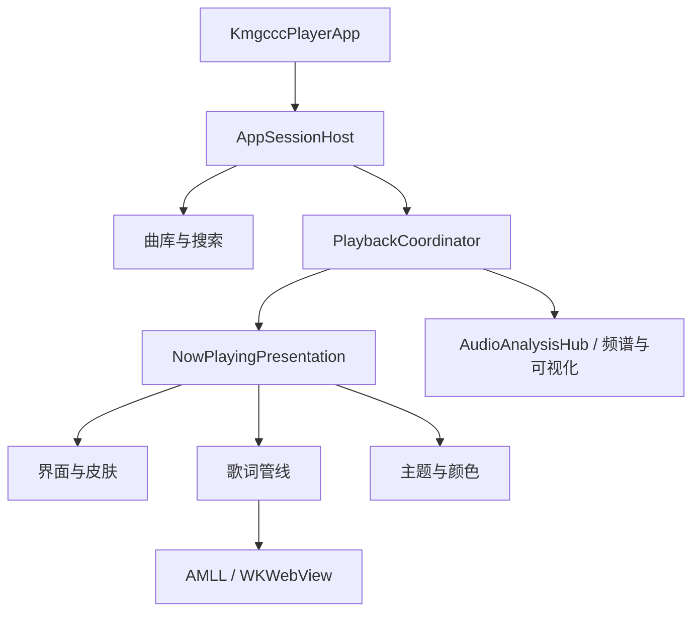

# 应用架构

kmgccc_player 使用 SwiftUI 构建场景和大部分内容视图，主窗口、歌词宿主和部分桌面行为由 AppKit 补足。播放、歌词、主题和全屏状态分别由明确的服务或 ViewModel 持有。

核心设计原则：控制命令进入 `PlaybackCoordinator`，当前播放内容由 `NowPlayingPresentation` 统一向外发布。歌词、皮肤、主题和频谱消费这个稳定表示，不各自猜测当前播放来源。



## 应用启动

`KmgcccPlayerApp` 是进程入口。它先建立保存曲目索引的 SwiftData `ModelContainer`，再创建 `AppSessionHost`。主窗口由 `AppDelegate` 触发，窗口出现前调用 `AppSessionHost.setupIfNeeded()`，该方法只执行一次，恢复上次的暂停状态后由 `AppKitMainSplitWindowController` 显示主窗口。

`AppSessionHost.setupDependencies()` 是应用级组合根。它在同一处建立并连接所有长期服务：

- `SwiftDataLibraryRepository`、`LocalLibraryService` 和 `LibraryViewModel`：曲库索引、文件监控和导入；
- `AVAudioPlaybackService` 和 `PlayerViewModel`：本地音频引擎、队列、进度和音量；
- 两个外部播放 provider、`PlaybackCoordinator`、`LyricsViewModel` 和 `LyricsPlaybackPipeline`；
- `LEDMeterServiceProvider`、`SkinManager`、`FullscreenWindowManager` 以及遥测和生命周期回调。

视图不应自行创建第二套播放、歌词或主题服务——否则窗口和全屏会各自持有一份状态，导致切换时出现不一致。

## 播放

### 本地播放

本地播放的命令入口是 `PlaybackCoordinator`。界面调用它的 play、pause、seek、next、previous 等方法，当来源不是本地时，播放某个曲目会先切回 `.local`。协调器把具体操作交给 `PlayerViewModel`，后者持有当前曲目、队列、播放顺序、进度、音量和播放态，并调用 `AVAudioPlaybackService` 驱动 AVAudioEngine。

`PlaybackCoordinator` 不复制播放状态。它在 `refreshPresentation()` 中读取快照，生成新的 `NowPlayingPresentation`，在内容确实变化时通知下游。删除曲目、恢复队列和切换播放顺序也要经过现有 owner——直接从视图修改队列或音频引擎，容易让 Now Playing、歌词和频谱仍停在旧状态。

### 外部播放

外部播放统一服从 `ExternalPlaybackProvider` 协议，有两条实现：

- `AppleMusicPlaybackAdapter` 用 `AppleMusicBridge` 读取和控制 Music.app，结合 `ExternalPlaybackMetadataStore` 处理稳定元数据和匹配结果；
- `SystemNowPlayingProvider` 使用 App bundle 中的 MediaRemoteAdapter，接收其他播放器的系统 Now Playing JSON，并维护连接可靠性、稳定曲目、进度基线和控制能力。

`PlaybackCoordinator.activeSource` 在 `.local`、`.appleMusic` 和 `.systemNowPlaying` 间选择当前 provider。外部 provider 各自维护 presentation，协调器只取当前来源的快照，补入统一的 refetch 状态后发布给 UI。控制按钮是否可用、能否 seek、能否调音量也来自 presentation 的 capability 字段，界面不按来源名称硬编码。

### NowPlayingPresentation

`NowPlayingPresentation` 是本地与外部播放共用的只读展示模型。它携带当前来源、展示标题/歌手/专辑、封面数据与 identity、时长、进度、播放态、音量、歌词文本与 identity、外部连接状态和各类控制 capability。

`PlaybackCoordinator.presentation` 是发布点。MiniPlayer、Now Playing 皮肤、全屏、歌词管线、Dock 和遥测都读取它。需要新增跨来源字段时，先让两个来源都能给出明确语义，再放进 presentation。

### 修改来源切换时需要注意

修改 `PlaybackCoordinator` 的来源切换逻辑或 `NowPlayingPresentation` 的字段时，以下界面都要检查：

- 普通窗口的 Now Playing 皮肤
- MiniPlayer
- 全屏播放器
- 歌词管线（timing、offset、refetch）
- Dock 播放状态

## 歌词

歌词搜索入口是 `LyricsSearchHelper.performFullSearch()`。它并行查询两类来源：本地 AMLL DB 索引（由 `AMLLDBService` 管理）和 bundle 中 LDDC Fetch Core 的本地 HTTP 服务。结果经过统一打分、合并和排序，自动匹配时还会检查顶部候选阈值，避免低置信度结果直接应用到当前曲目。

歌词进入播放器后的数据流：

```
TTML 歌词文本
  → NowPlayingPresentation
  → LyricsPlaybackPipeline（监听 presentation 变化，区分本地/外部来源）
  → LyricsViewModel（持有当前曲目、歌词配置和 offset 计算）
  → LyricsSurfaceManager（管理 main/fullscreen 等 surface 的活动关系）
  → LyricsWebViewStore（持有 WKWebView 生命周期和 bridge 调用）
  → AMLL WKWebView（TTML 解析 + timing 预处理 + DOM LyricPlayer）
```

各层职责：

- `LyricsPlaybackPipeline` 监听 presentation 变化，同步歌词内容、时间和播放态；
- `LyricsViewModel` 持有当前曲目和 offset 计算，决定何时需要重新 apply；
- `LyricsSurfaceManager` 持有各 surface 的活动关系和可回放 snapshot，切换 surface 时先准备目标再延迟回收旧目标；
- 每个 `LyricsWebViewStore` 持有自己的 WKWebView 生命周期、ready 状态和 bridge 调用；
- AMLL 的 `index.html` 负责 TTML 解析后的 timing 预处理、配置适配和 DOM renderer。

窗口或全屏视图只报告可见性，不应成为歌词内容的状态源。手动隐藏再显示会保留持久 WKWebView 和已有行，切歌或新 surface 才投递新歌词。

`LyricsSurfaceManager` 协调多个 surface 的切换，是歌词系统的核心调度点。修改歌词相关逻辑时，需要同时验证窗口歌词、全屏 surface、cover blur surface、seek、暂停与恢复、重叠行渲染和 lead-in 精度。

## 界面与皮肤

`SkinRegistry` 列出可用的 Now Playing 皮肤及其兼容范围，`SkinManager` 把设置中的 ID 归一化为可用皮肤。普通窗口由 `NowPlayingHostView` 读取 presentation、原子封面快照、语义颜色和窗口尺寸，组装 `SkinContext` 后交给具体皮肤。实时频谱帧由皮肤内的 consumer 订阅，不塞进父级 context 反复重建视图。

全屏设置由 `FullscreenPresentationCoordinator` 持有，包括皮肤、可视化模式和 MiniPlayer 频谱选择。`FullscreenWindowManager` 负责依赖注入、窗口建立和歌词 surface 切换；`FullscreenPlayerView` 同时支持系统 fullscreen space 与主窗口内嵌模式。两种宿主共享内容实现，但窗口生命周期和歌词 surface 要分别处理。

修改皮肤时先确认它支持普通 Now Playing、全屏或两者；修改全屏窗口行为时，不要把系统全屏、窗口模拟全屏和普通窗口三条路径合为一个布尔判断。

## 封面、颜色和频谱

本地曲目的封面来自曲库与缓存，外部播放由相应 provider 解析。在线封面候选可来自 QQ Music Helper 和 SACAD，候选进入共享 cover pipeline 后才由上层决定是否采用，helper 不直接写曲库。

`NowPlayingPresentation` 发布当前封面数据和 identity，`NowPlayingHostView` 等待完整图片解码后保持封面图片、checksum 和 track identity 原子切换。`ThemeStore` 是颜色状态 owner：按封面 identity/checksum 去重，复用 `ArtworkAssetStore` 或执行颜色分析，生成 `SemanticPalette`。普通皮肤、全屏和 AMLL 都消费这套语义颜色。新封面尚未完成分析时暂时保留上一张封面的主题，避免切歌时闪回默认色。

本地音频分析从 `AVAudioPlaybackService.analysisMixerNode` 进入共享 `AudioAnalysisHub`。hub 持有唯一的 AVAudioEngine tap 和 FFT 结果，再由 `LEDMeterService` 与 `AudioVisualizationService` 消费；`LEDMeterServiceProvider` 根据播放态和消费者数量管理这些服务的启停与分发。外部播放没有 mixer，协调器切换到 `ExternalPlaybackSpectrumSimulator`，provider 只在播放且有消费者时轮询。频谱视图应订阅共享 provider，不要各自给 AVAudioEngine 安装 tap。

## 外部运行组件

App 依赖五个外部运行组件，都由 `bootstrap.sh` 构建，产物通过 Xcode Build Phase 复制进 App bundle。运行时一律从 `Bundle.main.resourceURL` 解析 helper 路径。

| 组件 | 进程边界 | Swift 入口 | 失败影响 |
| --- | --- | --- | --- |
| AMLL | WKWebView 中的 JS/DOM | `LyricsWebViewStore` | 对应歌词 surface 无法渲染 |
| LDDC Fetch Core | `127.0.0.1` 随机端口 HTTP | `LDDCServerManager` | 在线歌词搜索失败，AMLL DB 仍可用 |
| QQ Music Helper | stdin/stdout JSON 子进程 | `QQMusicHelperProcess` | QQ 封面候选不可用，其他来源独立 |
| MediaRemoteAdapter | Perl launcher + framework | `SystemNowPlayingProvider` | 系统外部播放不可用，本地和 Apple Music 独立 |
| SACAD | 单次命令行进程 | `CoverDownloadService` | SACAD 封面候选失败，其他来源独立 |

详细的组件说明和许可证见 [外部组件与构建依赖](dependencies.md)。

## 修改代码时需要注意的边界

- **播放来源切换**：会影响普通窗口、MiniPlayer、全屏、歌词管线和 Dock。修改 `PlaybackCoordinator` 或 `NowPlayingPresentation` 后，需要验证本地、Apple Music 和系统 Now Playing 三条路径。
- **歌词系统**：涉及 `LyricsPlaybackPipeline`、`LyricsViewModel`、`LyricsSurfaceManager` 和多个 surface。改动后需要验证窗口歌词、全屏、cover blur、seek、暂停、重叠行和 lead-in。
- **AMLL**：不要在未定位根因前叠加 patch。能放在 App 适配层（`index.html`、`bridge.js`、CSS）的修改不要改 fork core。改动 fork TypeScript 核心前，确认该改动无法在适配层完成，并保留退化到上游默认行为的路径。
- **Fullscreen**：系统全屏、窗口模拟全屏和主窗口内嵌是三条独立路径，不要合并为一个布尔判断。
- **外部 helper**：所有 helper 路径从 bundle 解析。QQ Music API 只能经 bundled helper 调用，不要在 Swift 中直接调用第三方 API。
- **主题颜色**：`ThemeStore` 是唯一的状态 owner。界面消费 `SemanticPalette`，不要各自执行颜色分析。
- **频谱**：所有可视化视图共享 `LEDMeterServiceProvider`，不要各自给 AVAudioEngine 安装 tap。
- **曲库持久化**：Track 和 Playlist 的持久化路径有多个方法（meta only、meta+lyrics、meta+artwork、全部），匹配方法到改动范围，不要为只改元数据而重写封面和歌词 sidecar。

## 相关文档

- [歌词渲染系统](lyric-rendering.md)
- [色彩系统](color-system.md)
- [资料库存储](library-storage.md)
- [曲库搜索](search.md)
- [偏好随机播放](smart-shuffle.md)
