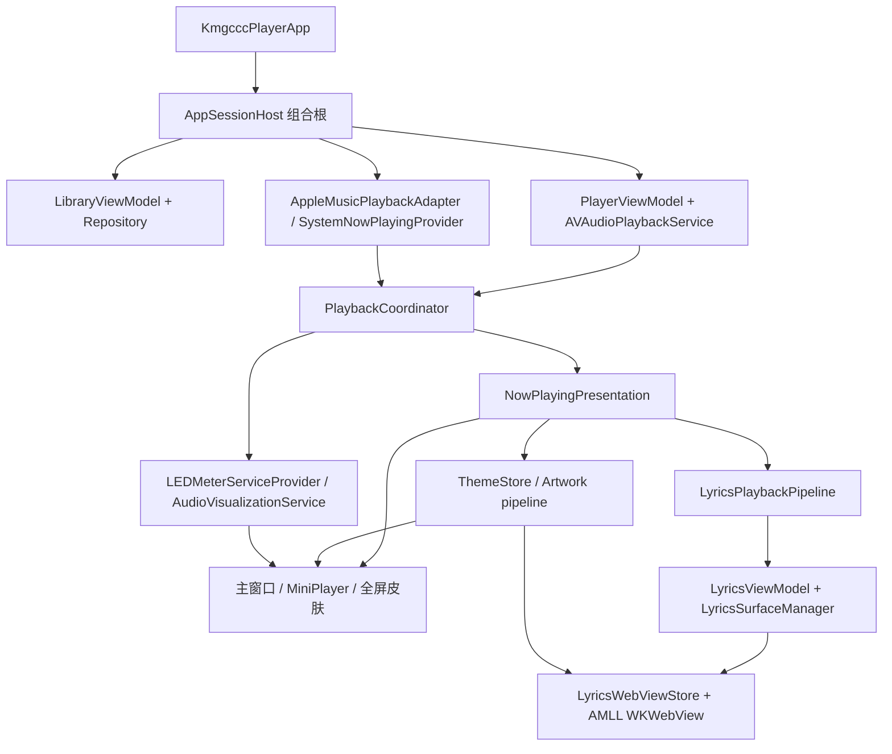

# 架构导览

本文只说明新人改代码时最先要懂的几条主链路。工程不是纯 SwiftUI 应用：SwiftUI 提供场景和大部分内容视图，主窗口、歌词宿主和部分窗口行为由 AppKit 管理；播放、歌词、主题和全屏状态则由各自的服务或 ViewModel 持有。

## 总体关系



主原则很简单：控制命令进入 `PlaybackCoordinator`，当前播放内容由 `NowPlayingPresentation` 统一向外发布；歌词、皮肤、主题和频谱消费这个稳定表示，不各自猜测当前播放来源。

## App 启动与组合根

`KmgcccPlayerApp` 是进程入口。它先建立保存曲目索引的 SwiftData `ModelContainer`，再创建单例式的 `AppSessionHost`。真正的主窗口由 `AppDelegate` 触发，窗口出现前调用 `AppSessionHost.setupIfNeeded()`；该方法只执行一次，恢复上次的暂停播放状态后，再由 `AppKitMainSplitWindowController` 显示主窗口。

`AppSessionHost.setupDependencies()` 是应用级组合根。它在同一处建立并连接：

- `SwiftDataLibraryRepository`、`LocalLibraryService` 和 `LibraryViewModel`，负责曲库索引、文件监控和导入入口；
- `AVAudioPlaybackService` 和 `PlayerViewModel`，负责本地音频、队列、进度和音量；
- 两个外部播放 provider、`PlaybackCoordinator`、`LyricsViewModel` 和 `LyricsPlaybackPipeline`；
- `LEDMeterServiceProvider`、`SkinManager`、`FullscreenWindowManager` 以及遥测和生命周期回调。

因此，新增跨模块依赖时应先判断它是否属于组合根。视图不应自行创建第二套播放、歌词或主题服务，否则窗口和全屏会各自持有一份状态。

## 本地播放

本地播放的命令入口是 `PlaybackCoordinator`。界面调用它的 play、pause、seek、next、previous 等方法；当来源不是本地时，播放某个曲目会先切回 `.local`。协调器再把具体操作交给 `PlayerViewModel`，后者持有当前曲目、队列、播放顺序、进度、音量和播放态，并调用 `AVAudioPlaybackService` 驱动 AVAudioEngine。

本地曲库状态由 repository 和 `LibraryViewModel` 持有，播放状态由 `PlayerViewModel` 持有。`PlaybackCoordinator` 不复制这些可变状态；它在 `refreshPresentation()` 中读取快照，生成新的 `NowPlayingPresentation`，并在内容确实变化时通知下游。

```text
用户操作
  -> PlaybackCoordinator
  -> PlayerViewModel
  -> AVAudioPlaybackService
  -> PlaybackCoordinator.refreshPresentation()
  -> NowPlayingPresentation
```

删除曲目、恢复队列和切换播放顺序也要经过现有 owner。直接从视图修改队列或音频引擎，容易让 Now Playing、歌词和频谱仍停在旧状态。

## 外部播放

外部播放统一服从 `ExternalPlaybackProvider` 协议，目前有两条实现：

- `AppleMusicPlaybackAdapter` 用 `AppleMusicBridge` 读取和控制 Music.app，并结合 `ExternalPlaybackMetadataStore` 处理稳定元数据、匹配结果和覆盖信息；
- `SystemNowPlayingProvider` 使用 App bundle 中的 MediaRemoteAdapter，接收其他播放器的系统 Now Playing JSON，并维护连接可靠性、稳定曲目、进度基线、控制能力、封面和歌词匹配。

`PlaybackCoordinator.activeSource` 在 `.local`、`.appleMusic` 和 `.systemNowPlaying` 间选择当前 provider。外部 provider 各自维护 presentation；协调器只取当前来源的快照，补入统一的 refetch 状态，再发布给 UI。控制按钮是否可用、能否 seek、能否调音量也来自 presentation 的 capability 字段，界面不按来源名称硬编码。

系统 Now Playing 路径没有本地音频 mixer；它的频谱只能使用外部模拟数据。Apple Music 和系统 provider 的歌词自动匹配虽然入口不同，最终都回到同一个 `LyricsSearchHelper` 和 presentation 管线。

## NowPlayingPresentation

`NowPlayingPresentation` 是本地与外部播放共用的只读展示模型，也是多数播放界面的输入。它同时携带：

- 当前来源、本地 `Track` 引用和展示标题、歌手、专辑；
- 封面数据与 identity、加载状态；
- 时长、进度、播放态、音量和音频输出延迟；
- 歌词文本、歌词 identity、外部歌词偏移与重取状态；
- 外部连接状态、匹配信息和各类控制 capability。

`PlaybackCoordinator.presentation` 是发布点。MiniPlayer、Now Playing 皮肤、全屏、歌词管线、Dock 和遥测都应读取它；底层 owner 仍分别是 `PlayerViewModel` 或当前外部 provider。需要新增跨来源字段时，先让两个来源都能给出明确语义，再放进 presentation，避免 UI 同时依赖三套服务。

## 歌词搜索与 AMLL 渲染

歌词搜索入口是 `LyricsSearchHelper.performFullSearch()`。它并行查询两类来源：本地 AMLL DB 索引由 `AMLLDBService` 管理，在线来源由 bundle 中的 LDDC Fetch Core 本地 HTTP 服务提供；结果经过统一打分、合并和排序。自动匹配还会检查顶部候选阈值，再按顺序获取可用歌词，避免把低置信度结果直接应用到当前曲目。

歌词进入播放器后的数据流是：

```text
Track 或外部 provider 的 TTML
  -> NowPlayingPresentation
  -> LyricsPlaybackPipeline
  -> LyricsViewModel
  -> LyricsSurfaceManager 当前 snapshot
  -> 对应 LyricsWebViewStore
  -> bridge.js / index.html
  -> AMLL parseTTML + LyricPlayer
```

各层责任不能混用：

- `LyricsPlaybackPipeline` 监听 presentation 变化，区分本地和外部来源，并同步歌词内容、时间和播放态；
- `LyricsViewModel` 持有当前曲目、歌词配置和 offset 计算，决定何时需要重新 apply；
- `LyricsSurfaceManager` 持有 main/fullscreen 等 surface 的活动关系和可回放 snapshot，切换 surface 时先准备目标再延迟回收旧目标；
- 每个 `LyricsWebViewStore` 持有自己的 WKWebView 生命周期、ready 状态和 bridge 调用；
- AMLL 的 `index.html` 负责 TTML 解析后的 timing 预处理、配置适配和 DOM renderer。

窗口或全屏视图只报告可见性，不应成为歌词内容的状态源。手动隐藏再显示会保留持久 WKWebView 和已有行；真正切歌或新 surface 才投递新的歌词。修改 timing 或 fork core 前，应先理清 AMLL 的 patch 边界、timing 预处理规则和集成维护约束，不要在未定位根因前叠加 patch。

## 皮肤与全屏

`SkinRegistry` 列出可用的 Now Playing 皮肤及其兼容范围，`SkinManager` 负责把设置中的 ID 归一化为可用皮肤。普通窗口由 `NowPlayingHostView` 读取 presentation、原子封面快照、语义颜色和窗口尺寸，组装 `SkinContext` 后交给具体皮肤；实时频谱帧由皮肤内的 consumer 订阅，不塞进父级 context 反复重建整棵视图。

全屏设置由 `FullscreenPresentationCoordinator` 持有，包括皮肤、可视化模式和 MiniPlayer 频谱选择。`FullscreenWindowManager` 负责依赖注入、窗口建立、main/fullscreen 歌词 surface 切换和回收；`FullscreenPlayerView` 同时支持系统 fullscreen space 与主窗口内嵌模式。两种宿主共享内容实现，但窗口生命周期和歌词 surface 仍要分别处理。

修改皮肤时先确认它支持普通 Now Playing、全屏或两者；修改全屏窗口行为时，不要把系统全屏、窗口模拟全屏和普通窗口三条路径合为一个布尔判断。

## 封面、颜色和频谱

本地曲目的封面来自曲库与缓存；外部播放由相应 provider 解析，手工或导入时的在线候选可来自 QQ Music Helper 和 SACAD。候选进入共享 cover pipeline 后才由上层决定是否采用，helper 不直接写曲库。

`NowPlayingPresentation` 发布当前封面数据和 identity，`NowPlayingHostView` 再等待完整图片解码，保持封面图片、checksum 和 track identity 原子切换。`ThemeStore` 是颜色状态 owner：它按封面 identity/checksum 去重，复用 `ArtworkAssetStore` 或执行颜色分析，生成 `SemanticPalette`；普通皮肤、全屏和 AMLL 都消费这套语义颜色。新封面尚未完成分析时会暂时保留上一张封面的主题，避免切歌时闪回默认色。

本地频谱从 `AVAudioPlaybackService.analysisMixerNode` 进入 `LEDMeterServiceProvider`。provider 按需创建 `LEDMeterService`，把播放态和消费者数量用于启停分析；`AudioVisualizationService` 为多个界面分发波形/频谱帧。外部播放没有 mixer，协调器会切换到 `ExternalPlaybackSpectrumSimulator`，provider 只在播放和有消费者时轮询。因而频谱视图应订阅共享 provider，不应各自给 AVAudioEngine 安装 tap。

## 外部 helper 与服务

| 组件 | 进程边界 | 启动时机 | Swift 入口 | 失败影响 |
| --- | --- | --- | --- | --- |
| AMLL | WKWebView 中的 JS/DOM runtime | surface 准备或显示时 | `LyricsWebViewStore` | 对应歌词 surface 无法渲染 |
| LDDC Fetch Core | 本机 `127.0.0.1` 随机端口 HTTP 服务 | 首次需要 LDDC 搜索时 | `LDDCServerManager` | 在线 LDDC 搜索/获取失败，AMLL DB 仍是独立来源 |
| QQ Music Helper | stdin/stdout JSON 子进程 | QQ provider 首次查询时按需启动，空闲或 App 退出后结束 | `QQMusicHelperProcess` | QQ 元数据和封面候选不可用 |
| MediaRemoteAdapter | Perl launcher + framework + test client | 系统 Now Playing provider 启动时 | `SystemNowPlayingProvider` | 系统外部播放无法连接；本地和 Apple Music 路径独立 |
| SACAD | 单次命令行进程 | 发起 SACAD 封面请求时 | `CoverDownloadService` | SACAD 封面候选失败，其他候选来源独立 |

所有运行路径都从 `Bundle.main.resourceURL` 解析。当前代码没有系统 Python、用户目录、开发 checkout 或环境变量 fallback；bundle 内容和复制关系见 `dependencies.md`。

## 新人定位入口

| 要改的行为 | 先看入口 | 状态 owner | 主要下游 |
| --- | --- | --- | --- |
| App 启动和依赖连接 | `KmgcccPlayerApp`、`AppSessionHost` | `AppSessionHost` | 主窗口、各服务 |
| 本地播放和队列 | `PlaybackCoordinator`、`PlayerViewModel` | `PlayerViewModel` | presentation、音频、Now Playing |
| Apple Music / 系统外部播放 | `ExternalPlaybackProvider` 实现 | 当前外部 provider | presentation、歌词、控制 UI |
| 跨来源展示字段 | `NowPlayingPresentation` | `PlaybackCoordinator` 发布 | MiniPlayer、全屏、歌词、Dock |
| 歌词搜索 | `LyricsSearchHelper` | `AMLLDBService` / `LDDCServerManager` | 候选排序、TTML |
| 歌词 WebView 生命周期 | `LyricsPlaybackPipeline`、`LyricsSurfaceManager` | surface manager 与各 store | AMLL bridge/DOM |
| 普通皮肤 | `SkinRegistry`、`NowPlayingHostView` | `SkinManager` 与设置 | 具体 `NowPlayingSkin` |
| 全屏窗口与配置 | `FullscreenWindowManager`、`FullscreenPresentationCoordinator` | coordinator / manager | `FullscreenPlayerView`、歌词 surface |
| 封面语义颜色 | `ThemeStore` | `ThemeStore` | 皮肤、全屏、AMLL |
| 频谱和 LED | `LEDMeterServiceProvider`、`AudioVisualizationService` | 共享 provider/service | Now Playing 与全屏可视化 |
