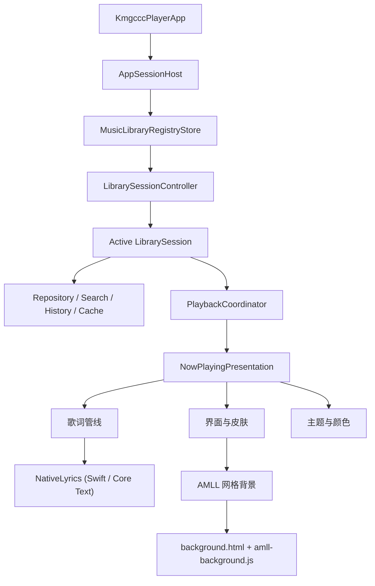

# 应用架构

kmgccc_player 使用 SwiftUI 构建场景和大部分内容视图，主窗口、歌词宿主和部分桌面行为由 AppKit 补足。进程级播放展示与资料库级存储由独立 owner 管理：`AppSessionHost` 组合长期服务，`LibrarySessionController` 串行切换一套 active `LibrarySession`。

核心设计原则：控制命令进入 `PlaybackCoordinator`，当前播放内容由 `NowPlayingPresentation` 统一向外发布。歌词、皮肤、主题和频谱消费这个稳定表示，不各自猜测当前播放来源。


```mermaid
flowchart TD
    App["KmgcccPlayerApp"] --> Host["AppSessionHost"]
    Host --> Registry["MusicLibraryRegistryStore"]
    Registry --> Controller["LibrarySessionController"]
    Controller --> Session["Active LibrarySession"]
    Session --> Library["Repository / Search / History / Cache"]
    Session --> Playback["PlaybackCoordinator"]
    Playback --> Presentation["NowPlayingPresentation"]
    Presentation --> UI["界面与皮肤"]
    Presentation --> Lyrics["歌词管线"]
    Presentation --> Theme["主题与颜色"]
    Lyrics --> NativeLyrics["NativeLyrics (Swift / Core Text)"]
    UI --> MeshBackground["AMLL 网格背景"]
    MeshBackground --> AMLLBackground["background.html + amll-background.js"]
```

## 应用启动

`KmgcccPlayerApp` 是进程入口。启动时先读取全局资料库 registry，并从 bookmark 与 `library.json` 解析初始 `LibraryContext`；没有可达资料库时保留 placeholder container，直接进入资料库创建/重连界面。真实 SwiftData `ModelContainer` 由 active `LibrarySession` 按资料库 root 创建，不是进程期固定单例。

`AppSessionHost.setupDependencies()` 是应用级组合根。它建立 registry、session controller 和进程生命周期服务；`LibrarySessionFactory` 为当前 context 建立资料库级 owner：

- `SwiftDataLibraryRepository`、`LocalLibraryService`、`LibraryViewModel`、history 和 search index；
- `FileImportService`、managed/referenced backend、source reconciler 与单一 `LibraryChangeMonitor`；
- 当前资料库的 cache services、`AVAudioPlaybackService`、`PlayerViewModel` 和 queue；
- 两个外部播放 provider、`PlaybackCoordinator`、`LyricsViewModel` 和 `LyricsPlaybackPipeline`；
- `LEDMeterServiceProvider`、`SkinManager`、`FullscreenWindowManager` 以及遥测和生命周期回调。

视图不应自行创建第二套播放、歌词或主题服务——否则窗口和全屏会各自持有一份状态，导致切换时出现不一致。

### 资料库 session

一个资料库由不可变 `LibraryContext` 定位。`library.json` 固定 managed/referenced 模式；全局 registry 只保存入口和 recent 指针，不保存曲目数据。切库先准备候选 session，再 flush、quiesce、解绑并 close 旧 session，最后加载和原子发布新 session。repository、scanner、索引和 cache task 都捕获 generation，过期结果不得跨 root 提交。

托管 backend 把音频提交到资料库；原位 backend 只持久化 `TrackMediaLocator.referenced` 和外部 bookmark。播放及辅助文件读取统一经 locator resolver，不从 UI 或 repository 拼接裸路径。原位 source scanner 生成 diff，reconciler 通过 durable intent 更新 sidecar、runtime、playlist 和派生索引；FSEvents callback 本身不修改 Track。

## 播放

### 本地播放

本地播放的命令入口是 `PlaybackCoordinator`。界面调用它的 play、pause、seek、next、previous 等方法，当来源不是本地时，播放某个曲目会先切回 `.local`。协调器把具体操作交给 `PlayerViewModel`，后者持有当前曲目、队列、播放顺序、进度、音量和播放态，并调用 `AVAudioPlaybackService`。服务通过唯一的 `RendererPlaybackPipeline` 驱动 `AVSampleBufferAudioRenderer` 和 `AVSampleBufferRenderSynchronizer`；解码、segment、PTS、输出设备切换与恢复在管线串行队列执行。managed locator 由 captured `LibraryPaths` 解析；referenced locator 通过 source/file bookmark 和成对的 scope lease 解析。

Renderer 保持源采样率与声道数，并向系统声明可用的空间化格式。输出设备 UID 绑定设备时钟；HAL 延迟只用于诊断。可视化延迟开关通过时间线保留零或固定 180 ms lead。无缝播放追加下一 segment，正常边界不重建输出对象。Renderer 连续故障只尝试一次重建；无法恢复或源读取失败时停止该请求，保留曲目与位置供用户重试。DSP 接入见 [实施计划](audio-dsp-implementation-plan.md)，当前输出统一阶段不包含效果处理。

未来远程 catalog 不复用本地 bookmark/locator 伪装网络流。它应使用独立媒体表示、backend 与 playback adapter；当前 session/backend factory 和统一展示模型是预留边界，不包含未实现的远程 API 或行为承诺。

`PlaybackCoordinator` 不复制播放状态。它在 `refreshPresentation()` 中读取快照，生成新的 `NowPlayingPresentation`，在内容确实变化时通知下游。删除曲目、恢复队列和切换播放顺序也要经过现有 owner——直接从视图修改队列或音频引擎，容易让 Now Playing、歌词和频谱仍停在旧状态。

### 外部播放

外部播放统一服从 `ExternalPlaybackProvider` 协议，有两条实现：

- `AppleMusicPlaybackAdapter` 用 `AppleMusicBridge` 读取和控制 Music.app，结合 `ExternalPlaybackMetadataStore` 处理稳定元数据和匹配结果；
- `SystemNowPlayingProvider` 使用 App bundle 中的 MediaRemoteAdapter，接收其他播放器的系统 Now Playing JSON，并维护连接可靠性、稳定曲目、进度基线和控制能力。

`PlaybackCoordinator.activeSource` 在 `.local`、`.appleMusic` 和 `.systemNowPlaying` 间选择当前 provider。外部 provider 各自维护 presentation，协调器只取当前来源的快照，补入统一的 refetch 状态后发布给 UI。控制按钮是否可用、能否 seek、能否调音量也来自 presentation 的 capability 字段，界面不按来源名称硬编码。

### NowPlayingPresentation

`NowPlayingPresentation` 是本地与外部播放共用的只读展示模型。它携带当前来源、展示标题/歌手/专辑、封面数据与 identity、时长、进度、播放态、音量、歌词文本与 identity、外部连接状态和各类控制 capability。

`PlaybackCoordinator.presentation` 是发布点。MiniPlayer、Now Playing 皮肤、全屏、歌词管线、Dock 和遥测都读取它。需要新增跨来源字段时，先让两个来源都能给出明确语义，再放进 presentation。

### 修改来源切换时需要注意

修改 `PlaybackCoordinator` 的来源切换逻辑或 `NowPlayingPresentation` 的字段时，以下界面都要检查：

- 普通窗口的 Now Playing 皮肤
- MiniPlayer
- 全屏播放器
- 歌词管线（timing、offset、refetch）
- Dock 播放状态

## 歌词

歌词搜索入口是 `LyricsSearchHelper.performFullSearch()`。它并行查询两类来源：本地 AMLL DB 索引（由 `AMLLDBService` 管理）和 bundle 中 LDDC Fetch Core 的本地 HTTP 服务。结果经过统一打分、合并和排序，自动匹配时还会检查顶部候选阈值，避免低置信度结果直接应用到当前曲目。

歌词进入播放器后的数据流：

```
TTML 歌词文本
  → NowPlayingPresentation
  → LyricsPlaybackPipeline（监听 presentation 变化，区分本地/外部来源）
  → LyricsViewModel（持有当前曲目、歌词配置和 offset 计算）
  → LyricsSurfaceManager（管理 main/fullscreen 等 surface 的活动关系）
      ├─► NativeLyricsSurfaceManager（原生 Swift 后端：Core Text 排版 + Core Animation 图层）
```

各层职责：

- `LyricsPlaybackPipeline` 监听 presentation 变化，同步歌词内容、硬件时钟时间基准和播放态；
- `LyricsViewModel` 持有当前曲目和 offset 计算，决定何时需要重新 apply；
- `LyricsSurfaceManager` 协调各 surface 的活动关系和可回放 snapshot，并派发到原生渲染 surface；
- `NativeLyricsSurfaceManager` 驱动基于 Core Text 与 Core Animation 的原生渲染视窗，以微秒级延迟响应音频时钟并呈现 120Hz 高刷新率动效；
- `AMLLMeshGradientBackgroundView` 只负责隔离的网格背景 WebView，不承载歌词内容。

窗口或全屏视图只报告可见性，不应成为歌词内容的状态源。手动隐藏再显示会保留持久渲染宿主和已有行，切歌或新 surface 才投递新歌词。

`LyricsSurfaceManager` 协调多个 surface 的切换，是歌词系统的核心调度点。修改歌词相关逻辑时，需要同时验证窗口歌词、全屏 surface、cover blur surface、seek、暂停与恢复、重叠行渲染和 lead-in 精度。详细架构见 [原生 Swift 歌词系统](native-lyrics.md)。

## 界面与皮肤

`SkinCatalog` 是唯一的皮肤登记集合；`SkinRegistry` 保留路由入口并委托给同一 catalog，`SkinManager` 在 App 组合入口接收它。每个 `NowPlayingSkin` 的 `SkinDescriptor` 声明支持的宿主、元数据、呈现策略、可视化能力和外观默认。当前默认值与历史兼容键分开保存，新增身份不需要扩充 `FullscreenSkinID` 或全局默认值名单。

普通窗口由 `NowPlayingHostView` 读取稳定 presentation、原子封面快照、语义颜色和窗口尺寸，组装 `SkinContext` 后交给具体皮肤。公共上下文只保留当前消费者需要的数据，磁带色板等专用输入在皮肤内部适配。实时频谱帧由皮肤内的 consumer 订阅，播放时钟由原有实时叶节点消费。

全屏设置由 `FullscreenPresentationCoordinator` 持有，包括皮肤、可视化模式和 MiniPlayer 频谱选择。`FullscreenWindowManager` 负责依赖注入、窗口建立和歌词 surface 切换；`FullscreenPlayerView` 同时支持系统 fullscreen space 与主窗口内嵌模式。两种宿主共享内容实现，但窗口生命周期和歌词 surface 要分别处理。

每个宿主持有自己的 `SkinSession`，管理切换 identity 与局部异步任务；它不创建另一套播放、主题、歌词或分析服务。封面异步准备在提交前确认会话 generation，切换时重建皮肤子树，原生歌词保留 manager-owned 渲染器身份。皮肤通过 `releaseCachedResources()` 释放专属派生缓存，`CacheManager` 分发清理并继续管理共享缓存。

有 `scene` 的皮肤由 `SkinSceneHost` 使用实际视口呈现，作者可以使用任意 SwiftUI 场景或 JSON 原生组合树。`SkinComponentCatalog` 登记可选封面、背景、文字、歌词、播放控制与共享可视化；新增组件不扩充宿主的皮肤 ID 分支。`SkinNativeLyricsMount` 以普通布局容器借用唯一歌词 view，激活和配置仍归原有 manager；作者覆盖叠在 App 配置之后，离开后恢复最新基础设置。

五个内置模块与用户安装项共用 `PackagedSkin` 和同一 catalog。`registerBundled` 同时登记完整模块及封面、背景、装饰部件；原生布局工厂保留为既有外观的兼容适配。`SkinPackageStore` 在服务层管理普通 ZIP、安装资源、身份冲突与导出，设置面板呈现导入、导出、重载、删除和少量声明参数。同 ID 更新通过 catalog revision 使宿主会话失效；失败重载保留原登记。删除后相关选择恢复默认内置皮肤，播放继续。Web、开发目录监听与市场按[演进计划](skin-system-evolution-plan.md)继续推进；当前接入和实际验证边界见 [P3 实施记录](skin-system-p3.md)，作者入口见[原生皮肤开发](skin-authoring-native.md)。

修改皮肤时先确认它支持普通 Now Playing、全屏或两者；修改全屏窗口行为时，不要把系统全屏、窗口模拟全屏和普通窗口三条路径合为一个布尔判断。

## 封面、颜色和频谱

本地曲目的封面来自曲库与缓存，外部播放由相应 provider 解析。在线封面候选可来自 QQ Music Helper、网易云音乐 API 和 SACAD，候选进入共享 cover pipeline 后才由上层决定是否采用；候选来源不直接写曲库。

`NowPlayingPresentation` 发布当前封面数据和 identity，`NowPlayingHostView` 等待完整图片解码后保持封面图片、checksum 和 track identity 原子切换。`ThemeStore` 是颜色状态 owner：按封面 identity/checksum 去重，复用 `ArtworkAssetStore` 或执行颜色分析，生成 `SemanticPalette`。普通皮肤、全屏、原生歌词和 AMLL 网格背景都消费这套语义颜色。新封面尚未完成分析时暂时保留上一张封面的主题，避免切歌时闪回默认色。

本地音频分析使用 `RendererPlaybackPipeline` 解码得到的 canonical PCM，按 synchronizer 时间与应用的分析 lead 投递至共享 `AudioAnalysisHub`，不在提前解码时立即发布。hub 持有共享 FFT 结果，再由 `LEDMeterService` 与 `AudioVisualizationService` 消费；`LEDMeterServiceProvider` 根据播放态和消费者数量管理这些服务的启停与分发，创建消费者无需创建输出对象。外部播放由协调器切换到 `ExternalPlaybackSpectrumSimulator`，provider 只在播放且有消费者时轮询。频谱视图订阅共享 provider。开发用 `SpectrumRecorder` 同样使用 renderer 和定时 PCM 输入。

## 外部运行组件

App 依赖五个外部运行组件，都由 `bootstrap.sh` 构建，产物通过 Xcode Build Phase 复制进 App bundle。运行时一律从 `Bundle.main.resourceURL` 解析 helper 路径。

| 组件 | 进程边界 | Swift 入口 | 失败影响 |
| --- | --- | --- | --- |
| AMLL background | 隔离的背景 WKWebView | `AMLLMeshGradientBackgroundView` | 网格背景不可用，歌词与播放不受影响 |
| LDDC Fetch Core | `127.0.0.1` 随机端口 HTTP | `LDDCServerManager` | 在线歌词搜索失败，AMLL DB 仍可用 |
| QQ Music Helper | stdin/stdout JSON 子进程 | `QQMusicHelperProcess` | QQ 封面候选不可用，其他来源独立 |
| MediaRemoteAdapter | Perl launcher + framework | `SystemNowPlayingProvider` | 系统外部播放不可用，本地和 Apple Music 独立 |
| SACAD | 单次命令行进程 | `CoverDownloadService` | SACAD 封面候选失败，其他来源独立 |

详细的组件说明和许可证见 [外部组件与构建依赖](dependencies.md)。

## 修改代码时需要注意的边界

- **播放来源切换**：会影响普通窗口、MiniPlayer、全屏、歌词管线和 Dock。修改 `PlaybackCoordinator` 或 `NowPlayingPresentation` 后，需要验证本地、Apple Music 和系统 Now Playing 三条路径。
- **歌词系统**：涉及 `LyricsPlaybackPipeline`、`LyricsViewModel`、`LyricsSurfaceManager` 和多个 surface。改动后需要验证窗口歌词、全屏、cover blur、seek、暂停、重叠行和 lead-in。
- **AMLL 背景**：只通过 `scripts/sync-amll-from-fork.sh` 更新生成的 `amll-background.js`，保留 `background.html` 与字体资源；不要重新引入歌词 DOM、bridge 或歌词 WebView fallback。
- **Fullscreen**：系统全屏、窗口模拟全屏和主窗口内嵌是三条独立路径，不要合并为一个布尔判断。
- **外部 helper**：所有 helper 路径从 bundle 解析。QQ Music API 只能经 bundled helper 调用，不要在 Swift 中直接调用第三方 API。
- **主题颜色**：`ThemeStore` 是唯一的状态 owner。界面消费 `SemanticPalette`，不要各自执行颜色分析。
- **频谱**：所有可视化视图共享 `LEDMeterServiceProvider` 和 `AudioAnalysisHub` 的 PCM 分析结果，不各自创建音频输出或分析管线。
- **曲库持久化**：Track 和 Playlist 的持久化路径有多个方法（meta only、meta+lyrics、meta+artwork、全部），匹配方法到改动范围，不要为只改元数据而重写封面和歌词 sidecar。
- **资料库 session**：磁盘服务只使用创建时捕获的 `LibraryContext`。新增长期任务时要在 quiesce/close 取消，并验证旧 generation 不会写入新库。
- **原位来源**：scanner 只产生 diff；删除、ignore、NCM reservation 和 source removal 通过现有事务服务处理，不从视图或 FSEvents callback 直接改 Track。

## 相关文档

- [歌词渲染系统](lyric-rendering.md)
- [色彩系统](color-system.md)
- [资料库存储](library-storage.md)
- [曲库搜索](search.md)
- [偏好随机播放](smart-shuffle.md)
