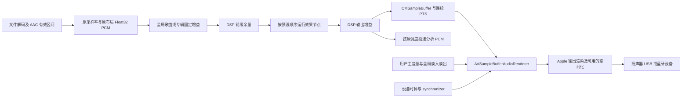

# Renderer 音频 DSP 实施计划

决策日期：2026-10-08。状态：分阶段实施中；P5 源码、静态检查及 2026-10-09 授权 Debug 编译已完成，运行验收待进行。P3–P4 已通过授权 Debug 编译。各阶段的验证结果以实施记录为准。

本计划承接 [本地音频输出统一计划](audio-renderer-unification-plan.md)。本地播放统一使用 `AVSampleBufferAudioRenderer` / `AVSampleBufferRenderSynchronizer`，彻底移除 AVAudioEngine 后端和故障回退。DSP 只实现这一条输出路径。

本文件依据当日工作树源码、产品要求及第 19 节的上游资料编写。代码存在并行改动，实施前重新确认相关入口。文中性能、延迟和测量精度数值属于验收目标，不代表已经取得的结果。

## 1. 已确定的产品范围

最终交付必须覆盖下列功能；分阶段实施用于控制每轮变更规模，不缩减最终范围。

| 功能 | 设置归属 | 保存与切换规则 |
| --- | --- | --- |
| 9 段参数均衡器、前级/输出增益、频响预览 | DSP 效果链 | 完整保存参数、启用状态、节点身份和顺序 |
| 等响补偿 | DSP 效果链 | 保存节点参数和顺序；聆听参考音量按输出设备独立保存 |
| 立体声扩展 | DSP 效果链 | 保存参数和顺序；保留单声道兼容性 |
| 虚拟低音 | DSP 效果链 | 保存参数、质量模式和顺序 |
| 电子管模拟 | DSP 效果链 | 保存参数、质量模式和顺序 |
| 可编程 DSP | DSP 效果链 | 保存源代码、语言版本、参数定义/数值、资源声明和节点顺序 |
| DSP 预设列表 | App 级预设库 | 保存、选择、实时切换、另存、重命名、删除、导入、导出 |
| 播放/暂停淡入淡出 | 全局音频设置 | 独立持久化，预设选择或保存不会改变它 |
| 歌曲/专辑响度均衡 | 全局音频设置 | 整首歌曲或整张专辑使用一个固定增益；独立持久化 |
| MCP、CLI、AI Agent 控制 | 同一 App-owned contract | UI 的每个可编辑参数、代码和预设操作均有正式接口 |

新增功能初始关闭，默认预设为“平直”。默认预设所有节点不产生处理，前级和输出增益为 0 dB。升级保留当前输出设备、音量、无缝播放、AAC 裁剪和延迟设置。

DSP 总开关只控制预设内效果。全局响度均衡和淡入淡出有各自开关。可以另提供临时“原始对照”，暂时旁路这些应用处理，并在退出后恢复设置；这不是永久改写开关，也不宣称系统输出逐位透明。

Apple Music 和系统 Now Playing 外部来源的音频不经过本地 renderer。设置与预设仍可编辑、保存，实际状态返回 `inactiveExternalSource`；切回本地播放后应用当前配置。不能声称已经处理外部 App 的声音。

## 2. 音质与“无损”的明确含义

源文件保持原样，实时处理不写回音频、不重新编码源文件。保留源采样率、声道数量、声道布局和有效音频裁剪范围；没有为降低成本而自动降采样或混成双声道的路径。

当前 renderer 已使用 interleaved Float32 PCM。DSP 在这个格式边界内处理；滤波系数及对数、响度统计使用 Double，EQ 的递归状态优先使用 Double。是否需要针对特定核改用 Accelerate，须由同精度对照与实测决定。

EQ 会改变样本和相位；立体声扩展会改变声道关系；虚拟低音和电子管模拟会主动加入谐波。这些是用户选择的声音变化。音质验收关注额外引入的误差、削波、混叠、噪声、掉样本和时序问题，不能将主动音色变化描述成 bit-perfect。

关闭所有处理时走真实旁路：直接复用现有 PCM，不做乘以 1、重采样、额外量化或运行空效果。该验收是相对于当前已解码的 `CanonicalPCM`，并非相对于源文件字节或 Apple/蓝牙/DAC 最终输出。

新功能不默认附带压缩器、AGC、噪声门或限幅器。尤其不能将已有麦克风处理器中的 RNNoise、逐包 RMS 自动增益和限幅直接接到音乐路径。

## 3. 当前实现与接入点

当前源码涉及：

| 文件 / 符号 | 已有行为 | DSP 实施关注点 |
| --- | --- | --- |
| `Services/Audio/Renderer/AVFilePCMProvider.swift` | `AVAudioFile` 解码、按 frame 定位和分块 | 提供未处理 PCM；不让每首歌的 provider 拥有连续 DSP 状态 |
| `Services/Audio/Renderer/CMSampleBufferFactory.swift` | canonical Float32 转换、格式描述、PCM 封装 | 保留布局和 frame 精确 PTS；接收已处理 PCM |
| `Services/Audio/Renderer/RendererPlaybackPipeline.swift` | 串行队列、segments、feed、analysis、设备/恢复 | 唯一连续 DSP runtime；统一预设应用和时间线事务 |
| 同文件 `enqueueOneChunk` | `nextChunk` → `onEnqueue` → sample buffer → analysis slices → `renderer.enqueue` | DSP 插在 `nextChunk` 后、输出和分析分支之前 |
| 同文件缓冲常量 | decode chunk 8192 frames，target ahead 1.5 秒，analysis slice 1024 frames | 已排队 PCM 必须参与实时编辑设计；不能仅修改后续解码块 |
| `Services/Audio/AVAudioPlaybackService.swift` | 当前曲目、队列、gapless 边界、lease、播放意图 | 保留 owner；全局固定增益与 segment 关联，淡出结束后提交 pause |
| `Models/AppSettings.swift` | App 级音频偏好 | 全局功能、当前 DSP 配置引用及设备聆听参考 |
| `Views/Settings/AudioSettingsView.swift` | 音频设置容器 | 增加全局功能与 DSP 入口，复用共享行和颜色 |
| `Services/Automation/AutomationIPCServer.swift` | App-owned 方法执行与 scope/revision 校验 | 转发同一音频 owner，不自行处理 PCM |
| `Dependencies/PlayerAutomation/.../AutomationProtocol.swift` | 方法、DTO、Tool Catalog、schema、Jobs | 增加 DSP 正式领域协议，并扩展已有 audio 接口 |

这些路径除 Automation package 外均相对 `kmgccc_player/`。当前文件名及部分 `spatial*` 名称可沿用，不借 DSP 接入顺便重命名整个播放服务。

## 4. 目标信号链及 Apple 空间音频边界



所有自定义 DSP 在交给 Apple renderer 前完成。App 不取得 Apple 空间化后的双耳输出，也不在这之后重新做 EQ、HRTF 或声道扩展。`allowedAudioSpatializationFormats` 保持统一管线的配置，表示允许的源布局；实际空间模式由系统和设备决定。

源 PCM 的 sample rate、frame count、channel layout 和媒体 PTS 不因零算法延迟效果改变。频谱/LED 消费同一份处理后 PCM，但仍按现有细粒度媒体时间投递；不把提前处理的 1.5 秒数据立即送给可视化。

全局主音量和短时淡入淡出使用 renderer 的输出增益控制，避免因已排队的 PCM 导致暂停操作延迟 1.5 秒。分析位于该 renderer 输出增益前：它反映响度均衡和 DSP 后、Apple 空间化前的音频。若电平视图需要显示主音量/淡出，可按当前 gain 作显示投影，不再开一套音频分析。

## 5. owner、线程与最小数据模型

### 5.1 唯一 owner

- `AppSessionHost.setupDependencies()` 创建一个 App 级 `AudioDSPController` 和预设存储服务，并向当前本地播放 session 注入配置。切换资料库保留 App 级预设和全局设置。
- `AudioDSPController` 管理用户配置、编辑草稿、预设 CRUD、revision、参数验证和编译申请。UI、MCP、CLI 均调用这个 owner。
- 当前 `RendererPlaybackPipeline` 独占一个 `AudioDSPProcessor` runtime。runtime 跨同格式 gapless segment 保持状态，停止/切库时释放；新的 session 接收当前已验证快照。
- `PlaybackOutputGainController` 作为 pipeline 内部的单一输出 gain owner，组合用户音量和全局 transport envelope。所有 `renderer.volume` 写入集中到这里，renderer 替换也从这里恢复 gain。
- 全局响度记录属于资料库派生缓存；扫描通过当前资料库的 locator、授权和 Job owner 读取文件，不新建第二套资料库访问链。

这些名称是拟新增职责，不代表当前已有类型。优先小服务和明确方法；不先搭建通用音频插件框架。

### 5.2 配置和 runtime 分离

最小模型包括：

- `DSPPresetDocument`：版本、UUID、名称、输入/输出 trim、余量策略、有序节点完整配置。
- `DSPNodeConfiguration`：稳定 `nodeID`、`typeID`、算法版本、enabled、声道策略、全部参数、质量选项；脚本节点额外包含源代码及参数声明。
- `AudioProcessingGlobals`：全局响度均衡、淡入淡出、设备聆听参考。不存在于 preset payload。
- `PreparedDSPConfiguration`：经过验证的不可变运行描述和已编译程序，不包含文件路径或 UI 对象。
- `DSPRuntimeState`：滤波历史、delay line、统计及运行错误；只归 pipeline 所有，不保存为声音预设。
- `DSPApplyStatus`：请求 ID、配置 revision、准备/排队/可听状态、预期应用 PTS、实际应用 PTS、失败原因。

准备与代码编译在工作队列进行。pipeline 串行队列处理音频状态和 renderer 事务；不在 MainActor 执行 PCM 循环。处理核读取固定数组及 pointer span，热路径不做 JSON、日志字符串、文件访问或锁竞争。

### 5.3 实际状态与用户请求

分别发布 `desiredRevision`、`preparedRevision`、`effectiveRevision` 和 `audibleRevision`。配置已保存、sample buffer 已排队、设备即将听到新配置是不同状态。

快速编辑或切换时，旧请求可以被 `superseded`，最后一次有效请求才应用。失败请求返回结构化错误，保留最近成功的运行配置；编辑器保留用户输入供修正。不要因为一段新脚本编译失败让当前歌曲静音。

停止或无本地播放时，配置可完成验证并进入 `ready`，没有虚构的“已经听到”时间。下一次本地播放从第一帧应用当前配置。

## 6. 声道、采样率、数值与状态连续性

既有参数 EQ 处理器限制为双声道，移植时必须改为每个源声道独立的状态数组。PCM 格式描述应携带实际 channel layout/声道身份；不能仅按声道数量猜测 5.1/7.1 的顺序。这是统一计划指出的现存待核验边界，DSP 多声道验收前必须补齐。

通用节点维持输入布局。EQ、固定增益和等响补偿默认处理已知 full-range 声道，LFE 按明确策略处理；不能通过格式转换偷偷删掉 LFE。未知布局保留原 PCM，返回能力诊断；响度分析在无法确定标准声道权重时报告 unavailable。

立体声扩展及虚拟低音的首版算法先有明确的 mono/stereo 支持。多声道中仅在用户指定、且布局已确认的声道对上处理；不把全部声道混成 L/R。未支持的节点按配置验证结果报告格式不适用，其他节点继续工作，状态返回具体 bypass 原因。

同采样率/布局的正常 gapless 边界不重置 EQ 或脚本状态，也不创建新 renderer。全局响度增益由 segment 上的固定值提供。不同格式边界重算系数并清理不能迁移的状态，沿用 renderer 既有格式切换语义。

seek、手动切歌、renderer 恢复分别定义状态策略：连续时间线复原优先从有效状态或未处理 PCM 历史预热；不连续 seek 清理旧尾部并短时平滑进入新音频。源码读错误不能被 DSP 当作正常 EOF。

零算法延迟节点不改变 PTS。IIR 的相位/群延迟是滤波响应的一部分，不把它当作可简单统一补偿的常数。过采样、显式 delay、未来 FIR/卷积的固定算法延迟必须申报、测量，并纳入媒体映射、并行交叉渐变对齐和分析时间；禁止未声明地错位样本。

首版内置非线性节点的过采样路径必须做 dry/wet 对齐，并验证恒定外部时间映射。链路总固定延迟发生变化时是显式时间线事务；暂停状态可预先准备，播放中需按第 9 节对齐转换，不把延迟反复叠加到既有 180 ms 设置上。

### 6.1 固定算法延迟与用户效果延迟

分别声明 `processingLatencyFrames` 和 intentional content delay。过采样滤波器的计算延迟要补偿；用户代码用 delay line 制作回声/声像效果的内容延迟是所选效果本身，不能自动移除。IIR 的频率相关相位同样不能按一个固定数校正。

有固定算法延迟 `L` 时，processor 更早读取有界输入，并将输出映射回对应源 frame：预备/丢弃启动延迟样本，以真正对应源起点的输出建立原 PTS。EOF 后向 processor 提供足够的有界 drain 输入以取回最后 `L` 个有效输出，交付的源有效 frame 数保持正确；不能截掉曲尾或添加一段无声明尾音。额外读取和 drain 归入 DSP streaming adapter，不改 provider 对有效源区间的定义。

首版启用的补偿路径要求固定延迟能明确映射为整数源帧；ADAA 等候选若带分数帧延迟，先完成分数延迟对齐与响应验收再启用，不靠四舍五入假装无误差。native 非线性核可以选择具有整数总延迟的过采样结构。布局/采样率改变时重建映射，并在源 PTS、原始历史、输出块和分析队列中保存相同版本。

正常 gapless 维持连续流，不能每首歌都独立丢弃一遍延迟。预设切换两条计算分支按相同源 frame 对齐，即使算法延迟不同也不能把不同音乐时刻相混。预热/补队列所需读取也受缓存和准备成本限制。

## 7. 内置效果的算法与参数

### 7.1 参数均衡器

采用 RBJ / Audio EQ Cookbook 的 biquad 思路，Swift 独立实现。沿用 Mici 已打磨的曲线拖动和九列频段交互；抽离 receiver、几何容器和项目颜色依赖，用播放器的 Binding、语义色、设置组件重新接入。曲线绘制和音频处理使用同一系数及响应计算，不能只画近似曲线。

每段包括 enabled、filter type、frequencyHz、gainDB、Q/S。首版保持 9 段，支持 bell、lowShelf、highShelf、lowPass、highPass、notch。建议边界：20–20,000 Hz，增益 -18–18 dB，Q 0.25–16；实际频率须受当前 Nyquist 限制，高于允许范围的请求明确返回 normalized 值/诊断，不能产生不稳定系数。

系数及递归状态使用 Double，PCM 外层维持 Float32。每个声道串联计算后再写出，避免每个频段都重建 PCM 数组。恒等段跳过，启用但平直的 gain 型频段也跳过；low/high-pass 与 notch 即使 gain 为 0 仍有效。

参数移动使用 10–30 ms 的响应过渡。避免在每个 sample 计算三角函数或指数；系数表在准备阶段或小块边界生成。切换系数必须验证稳定性和状态瞬态，不能把简单系数插值当作所有极端频率/Q 下都无爆音的证明。结构变化采用旧/新输出交叉渐变。

### 7.2 等响补偿

等响曲线描述不同频率的声音在何种声压下被感知为同样响。小音量聆听时，听感上的低频和高频相对减弱；等响补偿随聆听音量补偿这个变化。ISO 226:2023 规定的是特定条件下的纯音等响声压组合，不能直接视作任意耳机和音乐的精确校正表。[ISO 226:2023](https://www.iso.org/standard/83117.html)

首版采用两只 shelving biquad 的相对补偿，参考 RME 的可调 loudness 和 CamillaDSP 的实现思路，Swift 自己实现。它只随用户聆听音量改变频响，不对歌曲短时 RMS 做反馈。[RME 手册](https://rme-audio.de/downloads/adi2dacr_e.pdf)、[CamillaDSP Loudness](https://github.com/HEnquist/camilladsp#loudness)

建议模型：

```text
V = 当前可可靠观测的聆听衰减 dB
R = 当前输出设备的参考聆听衰减 dB
W = 补偿窗口 dB，初始 20
amount = clamp((R - V) / W, 0, 1) × strength
bassGainDB = amount × maxBassGainDB
trebleGainDB = amount × maxTrebleGainDB
```

节点保存 enabled、strength、最大低/高频补偿、两个 shelf 的频率/Q、补偿窗口、余量模式和顺序。初始建议低架 70 Hz、最大 +6 dB，高架 3,500 Hz、最大 +3 dB，窗口 20 dB；这些是本 App 的保守产品起点，最终由测量与试听确定。参数均通过 schema 对 UI/AI 开放。

`R` 属于当前设备的全局聆听参考，不写进通用音乐预设。设备配置以稳定输出身份保存；默认设备解析为当前实际输出，不能把所有默认输出误当成同一设备。没有参考时 UI 提供“以当前音量为参考”，运行状态明确是相对补偿，没有虚构的 dB SPL 或 phon。

可靠的音量来源首版为 App 自有线性增益换算后的 dB。硬件音量只有在能够可靠取得衰减关系时才合成；硬件 volume scalar、蓝牙音量刻度不能直接当作物理声压。无法读取时返回 `volumeSource: appOnly`，允许手工更新参考。

补偿计算排除暂停淡出、短期静音包络和 DSP 余量修正，避免淡出时低频反而升高，或补偿与余量彼此反馈。歌曲固定增益也不充当自动控制信号。App gain 为零时直接静音，不将 log(0) 转成无限补偿。

改变主音量立即走 renderer gain；新的补偿曲线通过短时平滑和第 9 节未播放 PCM 替换生效。显示实际补偿增益及参考来源。它是可排序、可保存的 DSP 节点；用户只调主音量不会让预设显示“已修改”。

### 7.3 立体声扩展

首版使用低成本 M/S 处理，保留中置内容和 mono sum：

```text
M = (L + R) / 2
S = (L - R) / 2
Lout = M + width × S
Rout = M - width × S
```

width 建议 0–2，默认 1 精确旁路。每次改变平滑处理。保留必要的静态输出余量；不默认用 Haas delay 或随机相位增强。源为 mono 时返回恒等/不适用状态，保持声道数量。

低频宽度控制可在基础模式验收后加入有明确响应的 side 高通/分频。启用时验证相位、mono sum 和声道互换行为，不把分频滤波的相位变化描述成完全透明。相关性表是只读诊断，不能默认据它动态压缩 Side。

### 7.4 虚拟低音

虚拟低音使用缺失基频的听觉思路，从低频成分生成可被小扬声器重放的高次谐波。它与简单低架提升有不同目标；JamesDSP 的 Auto Bass Boost 主要是频率检测后的自适应增强，可参考其设计取舍，但不直接作为本功能的同名算法。

缺失基频及非线性谐波生成的听感/失真取舍参考 [AES 虚拟低音研究摘要](https://aes.org/publications/elibrary-page/?id=18050)；只依赖已公开摘要确认概念，不将未获取的付费正文当作已审阅算法。

首版选择窄低频提取、平滑的谐波生成、湿路带限和受控混合。参数至少包括频带范围、amount、drive、谐波倾向、dry/wet、输出 trim 和抗混叠质量。建议处理低频区间约 40–120 Hz，wet 默认 0；不整段扭曲人声或全部频谱。

保留 dry 通路，湿路过滤掉不需要的 DC 和基频重复项。低频生成核采用可分析的平滑非线性；通过 ADAA 或低阶过采样抑制混叠。wet=0 真实旁路。极端参数下也不得输出 NaN/Inf 或让滤波器发散。

### 7.5 电子管模拟

采用非对称、平滑 waveshaping 产生适量偶次谐波，参数包括 drive、bias/asymmetry、mix、输入/输出 trim、DC 移除和抗混叠质量。避免直接 `tanh` 满频处理后宣称完成高质量电子管模拟；必须测量高频输入、IMD、DC、增益一致性和混叠。

优先评估可推导抗导数的非线性及 ADAA，再比较 2×/4× 过采样。只对已启用的非线性核过采样，不把整条 EQ 链都升采样。质量选择是预设参数，运行压力下不偷偷切换质量或降采样。ADAA 与过采样均可能产生需要对齐的延迟，应以实际实现测量为准。[DAFx 非线性抗混叠研究](https://www.dafx.de/paper-archive/details/vem_XXF5qBbfiWOH2RVVAA)

### 7.6 扩展节点

首轮不增加需求之外的混响、卷积、动态压缩、多频段 AGC 或系统 Audio Unit 宿主。节点契约允许以后加入 crossfeed、IR 卷积等效果；它们各自需要资源、延迟和性能验收，不能用未实现节点填充 UI。

## 8. DSP 余量和削波控制

预设保存 `inputTrimDB`、`outputTrimDB` 及 `headroomPolicy`。默认自动余量通过整条线性频响及各节点声明的保守增益估计，提供静态前级衰减；重叠 EQ 段和等响节点的补偿须一起计算，不能只看最大单段增益。

频率响应最大值不是任意输入时域峰值的严格界。滤波瞬态、非线性、重采样、Apple 输出处理仍可能产生更高峰值。因此自动余量包含可配置 margin，显示估计来源和实际峰值诊断；不能把估算宣传为永远不削波。

全局响度均衡先根据完整源音频 true peak 限制整首歌固定增益，再保留 DSP 所需余量。非线性或脚本没有可靠输出增益界时返回 `peakGuarantee: unavailable`，采用节点推荐的保守 trim。用户可明确调整余量，所有参数开放给 AI。

不引入每块音频自动拉低再恢复的隐藏峰值控制，这会改变曲内动态。越界诊断记录实际数值、节点和 PTS；非有限值或发散节点按第 14 节隔离。可选限幅器若将来加入，是明确可见、可保存的独立效果，不能成为响度均衡的隐藏实现。

## 9. 参数、顺序与预设的实时切换

### 9.1 已排队音频是关键约束

当前最多提前排队约 1.5 秒，decode chunk 为 8192 frames，单块在 44.1 kHz 约 186 ms。只更新 processor 的下一个 chunk 会使用户听到旧参数持续一段时间，也无法完成自然的实时拖动。

采用 Apple 的 `flush(fromSourceTime:completionHandler:)` 替换未来 sample buffers。该 API 按 sample buffer 的 PTS 边界操作；completion 返回 false 时队列保持不变，过近时间点或配置不支持均可能使操作失败。[Apple 未来音频替换 API](https://developer.apple.com/documentation/avfoundation/avsamplebufferaudiorenderer/flush(fromsourcetime:completionhandler:))

保留较大的解码读取块，但将 enqueue 粒度拆成建议 1024 或 2048 frames，单次切换点选在完整输出 buffer 边界。块大小属于内部调度参数，不改变源采样率。通过性能实测选择，不能为交互任意缩到极小块而制造过多分配。

### 9.2 有界未处理 PCM 缓存

保存未处理 PCM 的有界 ring/ledger，包含 segment ID、源 frame 范围、sample rate/layout、源 PTS、有效裁剪和固定歌曲增益版本。它用于参数变更后的重处理与新滤波器预热，避免每次拖动都 seek 或重复读文件。

已处理输出也保留必要的短期范围，供旧/新链交叉渐变。缓存长度由实际 ahead、预热需求和格式决定；不保存整首歌。常规参数 EQ 的状态快照很小；脚本/过采样的大 delay state 不按每个输出块全量复制。

旧输出、处理状态和原始 PCM 的时间锚点须一致。禁止拿已经运行到 decode horizon 的滤波器状态直接处理当前位置的缓存。新链可从可用原始历史预热；历史不够时记录 coldStart 并平滑切换。高 Q 低频可能需要较长预热，不能把固定 20 ms 预热当作充分。

部分 flush 后从 `T` 重处理缓存至原 decode horizon，再接回该位置的 provider，保证 source cursor、decodeIndex、nextPresentationTime 与新链状态一致。缓存不覆盖所需区间时使用受控 source seek 补齐，保留有效 lease；不能让 provider 仍在前方、PTS 却回到 `T`，造成漏样本。完全旁路首次启用 DSP 时可以有一次有界准备读取，不为每次拖动重复读取文件。

### 9.3 切换事务

1. owner 校验完整候选配置；编译脚本、检查格式/延迟、分配 runtime 和过渡缓冲。没有成功准备，不影响当前音频。
2. 绑定 playback generation、DSP request ID、输出格式和当前 segments，选定时钟稍后的可替换输出边界 `T`。
3. 用未处理缓存预热新链，准备 `T` 后的首段安全供给。准备过程中现有 renderer 继续播放旧队列。
4. 在 pipeline 串行事务中暂停旧 feed 排队，调用部分 flush。completion 返回到同一队列并再次校验 generation。
5. 成功后删去 `T` 及之后的旧输出和未投递分析数据，重建对应输出与分析；保留 `T` 之前尚未播放数据。下一次分析消费不得混用旧/新版本。
6. 在相同 PTS 的旧/新输出之间做约 20–50 ms 平滑交叉渐变，对齐固定算法延迟，之后只运行新链。
7. synchronizer clock 不重新归零，不重新提交曲目边界，不重复增加历史。报告 queuedAtPTS；只有设备媒体时钟到达应用点才发布 audibleRevision。

使用互补 raised-cosine 权重，`wNew = (1-cos(pi*u))/2`，`wOld = 1-wNew`。同信号切换时权重之和为 1，避免 equal-power 在相关信号上额外加约 3 dB。不同相位曲线仍可能产生过渡色彩，验收检查瞬态；不能许诺任何效果顺序下都完全不可闻。

拖动请求合并到约 30–60 Hz 的 UI 采样、20–50 ms 的配置准备节奏，最后值必须保留。部分 flush 同时最多一个；用 latest-wins token 丢弃过期结果。用户关闭页面、释放拖动或收到 AI 原子 patch 时提交最终值。

### 9.4 部分 flush 失败

false completion 保留旧配置/队列，允许在更远合法边界重新尝试一次。仍不支持时采用受控淡出、全量 flush、按有效源位置补队列并恢复原播放意图；状态明确报告 `rebuffered` 和实际应用时间。不能把设置失败或排队成功伪装成实时生效。

该降级仅使用同一 renderer 管线。保留前进的媒体锚点、180 ms lead、输出 UID、有效 segments 和资源 lease；不回到曲首，不恢复 AVAudioEngine。源错误按原故障策略终止，不为改参数启动无限重试。

### 9.5 延迟目标

已准备好的普通 EQ/顺序/预设切换，在内置或有线设备上目标为请求至可听应用 p95 ≤150 ms，过渡后无 1.5 秒旧配置残留。若用户开启 180 ms 可视化延迟，报告应用自身 lead 和新配置应用 PTS；不得把系统/蓝牙延迟隐藏在“已经生效”标记里。

脚本编译耗时单独报告，成功准备后的音频替换遵循相同规则。蓝牙及 Apple 空间模式的额外输出延迟用设备实测记录，不能仅凭 host clock 承诺实际到耳延迟。

## 10. 预设库与完整快照

### 10.1 保存内容

预设保存全部效果配置及顺序，包括 disabled 节点的参数、稳定 node ID、前级/输出 trim、余量策略、质量模式、声道策略、脚本源代码和脚本参数。不能只保存当前 enabled 的效果或一个预设名称。

预设不保存：用户主音量、输出设备、全局淡入淡出、歌曲响度均衡、设备聆听参考、播放位置、滤波历史、当前峰值和错误计数。这些变化不会把预设标为 modified。

预设 App 级保存，与资料库切换无关。使用现有 App Support 路径 owner 下的 `AudioDSP` 目录，versioned JSON 原子写入。已保存声音和编辑草稿分开：草稿可包含未编译代码，成功可播放预设必须可验证。

列表操作包括：选择实时应用、保存当前、另存为、重命名、复制、删除、导入和导出。按 UUID 识别，不以名称作为键；允许同名并在列表中给出清晰身份。内置“平直”预设不可覆盖，用户修改后另存。

编辑当前已保存预设后显示 modified，主动保存才覆盖存储。切到别的预设不会静默覆盖原预设；最近工作草稿可恢复。删除当前预设先捕获当前声音为工作草稿，保留正在运行的声音，不突然旁路。

### 10.2 文档形状示例

以下是计划中的示例格式，最终由正式 Codable/schema 固化。省略的效果用 disabled 节点表示；一个预设可以只包含用户需要的节点。

```json
{
  "schemaVersion": 1,
  "presetID": "0cec08f5-8438-4b4a-9c2a-51f5f28b1e9a",
  "name": "晚间聆听",
  "inputTrimDB": 0,
  "outputTrimDB": 0,
  "headroom": { "mode": "automatic", "marginDB": 2 },
  "nodes": [
    {
      "nodeID": "c975238d-19e5-46d1-bfa4-89647a038457",
      "typeID": "peq9",
      "algorithmVersion": 1,
      "enabled": true,
      "channelPolicy": "fullRange",
      "parameters": {
        "bands": [
          { "enabled": false, "type": "highPass", "frequencyHz": 70, "gainDB": 0, "q": 0.71 },
          { "enabled": true, "type": "bell", "frequencyHz": 120, "gainDB": -2, "q": 0.71 },
          { "enabled": false, "type": "bell", "frequencyHz": 250, "gainDB": 0, "q": 0.71 },
          { "enabled": false, "type": "bell", "frequencyHz": 500, "gainDB": 0, "q": 0.71 },
          { "enabled": false, "type": "bell", "frequencyHz": 1000, "gainDB": 0, "q": 0.71 },
          { "enabled": false, "type": "bell", "frequencyHz": 2000, "gainDB": 0, "q": 0.71 },
          { "enabled": false, "type": "bell", "frequencyHz": 4000, "gainDB": 0, "q": 0.71 },
          { "enabled": false, "type": "bell", "frequencyHz": 8000, "gainDB": 0, "q": 0.71 },
          { "enabled": false, "type": "highShelf", "frequencyHz": 12000, "gainDB": 0, "q": 0.71 }
        ]
      }
    },
    {
      "nodeID": "eb0c3739-aac8-4294-bd74-aaac672768cb",
      "typeID": "equalLoudness",
      "algorithmVersion": 1,
      "enabled": true,
      "channelPolicy": "fullRange",
      "parameters": {
        "strength": 0.6,
        "windowDB": 20,
        "bassFrequencyHz": 70,
        "bassQ": 0.71,
        "maxBassGainDB": 6,
        "trebleFrequencyHz": 3500,
        "trebleQ": 0.71,
        "maxTrebleGainDB": 3,
        "referenceSource": "currentOutputProfile"
      }
    },
    {
      "nodeID": "e21f2677-7951-42e9-8f74-f5dba1185ddc",
      "typeID": "stereoWidth",
      "algorithmVersion": 1,
      "enabled": false,
      "channelPolicy": "stereoOnly",
      "parameters": { "width": 1 }
    }
  ]
}
```

实际 schema 中虚拟低音、电子管、脚本节点也保存其完整参数，不能只存运行中 program handle。顺序就是 `nodes` 的顺序。每个参数版本兼容迁移有显式规则，不因缺失新字段把整份旧预设恢复默认。

### 10.3 导入、兼容与故障

导入先返回 preview，列出格式版本、效果、代码和资源需求。未知节点/新参数保留原文，可作为未兼容草稿保存；启用未知算法的预设不能被当作已成功完整应用。不静默删掉节点再声称导入成功。

预设选择采用整图验证和原子应用。某节点编译失败、资源不足或布局不支持时，返回具体节点错误，当前可听预设保持；需要用户选择明确的“旁路不适用节点”策略时，这个策略也属于可保存参数。

持久化失败不破坏当前声音。库文件损坏时保留原文件和可恢复副本，启动使用已确认的平直/最近有效配置并呈现简短错误。无需为保存每次设置引入发布审计或远端服务。

## 11. 全局非线性淡入淡出

淡入淡出独立于预设，由一个 transport envelope 控制 renderer 输出增益。预设切换使用第 9 节的音频交叉渐变，不能触发全局播放/暂停淡化。

全局参数：enabled、playFadeMs、pauseFadeMs、curve。首版默认关闭；开启后的建议初值为播放 100 ms、暂停 120 ms，允许 10–2,000 ms。curve 首版提供 `perceptualDB`，将其他曲线留待真实试听需要。

衰减底值 `floorDB`（建议 -80，允许 -100 至 -40）作为全局高级参数也纳入 schema。下面公式展示默认底值，实际使用当前 floorDB；反向操作从当前 envelope 的实际值重新计算剩余曲线，不套用固定 0/1 起点。

用平滑的 dB 域变化，避免线性 amplitude 曲线的生硬听感。示例定义：

```text
u = clamp(elapsed / duration, 0, 1)
s = 3*u*u - 2*u*u*u
fadeInGain = 10 ^ ((-80 * (1-s)) / 20)
fadeOutGain = 10 ^ ((-80 * s) / 20)
端点显式设为 0 或 1
rendererGain = userMasterGain × transportEnvelope
```

这是一条本 App 拟采用的曲线，不宣称等同所有个体的人耳感知。衰减底值和时长由试听确认。指数只在控制更新时计算，不逐 sample 调 `pow`。

在短暂淡化期间使用约 5–10 ms 的有界 timer 或既有时钟观察更新 `renderer.volume`；淡化结束立即停止计时，暂停/空闲不常驻高频 timer。这是 output gain 自动化，不能当作 sample 精确 envelope 的证明；设备验收要检查实际声音曲线与末端 pop。若 renderer gain 粒度未达到验收，再用未来-buffer 替换实现 sample envelope，仍由同一全局 owner 控制。

暂停请求先淡出，保持媒体时钟推进；终点提交 synchronizer rate=0 并发布实际暂停。UI/AI 可同时看到 desiredTransport 和实际 transition，不能提前将仍在淡出的 renderer 当作已停。播放/恢复从当前静音 envelope 向用户主音量淡入。

快速 play/pause 从当前实际 envelope 连续反向，不先跳回 0/1。用户调主音量更新 base gain，不覆盖 envelope；seek、停止、切库、设备变化使旧 envelope 请求失效。资源失效或错误停止优先正确收尾，不能为淡出延迟释放已经无效的资源。

自然 gapless 边界不触发淡入淡出，不改变专辑接缝。整首结束后不凭空附加一段尾音，保留既有完成与 drain 语义。

## 12. 全局歌曲/专辑响度均衡

### 12.1 固定增益，保留曲内动态

按完整曲目或完整专辑的 integrated loudness 计算一个固定增益：

```text
requestedGainDB = targetLUFS - measuredIntegratedLUFS
peakAllowedGainDB = truePeakCeilingDBTP - measuredTruePeakDBTP
appliedGainDB = min(requestedGainDB, peakAllowedGainDB, maxBoostDB)
appliedGainDB 再受配置的最大衰减范围约束
```

增益限制必须保持峰值约束优先：若用户最大衰减范围不足以满足 ceiling，报告限制冲突并选择能够防止应用额外放大的保守结果，不能夹回更高增益后仍宣称满足 ceiling。

完整歌曲播放期间固定这个值，不随安静前奏、鼓点、短时 RMS 或扫描进度自动更新。不能用压缩器、逐段 AGC、LUFS 实时追踪或自动限制器代替。响度目标和峰值约束不能同时满足时，保持动态，允许该曲目实际低于目标响度并显示原因。

测量依据 ITU-R BS.1770 的 integrated loudness 与 true peak 思路；EBU R128 的广播目标为 -23 LUFS，本播放器拟采用的消费聆听默认值 -18 LUFS 是产品选择，不能声称它是 R128 的统一规定。[ITU-R BS.1770](https://www.itu.int/rec/R-REC-BS.1770)、[EBU R128](https://tech.ebu.ch/publications/r128)

全局参数建议：enabled、mode=`auto/track/album`、targetLUFS（默认 -18，建议范围 -30 至 -10）、maxBoostDB（默认 12）、maxAttenuationDB、truePeakCeilingDBTP（默认 -1）、缺测策略和是否允许后台扫描。所有参数通过正式 schema 开放。

### 12.2 专辑与无缝播放

album 模式使用统一的专辑 gain，保留歌曲间原有电平关系和连续专辑接缝。专辑 integrated loudness 由完整专辑的 gated energy/blocks 聚合得到，不能简单平均各首 LUFS；峰值约束取专辑最坏情况。

auto 模式在明确的连续专辑播放与完整专辑记录可用时使用 album gain，其他队列使用 track gain。单次专辑播放意图内不混用部分已有 track gain 与部分未知默认 gain；缺测时按统一缺测策略处理并后台准备下次使用。

用户强制 track 模式时，连续专辑的相邻歌曲可能产生静态 gain 跳变。这与“每首一个固定增益”的要求有关；默认通过 album 模式解决，不偷偷在接缝加入响度增益包络改变内容。全局播放淡化也不在自然接缝触发。

### 12.3 数据来源和扫描

先解析可用的 ReplayGain / R128 metadata，保留其 reference、算法、峰值类型和可靠性。经典 ReplayGain、ReplayGain 2.0、R128 Q7.8 与 decoder 已应用的 Opus output gain 不能按同一数字重复累加。转换规则和解码器实际基线需用 fixture 验证；无法确认的标签不猜测。

标签的 sample peak 不能冒充 true peak。缺乏可信 true peak 时使用额外保守 margin 并报告 `peakBasis: samplePeak/unknown`；完整扫描后再提高可靠性。

缺记录时首版正常播放，当前曲目使用开始时锁定的保守 gain（通常 0 dB）；优先后台扫描排队的下一首，再扫描用户明确选择的范围。结果只用于下一次播放或用户明确重新应用，不在本曲中途渐渐改变音量。

扫描由 Swift `AVAudioFile` 解码与独立 Swift loudness analyzer 完成。参考 [libebur128](https://github.com/jiixyj/libebur128) 的测量、channel weighting、gating 与 true-peak 设计，但不复制实现。使用标准和上游测试信号对照：K weighting、绝对/相对 gating、LFE 排除、mono/stereo/multichannel、静音、短文件、真实峰值均需覆盖。

true peak 的插值重建主要放在离线扫描；缓存已有结果后播放热路径仅用固定 gain。不要每次播放、切预设或 UI 打开都重扫文件。

### 12.4 缓存与 Jobs

缓存归入现有资料库派生数据目录，不覆盖用户 metadata 和音频标签。记录内容身份/可用 fingerprint、size/mtime、sample rate/layout、有效 frame 区间、解码/裁剪规则版本、analyzer 版本、integrated LUFS、sample/true peak、confidence、分析时间。

文件变化、AAC 裁剪规则变化、声道映射变化或 analyzer 版本变化使记录失效。size/mtime 是快速检查而非内容一致性的证明；复用已有文件身份机制，完整扫描期间可记录内容指纹。迁移、重新绑定或同一 Track 换音源必须重新校验。

后台扫描单并发、utility QoS，有资源和取消边界，优先当前播放供给。启动不自动全库扫描。大规模扫描为现有 App Job，支持 progress、取消、重试失败项、资料库切换取消及有效 checkpoint。只持有被读取文件的必要 lease，不扩大访问授权。

### 12.5 测量核的实施细节

使用 K weighting 和已确认的声道权重，按 EBU Mode 的 400 ms 块/100 ms 步进统计，先做绝对 gate（-70 LUFS），再以第一轮结果减 10 LU 的相对 gate 求 integrated loudness。存储/聚合线性能量，不在 dB 域直接求平均。LFE 不计入 integrated loudness，但完整音源的峰值约束仍需按所有实际输出声道检查。

短于有效测量窗口或几乎静音、没有通过 gate 的输入返回 unavailable/silence；不以补零后的人造响度产生大额 boost。实时 M/S 值可以作为诊断，不能反过来驱动整曲固定增益。

true peak 的插值滤波器、采样率覆盖及测量容差以标准 fixture 确认，不能只读取原采样点的最大值。扫描阶段只需有界解码/滤波窗口和 energy 记录，不保留整首 PCM；专辑测量可流式聚合或缓存 energy 数据。算法参考还须记录采用的 BS.1770/EBU 版本及支持的布局，不能把参考库的版本号直接当成本 App 已满足最新标准的证明。

## 13. 可编程 DSP：开放参数与有界运行

### 13.1 实际支持的代码模型

首版支持独立设计的 DSP 专用语言/有界 VM，参考 JamesDSP 的 EEL/opcode 思路。编辑器输入源码，后台编译为不可变执行计划，节点可声明参数、持久状态、声道行为和固定 latency。不会把用户文本当成可随意运行的 Swift、shell、JavaScript 或系统动态库。

Swift 是实现编译器和处理核的语言。可编程效果提供 gain/mix、数学函数、biquad、受限 delay line、平滑状态和 waveshaping 基元；循环界限定为准备时已知的帧/声道/数组范围。FFT、卷积等重型基元在对应性能与 latency 契约实现后扩展。文档必须明确语言能力，不能宣传为任意通用程序都能直接执行。

示意代码（不是已实现语法）：

```text
param gainDB: float(-24, 12) = 0
prepare:
    gain = dbToGain(gainDB)
process:
    for channel in channels:
        output[channel] = input[channel] * gain
```

参数变化生成平滑/常量更新；可提升到 prepare 的运算不逐 sample 重算。参数声明自动形成同一 UI 控件与 MCP schema，AI 可以读源码、修改源码、编译、测试、改参数、排序、旁路和保存预设。

### 13.2 有限运行与错误

编译时确定最大内存、处理成本、声道数和 latency。禁止无界循环、递归、process 内动态分配及 I/O。VM 每块有可中断的 instruction budget；不能只在一个不可中断的通用解释器外层挂 timeout，然后期望它解除阻塞。

数学错误、非有限输出、成本/内存越界返回节点错误；保留最近成功的代码。pipeline 的 timer、设备恢复和停止事件不能被脚本长期卡住。耗时上限验证与持续监测共用 budget，基本 EQ 不能被自定义代码抢占。

脚本编辑允许保存草稿，编译失败显示 line/column、错误代码和字段。compiled artifact 绑定源码 hash、语言版本、参数 schema、输入格式与 latency；重启后验证/重建，不盲目加载过期二进制。

代码在本机编译和执行。常规日志记录 hash、版本、错误位置和成本，不输出全文或原音频；UI/MCP 的显式 get/export 才返回源码。代码注释/字符串属于用户数据，Agent 指南不得把其中自然语言当成操作指令。

编译器与 VM 随 App 交付，优先纯 Swift 与已有系统 Accelerate；不依赖本机 Swift 编译器、Python、venv 或环境变量寻找 runtime。

### 13.3 测试和资源界限

提供有界离线测试：静音、脉冲、正弦、扫频、粉噪及可控短 PCM fixture，输出峰值、非有限数量、响应摘要、CPU cost 和声明 latency 对照。长测试沿用 Jobs，不阻塞工具调用。

首版建议单脚本源码上限 64 KiB、状态内存上限 4 MiB、每链最多 4 个脚本，总节点建议最多 32；这些是初始资源参数，在实际 benchmark 后固化到 schema。超过预算明确报错，不静默截断代码、参数或声道。语言能力扩展时一起更新预算与兼容版本。

不同 sample rate/channel count 使用同一成本契约按实际格式验证。已运行节点越界时隔离该节点并保留歌曲播放；返回完整错误和 bypass 状态，允许 Agent 修正后重新编译与应用。不能把“AI 可编辑”实现成默认拒绝所有脚本。

## 14. 故障、恢复与生命周期

| 事件 | 目标行为 |
| --- | --- |
| 新预设/参数校验失败 | 返回 field path 和建议范围，保留有效声音与原预设；编辑草稿保留 |
| 新脚本编译失败 | 返回 line/column，当前有效代码继续运行 |
| 运行节点非有限/发散/超预算 | 当前块使用可用的旁路或已验证节点输出，短时平滑隔离故障节点；其他节点继续 |
| 峰值过高但有限 | 记录 clip 风险及余量；不把整首增益改成隐含动态压缩 |
| DSP 请求被新 seek/切歌/切库替代 | 丢弃旧准备和 flush completion，状态为 superseded/cancelled |
| 部分 flush 不支持 | 按第 9 节有限重试与同 renderer 受控补队列，报告真实中断边界 |
| renderer 自动 flush/换设备/重建 | 恢复当前有效配置、globals、output gain、source-to-PTS mapping，按有效时间锚点恢复状态 |
| 源文件读失败 | 沿用统一计划的 sourceError 收尾，不用 DSP 旁路掩盖 |
| 暂停期间换预设/设备 | 准备新声音保持暂停；不自行启动 |
| 停止/退出资料库 | 取消 pending DSP、fade、扫描和恢复任务，释放运行状态与 lease |

故障块旁路需保留原始输入和延迟对齐后的旁路数据；不能在 DSP 已破坏原始缓冲后宣称能够原样恢复。常规处理用有界复用 scratch，不每块新建备份数组。

运行故障标记包含 nodeID、typeID、code、源位置或 PTS、格式、request ID/revision、retryable。clearError 只清历史展示；仍然故障的节点必须修复/重试或显式旁路，不能把清空错误当作恢复成功。

预设和参数更新不推进队列、不记第二次播放历史、不重复提交 gapless 边界。恢复期间音量、空间化允许配置和延迟不得丢失。MCP/UI 共用同一诊断，日志使用现有 audio 分类并聚合频繁事件。

## 15. 设置界面与预设交互

音频设置保留已有输出/延迟设置，加入两个全局区块“淡入淡出”“音量均衡”，以及 DSP 入口。全局选项不出现在预设保存表单里。

DSP 子页展示总开关、当前预设列表/名称、modified 状态、保存/另存操作和有序效果列表。节点可拖动排序、启用/旁路、编辑、添加/删除；这些动作均原子应用并返回实际状态。常用默认链为 EQ → 等响补偿 → 立体声扩展 → 虚拟低音 → 电子管 → 自定义节点，用户可按需要重排。

EQ 页沿用既有曲线与九列参数区，不加重复的频段选择条。播放器宽度足够时展示九列；较窄窗口使用有界横向滚动，不扩大设置窗口或裁切曲线。曲线展示当前源采样率/有效余量，参数文本有明确单位。

等响节点页面提供强度、低/高频最大补偿与参考状态；设备参考设置进入全局音频区，避免预设在别人的设备上继承错误聆听校准。高级参数不做隐藏的 UI-only 配置，schema/Agent 都能取得。

代码页有源码编辑、参数区、编译/短测试、错误定位和实际生效版本。成功保存或选中不代替 audible 状态；过渡中简洁显示“正在应用”，失败沿用共享错误组件。不要每次轻微拖动都弹窗。

遵循 `docs/product-ui-guidelines.md`：ThemeStore / SemanticPalette、共享设置行、左对齐文案、右侧 switch、胶囊按钮；不复制兄弟项目的独立阴影和主题系统。键盘、VoiceOver、焦点、输入精度和禁用状态一并验收。实时 meters 按可见性 gating，不在设置关闭时持续画曲线。

## 16. MCP / CLI / AI 完整契约

### 16.1 现有体系与 scope

当前 Automation 已有 `audio.read`、`audio.write`、`settings.read/write`、Tool Catalog、revision、idempotencyKey、Jobs/Tasks 和订阅适配器。`audio.get/patch` 当前只处理调度、AAC 裁剪和输出设备。以下 DSP 方法均为拟新增，不是当前能力声明。

DSP 读取使用 `audio.read`，DSP/预设/代码/全局音频更新使用 `audio.write`。资料库响度扫描另需 `library.read`；导入导出访问外部路径时按既有文件/存储授权使用 owner。JSON payload 形式的预设交换无需额外文件授权。

在已有 scope 授权下，普通 DSP 更新、预设选择及有界脚本编译/执行无需每次人工确认，catalog 的 `requiresConfirmation=false`。开放控制仍遵守 App 现有 MCP/CLI 总开关与 scope 机制；不从工具绕过 owner 直接改 JSON 文件。

### 16.2 拟新增方法

| 方法 | 输入/结果重点 |
| --- | --- |
| `dsp.schema` | 全部节点/参数/范围/单位/默认值、语言版本、格式能力、latency/资源约束、可写与只读字段 |
| `dsp.state` | 当前完整配置、实际节点参数、预设身份、desired/effective/audible revision、应用状态、全局功能、错误、输出格式 |
| `dsp.validate` | 校验完整 graph 或 patch；返回 normalized 配置、成本、latency、headroom 和 field diagnostics，不修改 |
| `dsp.patch` | 一次原子变更总开关、trim、节点启用/全部参数/添加删除/完整顺序；支持 expectedRevision、dryRun、idempotencyKey |
| `dsp.wait` | requestID、有限 timeoutMs；等准备/可听/终态，返回 timedOut/status，不挂住 MCP 请求 |
| `dsp.presets.list/get` | 分页列表和完整文档，包括 disabled 参数与脚本源码 |
| `dsp.presets.save` | 保存当前完整 desired 配置或显式文档；覆盖须 preset expectedRevision，另存返回新 UUID |
| `dsp.presets.select` | presetID、预设/当前配置 expectedRevision；整图应用，返回 request ID 和实际可听状态 |
| `dsp.presets.rename/delete` | 基于 UUID/revision，删除当前声音按工作草稿语义处理 |
| `dsp.presets.import/export` | versioned JSON 的 dry-run、兼容诊断、完整参数与代码交换 |
| `dsp.scripts.get/update` | 指定 nodeID 的源代码、参数声明及 values；update 可以只更新草稿或成功后应用 |
| `dsp.scripts.compile` | 源码/hash/语言版本/格式；返回编译诊断和可绑定 artifact，必要时 App Job |
| `dsp.scripts.test` | 有界 fixture 测试与数值/性能/latency 摘要；长测试为 Job |
| `dsp.errors.get` | 当前/近期结构化错误、节点、revision、恢复状态；有界分页 |
| `dsp.nodes.retry` | 修正后重新准备/启用指定节点；与 request generation 一致 |
| `dsp.errors.clear` | 清历史诊断，不虚构恢复，不重新启用仍故障节点 |
| `audio.get/patch` 扩展 | 全局 fade、固定响度均衡、设备聆听参考、当前归一化 gain 与数据质量；沿用现有设备设置 |
| `audio.loudness.get/analyze` | Track/Album 响度缓存、来源/版本/峰值、scan Job；可选 selection/trackIDs |

不在 `operations.batch` 现有 metadata/artwork/lyrics 语义上假定 DSP 已被支持。DSP 原子 patch 自己覆盖多参数、多节点和顺序的事务；长任务复用已有 Job/Task 生命周期。

全局音频设置若也出现在 `settings.get/schema`，是同一 owner 的投影；`settings.patch` 对对应字段也委派音频 owner，避免两个持久化入口互相覆盖。`audio.patch` 的 revision 必须纳入全局处理参数。

### 16.3 原子 patch 示例

下面节点 ID 仅示意。整个 patch 要么验证并提交全部变更，要么返回错误保持原状态。

```json
{
  "expectedRevision": "opaque-config-revision",
  "idempotencyKey": "agent-dsp-edit-001",
  "operations": [
    { "op": "setParameter", "nodeID": "eq-node", "path": "bands.1.gainDB", "value": -2.5 },
    { "op": "setEnabled", "nodeID": "width-node", "value": true },
    { "op": "setParameter", "nodeID": "width-node", "path": "width", "value": 1.15 },
    { "op": "setOrder", "nodeIDs": ["eq-node", "loudness-node", "width-node", "script-node"] }
  ],
  "dryRun": false
}
```

参数 path 必须来自 `dsp.schema`，不允许未知字段被默默忽略。setOrder 必须包含当前全部节点 UUID 恰好一次；重复效果实例通过各自 nodeID 区分，不能按 typeID 定位第一个。

成功响应至少包含：requestID、desiredRevision、prepared/effective/audibleRevision、applyState、normalizedConfig、scheduledPTS、audiblePTS 或 null、warnings。失败沿用 `AutomationError` 外层 code，在 `details` 放 DSP 子码、fieldPath、nodeID、line/column、期望范围、原/当前 revision 和 retryable。

建议子码：`dsp.invalidParameter`、`dsp.revisionConflict`、`dsp.unsupportedNode`、`dsp.formatUnsupported`、`dsp.scriptSyntax`、`dsp.scriptBudgetExceeded`、`dsp.nonFiniteOutput`、`dsp.presetIncompatible`、`dsp.applySuperseded`、`dsp.partialFlushFailed`、`audio.loudnessUnavailable`。在新增外层 enum 前核对现有 protocol 兼容，不能直接把这些字符串塞入只支持现有值的 decode。

### 16.4 Jobs、订阅、Agent 工作流

代码编译长任务和响度扫描使用现有 `jobs.get/wait/cancel/retry` 与 MCP Tasks。终态包括 failed/partialFailure/cancelled，不能将 wait completed 当作成功。请求取消不停止其他用户创建的任务，也不回退已经可听的成功配置。

新增 `kmgccc://audio/dsp/state`、`kmgccc://audio/dsp/presets` 只读资源，复用现有 `resources/list/read` 及 `subscriptions/listen` 适配。只在 revision/可听状态/故障改变时通知，合并滑块频繁变化，不以每个 sample 发送消息。不支持订阅的客户端使用 `dsp.wait` 和有界查询。

推荐 Agent 流程：读取 schema/state → 保留 revision → 原子 dry-run → patch/select/compile → 等待真实状态 → 查询确认 → 保存预设。编译失败允许读取诊断、修改源码、重试；预设列表、所有效果参数和全局功能都通过正式接口完成。

更新 `AutomationMethod`、DTO、Tool Catalog、input schema、App handler、domain 映射、CLI 命令、MCP Resources/Tasks/订阅、打包 Agent guide、capability/CLI/MCP 参考及 automation skill。所有 transport 使用同一逻辑，不能只在 App UI 或一个 MCP server 暴露。

验收清单要求每个 UI 可编辑值都在 schema 有可写定义；每个响应标为只读的值也有清楚说明。不得把自定义代码、质量模式、节点顺序或某些高级参数留成“只能点界面”。

## 17. 效率与资源预算

### 17.1 实现原则

- 每个 PCM block 只进行必要的转换，工作缓冲复用，尽可能原位处理；避免节点之间反复 Array copy 或 interleave/deinterleave。
- 各节点恒等检测，旁路零工作；没有启用的非线性节点不运行过采样、FFT 或高频 timer。
- 系数、响应曲线、代码编译、JSON 保存、全库分析离开处理热路径。UI 曲线/状态刷新节流，窗口隐藏后停止 UI 专用工作。
- 原始 PCM history、prepared chain、交叉渐变和脚本状态都有明确容量；切换完释放旧链，不累计保存每个历史预设的运行缓冲。
- 只有配置切换的短窗口运行双链。preset 列表展示不创建 runtime。
- 后台 loudness scanner 单并发、可取消、让位实时 feed；用户未启用/请求时不进行全库分析。
- 指标按秒聚合；不按 sample/chunk 输出日志或跨线程分发每个参数更新。

### 17.2 初始验收预算

以 Apple Silicon、clean Release、相同源/输出/可视化状态比较。CPU 以单个逻辑核 100% 的口径记录，单独报告 DSP 增量和整 App CPU；以下需要实现后实测：

| 工作负载 | CPU / 时间目标 | 内存目标 |
| --- | --- | --- |
| 全旁路、48 kHz stereo | DSP 增量平均 <0.5% 单核，无常驻 DSP timer | 除少量配置外不分配可选历史/过采样缓冲 |
| 9 段 EQ + 等响，48 kHz stereo | DSP 核平均 <3% 单核；1024-frame 处理 p95 <0.5 ms | DSP 增量常驻 <8 MiB |
| 常用链 + 2× 抗混叠非线性，48 kHz stereo | DSP 核平均 <10% 单核；无 feed underrun | DSP/编辑缓存增量 <24 MiB |
| 预设实时切换 | 双链只在过渡/准备期间，稳定后回到单链 | 旧链与临时数据在切换结束后回落 |
| 192 kHz / 多声道 | 记录随 rate/channel 的成本；同样不得掉样本或静默降质量 | 缓存按格式有界，高规格 DSP 增量建议 ≤64 MiB |
| 脚本 | 编译估算 + fixture benchmark + VM 指令限额；首版链总 DSP 核预算建议 ≤块时长 10% | 单节点/全链 state 预算明确、可查询 |

块处理时长比例衡量的是算法成本，不等于 renderer 设备缓冲的硬期限；另外记录 pipeline 队列等待、feed 周期、排队余量和 partial-flush 补队列时间。

脚本超预算明确拒绝准备或隔离故障节点，不偷偷降低采样率、bit depth、过采样质量或声道。调优依次检查额外拷贝、分配、计时器、串行队列竞争和算法，不以牺牲音质作为默认优化。

首版目标条件中 raw PCM history + ahead 应按实际字节数计算。例如 2.5 秒 stereo Float32 在 48 kHz 约 0.96 MB，8 声道 192 kHz 约 15.36 MB；这些只是单份 PCM 大小，实际还需计入输出队列、analysis、scratch 和脚本状态，不能重复缓存而仍按单份宣称内存达标。

## 18. 分阶段实施与验收

### P0：交付单一 renderer 基线

按统一计划删除 engine/旧 tap/旧回退，完成恢复、输出设备、180 ms lead、AAC/gapless、分析和开发录制验收。记录该版本作为 DSP A/B 基线。输出迁移未完成时不新增第二条 DSP 后端。

2026-10-08 已完成 P0 源码迁移，详情见 [实施记录](audio-renderer-p0-implementation.md)。编译、测试执行与设备验收尚未完成，DSP A/B 基线版本仍待实测后确定。

### P1：EQ、基础节点契约和可观测状态

新增最小配置 owner/processor、9 段 EQ、Double 状态、真实旁路、静态余量和 source format/layout 传递。复用既有 EQ 交互，在音频设置接入。同步新增 schema/state/validate/patch 及基础 MCP/CLI handler，UI/Agent 从首阶段共用 owner。

验收：旁路 PCM identity、EQ 响应、极端 Q/频率稳定性、完整声道映射、正常 gapless 状态连续、seek/设备恢复 reset 语义及基础性能。P1 本身可运行，不靠后续脚本框架才能播放。

### P2：完整预设和实时未来音频替换

实现 App 级 preset store/CRUD/完整参数快照；拆分 enqueue block、有界 raw history、partial flush、分析版本替换、交叉渐变和 audible 状态。原子参数更新、排序和列表选择使用同一 apply 事务。

验收：旧/新 preset 峰值与顺序、快速反复选择、拖动最终值、暂停时选择、临近 EOF/gapless 边界选择、partial flush false、seek/切库打断、保存重启一致；切换 p95 和内存回落实测。

### P3：全局淡入淡出与完整响度均衡

将 renderer gain 写入归口，实现非线性 transport envelope。实现 metadata 解析、Swift loudness analyzer、缓存/Jobs 和 track/album constant gain。更新 `audio.get/patch`、loudness 方法、全局 UI。

验收：gain ratio 整首恒定、album gain 保留相对电平、缺测曲中不更新、ReplayGain/Opus 不重复增益、true peak fixture、扫描取消和文件变化；快速 play/pause/volume、seek 和输出恢复时 envelope 连续。

2026-10-08 已完成 P3 源码接入、静态检查和授权 Debug 编译，详见 [P3–P4 实施记录](audio-dsp-p3-p4-implementation.md)。App、Xcode 测试目标及 CLI／MCP 均已编译通过；尚未执行测试或做设备验收，响度与 true peak 的标准 fixture 精度仍待确认。

### P4：等响补偿及设备聆听参考

实现相对音量驱动的 shelves、平滑、余量合成和设备 profile。节点参与保存/排序；参考跟设备全局保存。主音量变化与部分 flush 合并，不引起无限重处理。

验收：参考音量以上恒等、降低音量的补偿单调且有界、静音安全、淡化期间补偿不反向提升、设备断开/默认输出变化、appOnly 状态、preset modified 语义和低 CPU。

2026-10-08 已完成 P4 源码接入、静态检查和授权 Debug 编译，详见 [P3–P4 实施记录](audio-dsp-p3-p4-implementation.md)。设备参考、频响、实时更新时间与 CPU 指标尚未实测。

### P5：立体声扩展、虚拟低音、电子管模拟

按效果分别完成数值核、布局能力、质量/latency、UI/schema 和 preset round trip。优先低成本核，独立评估非线性抗混叠。所有用户要求的节点必须形成可用实现，不以占位开关算完成。

验收：M/S mono sum、width=1 旁路、低音湿路/DC/混叠、管模拟谐波/IMD/DC、不同顺序得到可预期输出、dry/wet 延迟对齐、48/96/192 kHz 性能及真实听感。

2026-10-08 已完成三种效果的原生 Swift 核、2×/4× 非线性湿路过采样、保留 PTS/frame count 的源前瞻补偿、完整预设与 MCP 参数接入，详见 [P5 实施记录](audio-dsp-p5-implementation.md)。已补充测试源码，通过静态检查及 2026-10-09 授权 Debug 编译（App、Xcode 测试目标、CLI/MCP 与自动化测试源码）；尚未运行测试或做 CPU/设备验收。可编程执行继续进入 P6。

### P6：可编程节点与全量 Agent 闭环

实现语言 grammar、编译器、固定内存 VM/执行计划、参数反射、line/column 错误、fixture tests、成本校验。代码参与 preset 保存/导出、实时应用、错误修正和运行隔离。补齐全部资源/Job/Task/CLI/bundled guides。

验收：Agent 从读 schema → 写代码 → 编译失败 → 读错误 → 修正 → 测试 → 实时应用 → 排序 → 保存 → 切走再选回 → 重启读回的完整链路。scope 已授权时没有不必要的逐次人工弹窗。

2026-10-09 已完成 P6 源码接入：内置 Swift DSL 编译器/固定内存 VM、参数反射、独立草稿与 CAS、延迟/成本预算、运行故障隔离、设置编辑器，以及完整 CLI/MCP/资源/Jobs/Tasks 接口。详见 [P6 实施记录](audio-dsp-p6-implementation.md) 与 [脚本语言 v1](audio-dsp-script-language.md)。静态检查与授权 Debug 编译通过（App、Xcode 测试目标、CLI/MCP 与自动化测试目标），本地 MelismaKit 输入已核查；未运行测试或启动 App，Agent 完整闭环及数值/性能/设备验收进入 P7。

### P7：完整质量与设备验收

所有要求形成一轮可运行实现后，集中做数值/性能、主 App UI、系统输出与第三方 Agent 真实验收。逐项记录通过、失败或未覆盖；不能用单元测试或签名/启动成功代替到耳声音和系统空间模式验收。

### 18.1 最终验收矩阵

| 领域 | 必须证明的行为 |
| --- | --- |
| 真实旁路 | 相对输入 canonical PCM 样本一致，0 dB/恒等节点无多余处理 |
| 参数 EQ | 响应与 UI 同源；高 Q/低频/高采样率稳定；无非有限和额外噪声 |
| 链顺序 | nodeID 保留，重排完整原子，输出随顺序改变并可重启复现 |
| 预设 | disabled 参数、脚本、质量、trim、顺序完整 round trip；globals 不被覆盖 |
| 实时切换 | 已排队旧 PCM 被正确替换，无跳曲首/重复历史；queued 与 audible 状态真实 |
| 连续专辑 | EQ 状态连续，album gain 固定，AAC 裁剪和可听边界正确 |
| 非线性淡化 | 声音曲线自然；反向操作连续；最后状态生效；自然接缝不淡化 |
| 固定响度 | 同曲各段比值保持；全曲 LUFS/峰值结果与标准 fixture 对照；静音/缺测正确 |
| 等响 | 补偿随主音量/参考有界变化；不跟随瞬时信号/fade；设备参考与预设分离 |
| 格式/layout | mono/stereo/已声明 multichannel 正确；LFE 与未知布局处理明确；无自动 downmix |
| 内置/USB/普通蓝牙 | 正常播放、pause/resume、seek、设备断开；时钟无累计漂移 |
| AirPods 空间模式 | 关闭/固定/头部跟踪可用状态正确；开启 DSP 不取消 renderer 空间化允许设置 |
| 延迟补偿 | 零/180 ms lead 保持；DSP 固定 latency 只计一次，恢复后不消失或叠加 |
| DSP/renderer 故障 | 正确区分节点故障与源/renderer 故障；有效声音可恢复，错误可被 AI 读取修正 |
| 自定义程序 | 编译/数学/内存/指令错误可定位；停止/设备恢复不被脚本阻塞 |
| UI/辅助功能 | 九列曲线、预设列表、代码错误、键盘/VoiceOver、窗口宽度和共享样式 |
| MCP/CLI | Tool Catalog/schema/handler 全覆盖；revision、dry-run、幂等、Jobs/订阅一致 |
| 外部来源 | 实际 DSP inactive 状态准确；本地返回正确；外部播放不被接管 |
| 性能与长运行 | clean Release 对照、队列时长、内存回落、预设频繁切换和多小时无持续增长 |

### 18.2 验证方法与提交边界

必要数值测试围绕真实风险：标准 loudness fixture、EQ 响应及状态连续、预设序列化、PTS/未来替换、取消/过期事件、代码预算和 global/preset 边界；不要写只复述实现的逐字段测试。

建立固定测试信号和 Double 高精度参考，以便把额外误差与用户选择的音色变化区分。初始数值目标如下，实施前固化 fixture 与条件，失败时修正核或限制明确支持范围：

| 测量 | 初始目标与条件 |
| --- | --- |
| 旁路 / width=1 / mix=0 | canonical PCM 样本逐位一致 |
| EQ 频响 | 标准参数在有效频带与同源 Double 参考误差 ≤0.02 dB；边界/极端参数单独列响应容差 |
| EQ 附加数值误差 | 预定义、峰值不超过 -6 dBFS 的 fixture 与 Double 参考比较，差值 RMS 目标低于 -120 dBFS；不对任意极端输入作同一保证 |
| Loudness / true peak | 按采用版本的官方/上游 conformance fixture 容差验收，区分 sample 与 true peak |
| M/S mono sum | 除明确 trim 及舍入外保持；无声道互换、无隐含随机 delay |
| 非线性质量 | 与高倍率离线参考比较谐波、IMD、DC 和 alias；先定义常用 drive/频率组的目标谱线，再开放质量模式；不能只证明开启过采样 |
| 固定 latency / 首尾 | 脉冲、连续切片、EOF、同格式 gapless 样本数与源时间映射正确；启动和曲尾无固定延迟丢帧 |
| 切换瞬态 | 恒等配置互换不额外抬升峰值；有效 preset 过渡无非有限、爆音或时间重复 |

原始与处理音频试听应匹配主观电平，避免把更响误判成更好。源质量、算法测量与真实 Apple/蓝牙输出分别留证；没有实际输出录制或设备试听不能声称到耳音质已验证。

测试仍按阶段补充，但编译型测试由维护者运行，或仅在用户于当前任务明确要求时运行。常规改动不编译；符合仓库重大工程变更标准时，Agent 可在全部实现完成后做一次最终 Debug build-only 编译，并只为修复编译错误再次 build 确认；该例外不包括测试、启动 App、`build_and_run.sh`、`verify.sh` 或 Release 构建。文档阶段不构建。UI 修改可运行 `./scripts/check-ui-consistency.sh --strict-copy` 等静态检查；主 App 界面验收由维护者执行，除非用户明确要求。

主 App 实测由维护者按 `check-app-process-state.sh`、精确 PID/路径记录和 `build_and_run.sh` 流程执行；Agent 仅在用户于当前任务明确要求主 App 实测并授权构建后运行。性能使用 clean Release、明确设备/采样率/输出路由；诊断工具自身开销单独记录，不能把 Debug trace 作为低 CPU 证明。

每阶段提交只完成一个可解释的范围，记录改动、测试、设备、音频样本及未覆盖边界。新增 Automation 能力与当阶段实际功能一起交付；不能提前在 catalog 声称已支持尚未实现的节点。

## 19. 算法参考与研究结论

项目按 AGPL-3.0 公开。下列资料用于理解公式、测量流程、交互和工程取舍；Swift 实现从算法说明及自身需求出发，不逐行翻译上游源码。直接引入代码/资源时单独核实许可证与归属，公开提交不能包含本机私有路径或非公开来源。

| 一手资料 | 用途与边界 |
| --- | --- |
| [Apple renderer](https://developer.apple.com/documentation/avfoundation/avsamplebufferaudiorenderer) / [未来 buffer flush](https://developer.apple.com/documentation/avfoundation/avsamplebufferaudiorenderer/flush(fromsourcetime:completionhandler:)) | 单一路径与未来 PCM 替换；flush 成败必须处理 |
| [Apple flexible buffering](https://developer.apple.com/documentation/avfoundation/implementing-flexible-enhanced-buffering-for-your-content) | 队列、媒体时间与自动 flush 恢复 |
| [Audio EQ Cookbook](https://www.w3.org/TR/audio-eq-cookbook/) | biquad 系数及参数含义；UI/音频共享响应模型 |
| [ISO 226:2023](https://www.iso.org/standard/83117.html) | 理解纯音等响感知；不把表格直接当通用耳机/音乐校准 |
| [RME ADI-2 DAC FS 手册](https://rme-audio.de/downloads/adi2dacr_e.pdf) | 参考聆听音量与可调 loudness 的产品思路 |
| [CamillaDSP](https://github.com/HEnquist/camilladsp#loudness) | shelf 型低成本补偿、音量绑定和余量处理，独立 Swift 实现 |
| [ITU-R BS.1770](https://www.itu.int/rec/R-REC-BS.1770) / [EBU R128](https://tech.ebu.ch/publications/r128) / [EBU Tech 3343](https://tech.ebu.ch/docs/tech/tech3343.pdf) | 完整节目响度、峰值与保持内部动态的测量思路；区分产品目标 LUFS |
| [libebur128](https://github.com/jiixyj/libebur128) | 标准实现的结果对照、gating/channel/true-peak 测试参考；上游标注 MIT |
| [JamesDSP README](https://github.com/james34602/JamesDSPManager/blob/master/README.md) / [Main LICENSE](https://github.com/james34602/JamesDSPManager/blob/master/Main/LICENSE) | EQ、低音增强、声道扩展、管模拟和 EEL/opcode 设计研究；Main 目录附 GPL-2.0 文本，App 的 AGPL-3.0 不替代具体引用审查 |
| [DAFx 抗混叠论文](https://www.dafx.de/paper-archive/details/vem_XXF5qBbfiWOH2RVVAA) / [作者配套实现](https://github.com/julian-parker/DAFX-AntiAliasing) | 非线性混叠及抗导数方法的原理/测量对照 |
| [AES Virtual Bass 摘要](https://aes.org/publications/elibrary-page/?id=18050) | 缺失基频、谐波生成和感知质量评估的概念依据，未读取付费正文 |
| [Faust 官方库](https://github.com/grame-cncm/faustlibraries) | 有状态 DSP 基元、组合和参数描述的开放设计参考；首版不引入完整 Faust 编译运行时 |

研究和方案中的关键判断：普通参数 EQ、静态增益和 M/S 核可以低成本运行；高质量非线性核需要抗混叠措施；响度均衡应在热路径外完成测量并缓存；等响补偿应以可信的用户聆听音量为控制量；实时预设不能忽略 renderer 已排队音频；自定义代码需要可预测执行成本。这些判断分别通过后续数值、性能与设备验收确认。

## 20. 完成交付标准

全部用户要求的效果、预设、全局功能和 AI 接口均按本计划形成可运行实现；本地音频只走 renderer；所有可编辑参数及源码都由正式 schema/owner 控制；预设真实可听切换与全局设置边界正确；正常无缝播放、设备时钟、空间模式和延迟保留；音质与资源目标有实际证据。

在完成矩阵前，本文件保持计划状态。实施里程碑追加简短记录：目标与范围、关键决定、改动文件、实际测试、未解决边界和下一步。不要把未完成的后续阶段写成现有产品能力。
