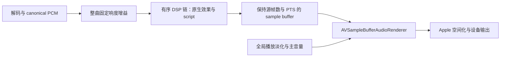

# DSP P6 实施记录

日期：2026-10-09。对应 [DSP 实施计划](audio-dsp-implementation-plan.md) 的 P6。

**本阶段已完成源码接入、静态检查及 2026-10-09 授权 Debug 编译。** App、Xcode 测试目标及 CLI/MCP 与自动化测试目标编译通过；未运行测试或启动 App。数值、CPU、真实输出和第三方 Agent 验收进入 P7。

## 1. 范围与位置

新增 `script` v1 节点，与 EQ、等响补偿和 P5 效果共享 `AudioDSPController`、完整预设与 renderer 应用事务。



脚本处理发生在 Apple 空间化之前。没有新增 AVAudioEngine 路径、独立播放时钟或 UI 音频 tap。全局淡化、整曲响度均衡、设备聆听参考继续由既有 owner 管理，不随 DSP 预设保存或切换。

## 2. 编译器与运行时

App 内置 Swift 编写的 DSP 专用语言编译器与 VM；源码经过词法、语法、符号、参数、格式、状态容量和成本检查，生成不可变执行计划。语言参考见 [DSP 脚本语言 v1](audio-dsp-script-language.md)。

```text
param gainDB(-24, 12) = 0;
prepare { let gain = dbToGain(gainDB); }
process { output = input * gain; }
```

`prepare` 一次性计算系数。`process` 每个源帧、每个选中声道执行。参数在准备时转换为索引数组，执行阶段不按名称查字典。VM 使用预分配寄存器、声道状态和固定长度延迟环；没有循环、递归、动态用户数组、系统编译器或 I/O。

三元表达式通过只向前的分支实现，未选中的分支不会执行数学运算或推进状态。比较结果为 0/1。每个 `biquad`、`delay`、`smooth` 调用位置拥有独立的逐声道状态；`inputAt` 从进入该节点时的同一帧读取其它声道，不会读到同帧较早声道的已处理结果。

编译产物绑定源码 SHA-256、语言版本、有效参数值和完整输入格式，包括布局数据与标签。编译缓存最多 32 个产物、估算容量 16 MiB；锁仅覆盖查找和存储，解析不在锁内。重启后根据源码重建，不保存或信任旧二进制。

没有实际格式时，只做格式无关的语法、符号和参数检查。含 `inputAt(2)` 或依赖 `sampleRate` 的合法预设不会在冷启动时被默认双声道、48 kHz 拒绝。实际来源准备时再按真实格式校验内存、索引和成本。

### 资源上限

| 项目 | v1 上限与口径 |
| --- | --- |
| 源码 | UTF-8 64 KiB |
| 参数 | 32 个，值须有限且处于声明范围 |
| 词法 / 指令 / 表达式深度 | 8192 / 8192 / 64 |
| 单脚本运行状态 | 4 MiB，按实际格式保守计入声道、寄存器和延迟 |
| 效果链 | 最多 32 节点，其中最多 4 个脚本 |
| 格式 | 8–768 kHz，1–32 声道 |
| 单脚本声明延迟 | 0–2048 源帧 |
| `delay` 长度 | 0–65536 帧，同时受状态预算限制 |
| 单脚本成本 | 每秒 24 M 次加权 VM 运算，按所有输入声道保守估算 |
| 链脚本成本 | 每秒 48 M 次，包含总延迟前瞻在常规 2048 帧输出块上的额外执行 |
| 草稿 / 活动内存缓存 | 最多 32 个节点；磁盘草稿独立保留 |
| 同时处理节点 | 最多 32 个，超限返回可重试错误 |

指令成本至少为 1，常量和跳转也计入；不同运算有权重。链估算为 `源帧脚本成本 × (1 + 总算法延迟 / 2048)`。格式变化导致超预算时，从链尾隔离脚本并报告原因，保留其余可准备的节点。

这些上限约束容量和执行工作量，**不是设备 CPU 保证**。短分块、EOF、状态预热、双链过渡和原生效果仍有额外成本，须在 P7 实测。运行状态上限是单个 runtime 的口径；live、preview 和新旧链切换可能同时存在多个实例，不能把 4 MiB 当成总内存占用。

## 3. 延迟、状态与错误

`latency N;` 声明代码本身已经产生的算法延迟，不再给湿路添加第二次延迟。例如 `latency 64; process { output = delay(input, 64); }` 的实际延迟为 64 帧。省略声明的 `delay` 是有意保留的延时效果。

renderer 沿用 P5 的有界源前瞻，将声明延迟补偿回原 PTS。所有节点延迟串联合成，前瞻上限为 10240 帧。未选中声道及故障后的 dry 旁路只补该节点声明延迟，因此多声道映射保持对齐。EOF 用有限零输入预览；输出源帧数不增加。

预览使用独立状态。标量、滤波器和游标复制；长延迟环只复制预览将读取的窗口，不逐块清零或复制整条长环。同格式 gapless 继续既有状态；seek、格式切换和设备恢复沿用 renderer 重建/reset 语义。实时替换使用既有有限历史预热和交叉渐变，不能重建任意脚本从歌曲起点开始的完整历史状态。

数学、非法索引或非有限/不可表示为 Float32 的脚本输出，使该节点在 64 帧内淡至对齐的 dry，后续节点继续工作。诊断带 code、nodeID、字段路径及可获得的 line/column，在对应音频块到达输出边界后发布状态。

若脚本输出本身有限，但后续 EQ 或 trim 使最终 Float32 输出溢出，则返回原时间位置的**完整源音频块**，锁定本次 prepared chain 的旁路并报告 `dsp.nonFiniteChainOutput`。`dsp.state.processing.chainRuntimeBypassed` 与脚本 `chainBypassed` 状态公开这一情况；修正后 apply/retry 重建链。此路径保证 renderer 不接收非有限 DSP 输出，也不返回混合了两种时间映射的半块音频。

清除错误仅清除历史展示；当前 runtime 故障继续出现在状态中，直到有效替换、重试或既有 reset。没有把错误清除当作恢复成功。

## 4. 草稿、设置与预设

`AppSessionHost` 创建唯一 `DSPScriptController` 并绑定 `AudioDSPController`。前者持有草稿、显式编译与测试活动；后者仍唯一持有有效声音配置。

设置中的脚本卡片包含源码编辑、草稿保存、编译、应用、反射参数、fixture 测试、诊断位置和当前有效节点重试。复用现有设置字体、行间距、胶囊按钮与语义色。

草稿按 nodeID 独立原子保存，带 `revisionString`，写入前检查 CAS。保存语法错误的草稿是允许的；编译失败保留草稿，当前有效代码继续播放。草稿保存失败也保留先前的成功编译结果。

异步结果根据 requestID、草稿 revision、节点身份和输入格式检查过期状态。应用还检查配置 revision；格式或源码变更后需重新编译。保存完整预设包含**有效**源码、语言版本、全部参数、质量、声道策略、顺序、disabled 数据及 trim；未成功应用的编辑草稿独立保存。

## 5. MCP、CLI、Jobs 与 Tasks

| 方法 | 行为 | scope |
| --- | --- | --- |
| `dsp.scripts.get` | 有效节点、保存草稿、参数反射、编译及 runtime 诊断 | audio.read |
| `dsp.scripts.update` | 保存草稿；`apply=true` 编译后经原事务应用；支持 dry-run 与双 revision | audio.write |
| `dsp.scripts.compile` | 保存草稿/有效源码或显式临时源码的离线编译，不改变声音 | audio.read |
| `dsp.scripts.test` | 有界 fixture 的资料库 Job，现代 MCP Tasks 包装同一 Job | audio.write + library.read |
| `dsp.nodes.retry` | 重新校验、启用并准备当前有效节点，支持 dry-run；不应用错误草稿 | audio.write |

排序、参数更新、启停、完整预设保存/导入导出继续使用既有 `dsp.patch` 与 `dsp.presets.*`。普通操作 `requiresConfirmation=false`，继续经过 App 的 scope、控制平面开关、idempotency 和 library/session 策略。

新增资源 `kmgccc://dsp-language` 与模板 `kmgccc://audio/dsp/scripts/{nodeID}`。语言指南随 CLI/MCP 打包，节点资源通过 App IPC owner 读取；源码与注释均作为用户数据，不产生 Agent 操作授权。现有 DSP 状态和预设变化订阅继续使用原 worker，没有承诺脚本资源订阅。

MCP resource、subscription、Tasks 的 caller 别名现已统一接受 App 的 MCP 开关检查。Job 重试读取所属资料库的上下文，并为脚本测试追加 audio.write/library.read，保留其他 Job 的原有权限。

fixture 支持静音、脉冲、正弦、扫频、固定 seed 粉噪，以及短 interleaved PCM。每项输入至多 2 秒，可追加有界延迟尾部；API 最多 5 项，自定义 PCM 最多 65536 样本，需匹配编译格式。测试在 detached utility 任务中执行，每 256 帧检查取消并让出执行。

结果包含 peak/RMS、响应摘要、非有限输出计数、`scriptFaulted`、结构化诊断、声明延迟、脉冲峰位置、加权工作量和实测 elapsed。即使故障隔离使最终输出有限，Job 仍将 `scriptFaulted` 作为失败。

`elapsedMilliseconds` 包括生成信号和统计；`estimatedProcessingMilliseconds` 是工作量除以预算得到的等价时间，不能用作 CPU 预测。合成测试按所有声道执行，不构成真实扬声器布局验收。

Job retrySpec 只保存 nodeID、revision、格式及合成 fixture 参数，不保存代码、参数值或自定义 PCM。重试要求原 revision 未变化。包含自定义 PCM 的 Job 返回 `retrySupported:false`；调用者可重新提供样本创建新测试。

## 6. 文件与验证

主要新增文件：

- `Services/Audio/DSP/DSPScriptCompiler.swift`、`DSPScriptModels.swift`、`DSPScriptRuntime.swift`、`DSPScriptFixtureRunner.swift`。
- `DSPScriptController.swift`、`DSPScriptDraftStore.swift`、`DSPNodeConfiguration+Script.swift`。
- `Views/Settings/AudioDSP/AudioDSPScriptNodeCard.swift`。
- `Services/Automation/AutomationDSPScriptsHandler.swift`、`AutomationDSPScriptFixtures.swift`。
- 协议包 `AutomationDSPScriptDocumentation.swift` 与正式 descriptor/schema；CLI 和 MCP 适配。

生产源码由 Xcode 文件系统同步组纳入；三个新增脚本测试文件已加入显式测试组。已有自动化协议和 IPC 测试文件补充 P6 用例。

| 验证 | 本次证据 |
| --- | --- |
| whitespace、Xcode project plist、UI/文案一致性 | 静态检查通过 |
| 编译 | 授权 Debug `build-for-testing` 通过；CLI/MCP `swift build --build-tests` 通过；本地 MelismaKit 1a46e8a 输入已确认 |
| 测试运行 / 主 App 启动 | 未执行 |
| 新增测试源码 | 编译、参数反射、lazy branch、独立状态、长环预览、格式绑定、Float32 故障、延迟补偿与预算、草稿 CAS、旧协议解码、Job 重试 metadata、控制平面开关 |
| 实机质量与 CPU | 未测量；不宣称无损、低 CPU 或空间音频兼容已验收 |

### 编译验收记录

2026-10-09 修复三类编译问题：`DSPScriptCompiler` 文件末尾缺少闭合括号；fixture 辅助 extension、统计/信号生成/粉噪类型在工程默认 MainActor 下需要显式 `nonisolated`；脚本测试的 `@testable import` 改为实际模块 `kmgccc_player`。

授权命令（只编译与链接，不执行用例）：

```sh
xcodebuild -project kmgccc_player.xcodeproj -scheme kmgccc_player \
  -configuration Debug -destination 'platform=macOS,arch=arm64' \
  -derivedDataPath build/DerivedData-DSP-P6-20261009 \
  -verbose BUILD_EXTENSION_MODE=disabled CODE_SIGNING_ALLOWED=NO build-for-testing
swift build --package-path Dependencies/PlayerAutomation --build-tests
```

本机日志：`build/logs/dsp-p6-xcode-build-retry4-20261009.log`（最终 exit 0 / TEST BUILD SUCCEEDED），`build/logs/dsp-p6-automation-build-20261009.log`（exit 0 / Build complete）。构建各轮组合日志 `dsp-p6-xcode-build-combined-20261009.log` 用于增量依赖输入核查，已通过 `check-melismakit-dependency.sh --require-local --build-log`；实际输入来自 `NativeLyrics/Sources/MelismaKit`。App 和测试 bundle、CLI 二进制已生成。构建仍有既有文件的并发/捕获警告，本次未扩大修改范围。

### P7 接续验收

1. 经维护者授权运行新增数值及竞态用例；编译验收已通过，测试运行尚未执行。
2. 实测 48/96/192 kHz、mono/stereo/多声道，含最大声明延迟、长延迟状态、高成本脚本及频繁预设替换；记录 CPU p95、块处理时间、内存峰值与回落。
3. 主 App 验收编辑、无效草稿、反射参数、快速编译取消、切换格式/来源、故障旁路与重试、预设切走再选回以及重启恢复。
4. 使用真实 Agent 执行 schema → 写无效代码 → 读错误 → 修正 → 测试/取消 → apply → wait audible → 调参/排序 → 保存/选择 → 重启读回；检查 scope、MCP 关闭和 Job revision 冲突。
5. 真实设备验收 gapless、空间音频、输出切换、延迟设置和蓝牙同步。比较到耳结果与 source-time 状态，不能用静态代码或 fixture 峰位置代替设备验收。
