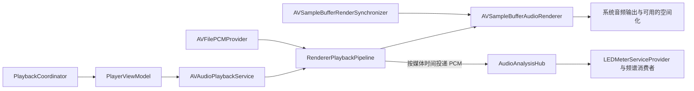

# 本地音频输出统一技术交接

决策日期：2026-10-08。状态：P0 源码迁移已完成；编译与设备验收待执行。实际改动和验证边界见 [P0 实施记录](audio-renderer-p0-implementation.md)。

本文件的迁移前源码事实依据当日最初工作树的只读检查编写，后续实施不覆盖其他任务的改动。第 2 节保留迁移前基线；设备恢复行为尚未在本轮运行验证。

## 1. 已确定的决策与交付范围

App 本地播放全部统一到现有的 `AVSampleBufferAudioRenderer` / `AVSampleBufferRenderSynchronizer` 管线，移除 AVAudioEngine 输出后端及故障回退。正常播放、恢复播放、音频分析和开发用频谱录制均使用 renderer 管线。

`AVSampleBufferAudioRenderer` 可输出普通 PCM 立体声。空间化是系统与输出设备提供的附加能力，普通立体声输出无需 AirPods。文中“renderer”均指这套 sample-buffer 播放管线。

本次实施包含：

- 移除本地播放的 engine、player node、mixer、delay node，以及后端选择和相关分支。
- 保留并完善 renderer 自身的故障恢复；持续失败时停止播放并发布真实失败状态。
- 将 LED、频谱及开发用录制工具统一为 renderer PCM 输入，清除通过 mixer 间接创建引擎的依赖。
- 保持本地播放的现有队列、无缝播放、AAC 裁剪、延迟补偿、输出设备时钟、空间化和资料库生命周期语义。
- 更新相关测试、架构说明和诊断记录。

`AVAudioFile` 解码、`AVAudioPCMBuffer`、Core Audio 设备查询与 `AVFoundation` 继续服务于新管线。Apple Music 与系统 Now Playing 外部来源继续由各自适配器控制；这些来源的音频并不经过本地 renderer，不能因本次迁移被接管。

DSP 均衡器、响度均衡、淡入淡出、脚本与效果链属于后续工作。本次先交付可独立验收的单一播放管线。

## 2. 迁移前源码事实

| 文件 / 符号 | 当前职责与实施关注点 |
| --- | --- |
| `Services/Audio/AVAudioPlaybackService.swift` | `outputBackend` 默认 `.spatialRenderer`，失败时进入 `fallbackToLegacyEngine`；同时持有旧图、旧调度队列、旧时钟和新 renderer 状态。以下路径均相对 `kmgccc_player/`。 |
| 同文件 `finishStart`、`pause`、`resume`、`seek`、`updateProgress` | 按后端分支执行；移除旧分支时保持公共服务接口及播放意图。 |
| 同文件 `scheduleNextSpatial`、`commitSpatialGaplessBoundary` | renderer 的预取、边界提交和资源 lease 管理。继续作为本地无缝播放路径。 |
| `Services/Audio/Renderer/RendererPlaybackPipeline.swift` | 串行队列管理解码、segment、PTS、renderer、synchronizer、分析投递、输出设备切换和恢复。 |
| `Services/Audio/Renderer/AVFilePCMProvider.swift` | 从 `AVAudioFile` 提供 PCM chunk，并按 frame 定位。 |
| `Services/Audio/Renderer/CMSampleBufferFactory.swift` | 将 PCM 转为 interleaved Float32 和 sample buffer；双声道使用标准 Stereo layout tag。 |
| `Services/Audio/AudioOutputLatencyMonitor.swift` | 查询设备 UID 和 HAL 延迟；设备 UID 用于绑定输出时钟，HAL 延迟仅用于诊断。 |
| `Services/Audio/PlaybackScheduling.swift` | `ScheduledItem` / `GaplessScheduleQueue` 描述旧 player-node sample clock。确认调用清零后删除。 |
| `Services/Audio/AudioAnalysisHub.swift` | 当前同时支持 mixer tap 与 renderer PCM；后者当前名为 external feed。 |
| `Services/Audio/LEDMeterServiceProvider.swift` | `getOrCreate()` 调用 `mixerProvider()` 并 attach mixer。即使播放走 renderer，也可能创建旧引擎。 |
| `Services/LibrarySession/LibrarySessionFactory.swift` | 注入 `playbackService.analysisMixerNode`；弱引用失效时还会创建 `AVAudioEngine().mainMixerNode`。必须清除。 |
| `Services/Audio/LEDMeterService.swift` | 提供 `attachToMixer` 转发入口；迁移后移除失去用途的入口。 |
| `Services/Audio/SpectrumRecorder.swift` | 开发用文件播放和频谱导出工具，目前独立创建 engine/player node。迁移到 renderer，保留录制与导出用途。 |

旧回退会停止 renderer、重置无缝调度，从当前文件位置重新安排旧引擎播放。它可能挽救 renderer 特有错误，但不保证故障时仍无缝，也不能保证解决同一文件的解码错误。

现有 renderer 已有三类恢复能力：

1. `handleAutomaticFlush`：处理自动 flush 与输出配置变化，重新定位 provider、重建排队时间线。
2. `detectStall` → `rebuildRendererAndResume`：时钟持续停滞时创建新 renderer，并恢复当前位置。
3. `setAudioOutputDeviceUniqueID`：串行执行暂停时钟、切换设备、flush、补充 PCM 和恢复原播放意图。

目前 `.failed` 状态经 `onFailure` 直接进入旧引擎；现有 renderer 替换方法用于 stall，尚不能据此认为它已验证适用于 `.failed`。

## 3. 目标调用链与状态 owner

- `PlaybackCoordinator` 保持控制命令入口；`NowPlayingPresentation` 保持展示发布入口。
- 服务 owner 继续管理当前曲目、准备请求、队列推进、资源 lease 和公共播放态。
- `RendererPlaybackPipeline` 独占 renderer 时间线、排队 PCM 和恢复事务。renderer、provider 定位、enqueue、flush、设备切换按现有串行队列约束执行。
- `AudioAnalysisHub` 保持唯一分析服务；可视化消费者仍按可见性和播放态启停。移除 mixer 后无需新增另一套 FFT 或分析 owner。
- 重建 renderer 是播放时间线事务；不能产生第二个逻辑播放会话，也不能重复增加播放历史或队列推进。

本轮可保留 `AVAudioPlaybackService` 与已有 `spatial*` 符号名称，避免接口清理扩大为无关重构。文件注释和日志应准确描述 renderer 管线。

## 4. 必须保持的行为

### 4.1 时间线、设备时钟和延迟

- 曲目 frame position、segment PTS、逻辑曲目时间和 synchronizer 时间各自沿用现有含义。恢复使用已提交的有效时间锚点。
- 系统设备切换期间出现暂时无效的时钟值时，沿用现有 `currentSynchronizerClockSeconds()` 的有效锚点处理，避免跳回曲首。
- 保留 `audioLookaheadEnabled` 及现有固定 180 ms 可视化延迟语义。开关关闭为零延迟；开启时通过 renderer 时间线表达，不再使用 delay node。
- 保持 `analysisLeadSeconds` 与 `analysisDeliveryLeadSeconds` 的现有区别。恢复后下一段 PTS 必须保留应用设置的 lead，避免一次设备切换就消除延迟补偿。
- HAL 的设备/stream 延迟只进入诊断。蓝牙输出时钟通过设备 UID 和 synchronizer 对齐，不把 HAL 延迟再次加到歌词、进度、分析或 PTS 上。
- 返回默认输出设备时，保留“创建新 renderer 使用默认设备”的处理。当前实现明确避免给 `audioOutputDeviceUniqueID` 赋 `nil`。

### 4.2 播放意图与异步事件

- 暂停状态下恢复或换设备必须保持暂停；暂停恢复会话不得自行播放。
- 新的 seek、切歌、停止、关闭资料库或终止 App，应使旧的 load/recovery 结果失效。
- 沿用现有 generation/token 和 pending seek 的有效性判断；延迟的失败、自动 flush、进度回调也需要校验对应会话。
- 停止后不能被旧 stall timer 或恢复回调重新启动；替换 renderer 时不得残留旧 observer、feed timer 或排队任务。
- `isPlaying`、进度计时器、分析状态、Now Playing 和实际输出一致。恢复开始或结束不得用一条独立 UI 状态绕过现有 owner。

### 4.3 无缝播放与资源

- 保留 renderer segment 时间线、下一首预取和单次边界提交。正常曲目边界不创建新 renderer，不 flush，不重置播放时钟。
- 保留 AAC priming/padding 裁剪判断及 `resolveAACTrim` 使用的当前元数据规则，不能因删除旧调度一并删掉。
- 保留自动推进资格判断：重复模式、队列变化、next/previous、seek、手动切歌均可能取消待提交边界。
- 曲目逻辑边界可能先于可听边界；延迟尾部完成前保留 outgoing lease。
- 故障恢复跨越当前/下一 segment 时，重新判断可提交边界，防止重复推进、漏曲或提前释放仍会被读取的文件。
- EOF 是正常完成，不能进入故障重试。故障停止也不能伪装成正常播完后自动下一首。

### 4.4 分析与音频格式

- LED、频谱只消费 renderer 的 PCM 投递。按现有分析时刻释放细粒度 chunk，不能把提前解码的全部数据立即送给可视化。
- load、seek、故障终止和资料库切换应清理旧分析数据；暂停时保留现有衰减与空闲挂起行为。
- 保持源采样率、声道数量和 channel layout 语义。此次迁移不新增降采样、强制立体声混音或音色处理。
- 当前 factory 根据声道数选择 layout tag；迁移不扩大声道支持承诺。多声道顺序与源 layout 的对应属于现存待核验边界，遇到问题应单独记录。

## 5. 单一 renderer 的故障策略

用现有错误类型完成最小可用的处理，不为本次迁移引入通用重试框架。

| 事件 | 目标行为 |
| --- | --- |
| 正常自动 flush / 输出配置变化 | 保留现有 renderer 内部恢复和暂停意图；不当作文件失败。 |
| 时钟持续停滞 | 保留现有 stall 检测与替换 renderer 的能力，统一其恢复事务和 token 校验。 |
| `rendererFailed` | 当前有效播放请求尝试一次 renderer 重建与重新定位；恢复成功继续，持续失败停止并发布失败。 |
| `sourceError` | 记录具体源错误并终止该请求；重复创建输出对象无法修复文件读取/定位错误。 |
| `unsupportedFormat` | 终止该请求并记录底层格式或 buffer 创建失败原因；不能无条件循环重建。 |
| 无有效源或 EOF | 区分无效请求与正常完成，各自进入现有对应收尾。 |

“尝试一次”指当前请求发生的同一连续故障：若尚未恢复可确认的正常输出就再次失败，应结束恢复。正常恢复后，后续独立设备变化可以再次恢复。采用现有请求 token 与少量状态即可；不得按每次轮询回调重新计数并无限重试。

具体实施注意：

1. 失败事件携带或关联 renderer/request generation，避免旧 renderer 的失败使新请求停止。
2. 从统一恢复入口捕获媒体锚点、播放/暂停意图、输出 UID、音量、延迟及有效 segments。
3. 创建新 renderer、恢复 observer 与空间化配置，在同一串行事务中定位源并补充 PCM。
4. 恢复真正失败时收尾：停止输出和 feed、取消待执行恢复、结束 pending seek、同步播放与分析状态，按现有资源 owner 释放 lease。
5. 保留曲目身份及有效位置供用户重试；下一次明确播放可以建立新请求。采用现有错误呈现机制和 `Log.audio`，不新增一套播放器错误 UI。

现有 `unsupportedFormat` 也用于 sample buffer 创建返回 `nil`；这个标签可能包含内存/封装创建失败，并非必然说明音源格式不支持。诊断时保留实际创建状态，用户提示不能据该枚举直接断言文件格式错误。

## 6. 实施顺序与删除清单

### 步骤 A：建立基线

- 检查工作树与实际主 App 进程，记录二进制路径、源码版本、输出设备及延迟开关。
- 在现有 renderer 路径记录基本播放、seek、无缝边界、输出切换与分析行为。
- 明确样本的采样率、编码及已知的 AAC 裁剪信息；使用已知连续的专辑片段判断 gapless。

### 步骤 B：完成 renderer 故障收尾和恢复

先把 `.failed` 的处理从 `onFailure → fallbackToLegacyEngine` 改为同一路径恢复或终止，处理重复失败与旧请求事件。保留普通配置变化及 stall 已有恢复语义，避免出现多个互相竞争的恢复入口。

### 步骤 C：清除分析链的 engine 依赖

- `LEDMeterServiceProvider` 移除 `mixerProvider`；创建分析消费者无需索取输出 mixer。
- `LibrarySessionFactory` 移除 `analysisMixerNode` 注入和临时 `AVAudioEngine()` fallback。
- `LEDMeterService` 与 `AudioAnalysisHub` 清除不再使用的 attach/tap 生命周期；保留 shared hub、消费者管理、PCM 输入和可见性 gating。
- 当前 external feed 命名指“从 mixer 外输入 PCM”，与外部播放来源含义不同。可局部改为 renderer PCM feed，并明确 start/stop/session reset 语义。停止 feed 不能再意味着切回 mixer。
- `SpectrumRecorder` 使用同一 renderer/PCM 投递录制；保留样本区间、采集和导出用途，不启动第二个主 App 或改变正式播放 owner。

### 步骤 D：删除旧输出后端

从 `AVAudioPlaybackService` 删除或改写：

- `AudioOutputBackend`、`outputBackend`、`fallbackToLegacyEngine` 与后端选择分支。
- `engine`、`isEngineInitialized`、`playerNode`、`playbackMixer`、`delayNode`、`analysisMixerNode`、`mainMixerNode`。
- `setupEngine`、engine configuration observer、`reconnectEngineAndResume`、`reconnectAudioGraph`。
- 图状态/图 generation 以及 `rebuildPlaybackGraph`、`graphReadyForPlay`、旧 `failPlaybackRequest` 中的 engine 操作。
- `configureDelay`、`resetDelayBufferIfActive`，同时保留 renderer lookahead 设置变更逻辑。
- `scheduleFile`、`scheduleSegment`、`recordCurrentScheduledItem`、旧 node-clock progress 和旧 gapless 提交分支。
- 旧 node completion callback 与旧图诊断；保留 renderer 仍使用的完成 token、drain、预取取消和公共收尾。

`PlaybackScheduling.swift` 中旧 node-clock 类型先确认引用清零，再删除源文件及工程引用。AAC 裁剪、资源 lease、通用 gapless 原因和 smart controller 队列逻辑应逐一按调用者判断，不能按名称批量删除。

### 步骤 E：更新工程、测试和文档

- 检查 Xcode 工程对删除文件的引用；此工程为 Xcode App，沿用当前项目组织方式。
- `SkinLifecycleCompletionTests` 当前为 provider 创建真实 engine/mixer，改为测试消费者生命周期与共享 PCM 分析。
- 保留 `RendererPipelineTests` 现有格式、PTS、跨采样率 segment 和分析粒度断言；添加本次真实改变的恢复与停止语义测试。
- 更新 `docs/architecture.md`：当前本地播放与分析章节仍描述 engine/mixer tap，交付时应改为 renderer/PCM feed。
- 公开文档索引按当时工作树状态合并；当前 `docs/README.md` 已有其他改动，不覆盖它。

## 7. 验收矩阵

| 路径 | 验收要求 |
| --- | --- |
| 内置扬声器、普通有线/USB 输出 | renderer 输出正常立体声；创建 LED/频谱消费者不初始化 engine。 |
| 普通蓝牙设备 | 连续播放、暂停恢复和 seek 正常；设备时钟正确绑定，进度与分析不累计漂移。 |
| 支持空间化的 AirPods | 可用的关闭/固定/头部跟踪模式正常；反复切换后维持音量、位置及播放意图。 |
| 显式设备 → 默认输出、设备断开 | renderer 返回默认设备，暂停时保持暂停；播放时成功恢复或明确失败，无卡死或跳曲首。 |
| 睡眠/唤醒、自动 flush | 有效时间锚点和延迟保留；旧回调不改变新会话。 |
| 延迟补偿开/关 | 保持现有零/180 ms 行为；设备切换或恢复不重复叠加、也不消除延迟。 |
| 普通播放、快速切歌、多次 seek | 最后一次操作生效；暂停中定位后恢复到正确位置；Now Playing 同步。 |
| 无缝专辑与 AAC 样本 | 预取、裁剪、单次队列推进和可听边界正确；延迟尾部期间 lease 有效。 |
| 下一首预取失败 / 队列变更 | 当前曲目正常完成或按真实错误停止，不漏曲、重复推进或错误播放过期预取。 |
| renderer `.failed` / 重复失败 | 恢复预算有效；成功继续，持续失败停止；下次用户播放可以重新建立请求。 |
| 恢复途中 pause/stop/seek/关闭资料库 | 旧恢复不重启播放，不回写旧位置，不访问已释放资源。 |
| 文件读错 / buffer 创建失败 | 明确收尾、播放态与输出一致，不能错误当作正常 EOF 自动下一首。 |
| LED/频谱/皮肤、MiniPlayer、全屏与 Dock | PCM 来自同一管线；暂停衰减、可见性挂起及播放展示正常。 |
| 外部播放来源切换 | 原外部适配器与模拟频谱行为保持正确；返回本地后 PCM owner 正确。 |
| 开发频谱录制 | 采集与导出继续可用，输出不依赖 engine/tap。 |

故障恢复允许出现可听中断；正常无缝边界应连续。验收报告分别记录两种路径，不能把“恢复后能继续”描述成“故障全过程无缝”。

## 8. 验证与交接要求

此次交接文档不代表代码迁移已完成。后续实施若仍涉及跨多个核心子系统的输出与生命周期接口，可在全部实现完成后按仓库重大工程变更标准做一次最终 Debug build-only 编译，并只为修复编译错误再次 build 确认；不运行测试或启动 App。编译型测试和主 App 实测由维护者执行，除非用户在当前任务明确要求。

- 静态检查：`git diff --check`；检索 App 自有源码中的旧输出类型、后端选择、mixer 注入和旧回退日志，解释每个残留引用。
- 重点测试：`RendererPipelineTests`、`SkinLifecycleCompletionTests`、`PlaybackKeyboardSeekTests`、`DynamicAuthorizedSourceRootsTests`，以及新补充的故障恢复/停止/过期事件测试。读取现有测试后再决定如何扩展；CodeGraph 的间接 caller 覆盖不能当作恢复路径已测。
- 当前 `RendererPipelineTests` 主要覆盖 Stereo layout、sample 精确 PTS、PCM 切片、跨采样率时间线、非零起点和分析粒度，尚未直接证明设备故障恢复。
- 维护者进行主 App 实测前运行 `./scripts/check-app-process-state.sh`；使用 `./scripts/build_and_run.sh`，确认精确 PID、启动二进制及只有一个主进程。重大改动的最终 build-only 许可不授权 Agent 启动 App；Agent 仅在用户明确要求本轮主 App 实测并授权构建时才运行该入口。
- 构建遵守 `./scripts/check-melismakit-dependency.sh --require-local` 前置，确认实际输入来自本地组件。
- 单元测试不能替代设备播放、蓝牙时钟、空间模式和可听 gapless 验收。完整 `verify.sh` 由维护者在合并/发布阶段手动执行；重大改动的最终编译许可不包含它，Agent 仅在用户明确要求本轮运行时才执行。

交接完成条件：App 本地播放及分析/开发播放入口无 AVAudioEngine 依赖；公共播放命令单一路径；恢复与终止可预测；验收矩阵逐项记录通过、失败或未覆盖的设备条件；架构文档与实际代码一致。

提交与最终报告应给出改动范围、真实测试结果、设备/系统条件、日志或截图位置及未覆盖边界。保留其他并行工作树改动，不跨公开与私有仓库混合提交。

## 9. 后续 DSP 的接入边界

完整实施方案见 [Renderer 音频 DSP 实施计划](audio-dsp-implementation-plan.md)，覆盖参数 EQ、等响补偿、声音效果、可编程节点、完整预设与实时切换、全局淡入淡出/固定响度均衡及 MCP/AI 控制。本次统一迁移仍先独立完成本文件的验收，再按 DSP 计划推进。

单一 renderer 稳定交付后，DSP 可接在 `enqueueOneChunk` 取得 canonical PCM 后、创建 sample buffer 前。处理后的同一份 PCM 供输出及分析使用，分析投递仍沿用现有时间调度。

DSP owner 应位于连续播放管线，避免每换一个 provider 就重置滤波状态。seek、格式改变和故障重建需要明确的 reset 策略；带算法延迟的效果另行设计 PTS/分析补偿。当前迁移只明确边界，不添加 DSP 节点或预留未使用框架。

## 10. Apple 参考资料

- [AVSampleBufferAudioRenderer](https://developer.apple.com/documentation/avfoundation/avsamplebufferaudiorenderer)
- [allowedAudioSpatializationFormats](https://developer.apple.com/documentation/avfoundation/avsamplebufferaudiorenderer/allowedaudiospatializationformats)
- [Implementing flexible enhanced buffering for your content](https://developer.apple.com/documentation/avfoundation/implementing-flexible-enhanced-buffering-for-your-content)
