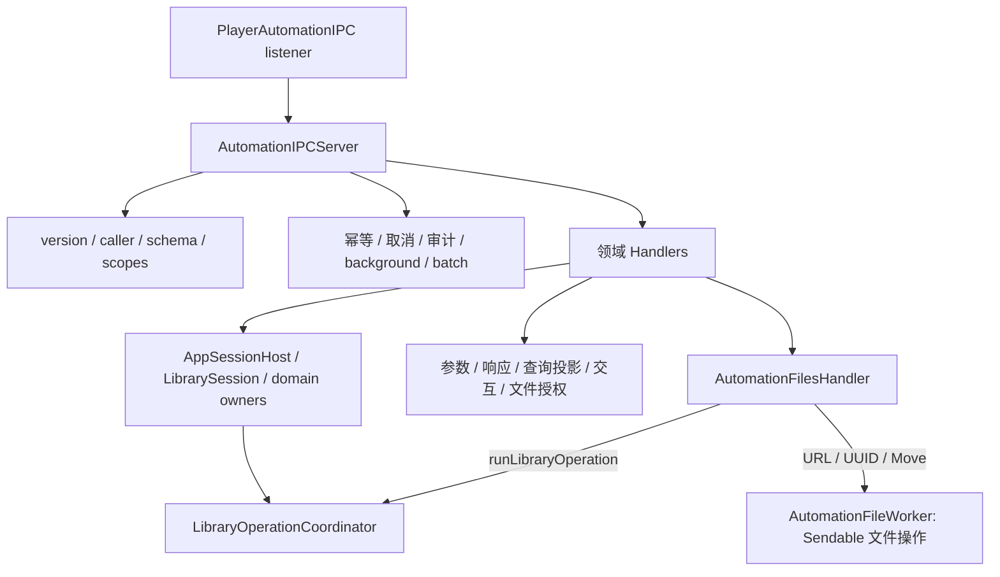

# Automation Server 架构审计与重构

## 范围与行为基线

审计对象是 App 内 Automation 执行层；PlayerAutomationProtocol 的 catalog/schema、CLI、MCP 和 AF_UNIX transport 均保持原状。基线工作树干净。原文件 12,978 行，execute 从 687 至 7,618 行。行数仅用于定位，拆分依据为调用链和状态 owner。

调用链：AppSessionHost 创建一个 AutomationIPCServer → listener 的 cancellableHandler → handle → execute → LibrarySession / AppSessionHost / LibraryViewModel / PlaybackCoordinator 等现有 owner。传输包验证 peer/secret、处理 framing/EOF；Server 不重建传输、认证、数据库或 Job 框架。

## 原职责与迁移目标

下表行号是重构前的位置。

| 原区域 | 职责与实际依赖 | 迁移目标 |
| --- | --- | --- |
| 10–387 | TaskLocal、App identity、scope/idempotency/selection persistence、storage backup models/retention | 请求编排、策略持久化、Selection store、Storage 各自文件 |
| 388–686 | listener、weak host、候选缓存、幂等等待者、start/stop/handle | Server 保留 listener/幂等；候选缓存进入各领域 |
| 687–824 | version、caller 开关、未知参数、动态 scope、background 包装 | Server 保留校验顺序 |
| 855–2165 | registry/lifecycle、import、query/report、bundle export、selection | Library Handler；生命周期仍走 Host，导入/bundle 仍走 Session |
| 2166–3735（交错） | Playlist mutation 与 Source 管理/配置交换 | Playlist / Source Handler；mutation 不绕过 ViewModel 事务 |
| 3736–4095 | 授权媒体解析、inspect/reveal/export/rename/move/delete | Files Handler；授权路径 helper 供 embedded/bundle 共用 |
| 4096–4346 | 播放命令与队列预览/修改 | Playback Handler；Coordinator/PlayerViewModel 仍是 owner |
| 4347–4540 | History 读取、统计、确认清空 | History Handler；复用 PlaybackHistoryStore |
| 4541–4972 | Artwork target、候选、revision、图片输入/应用 | Artwork Handler 独占有界候选缓存 |
| 4973–6028 | Metadata 文档、provider、entity patch、embedded tags | Metadata Handler；复用 provider、MP3 服务与 mutation owner |
| 6029–6438 | Lyrics 搜索/cache、质量、apply/clean/refresh | Lyrics Handler 独占候选缓存；写入仍走 Session |
| 6439–6731 | Job 观察/等待/取消/重试 | Jobs Handler；Coordinator 继续拥有工作及持久历史 |
| 6732–7508 | diagnostics、settings/audio、storage | Settings 与 Storage Handler；storage helper 跟随 Storage |
| 7509–7618 | capability/scope 授权与撤销、未知方法 | Server |
| 7620–12743 | 参数/响应、领域 helper、query、审计、background/batch、文件授权 | 随领域迁移；共享 helper 只承担窄职责 |
| 12745–末尾 | typed 参数解析、参数与文件错误 | 独立参数与错误定义 |

跨领域复用的真正边界：有序 Track ID 解析、曲目过滤/排序/Selection revision、Track/Playlist 投影及歌词状态、授权媒体路径、响应编码/错误映射、App 前台 picker/确认、Job summary。不让 Handler 调用另一 Handler。Playlist Selection 原本再次调用 execute，需保留 Server 校验再执行 Playlist 子操作。

## 必须保持的约束

- 幂等 replay/pending coalescing 在 execute 之前，指纹包括 Library/principal/caller/params；只缓存成功写操作/后台提交；重放改 requestID 保留原 serverTime。相同 key 不同指纹返回 invalidRequest。等待者共用响应，取消提交者不得误取消共享 Job。
- 所有正常请求、background/batch 子请求都经过相同 version/caller/schema/scope 校验。dry-run 的写 scope 豁免、history 条件 scope、导入/重试附加 scope 保持。
- activeSession 对 request.libraryID 校验；Job/候选/Selection 均有原有资料库归属。异步等待与搜索之后现有 identity/revision 校验继续保留。
- mutation 的 revision、preview、confirm=true 与 App 前台确认次序、阈值、原错误文案/结构保持。不给已有简单操作增加确认门槛。
- LibraryOperationCoordinator 拥有取消、quiesce 和持久 Job；批次仅允许原有 Metadata/Artwork/Lyrics 方法，逐项持久化结果，聚合确认通过 TaskLocal 传递。
- jobs.wait 取消只结束等待；已返回 Job 显式由 jobs.cancel 管理。刚提交且没有幂等等待者的 Job 保留原请求取消传播。
- 只传 Sendable 值跨后台边界，不传 Track、ViewModel、SwiftData 或 scope owner。目的目录 scope 成对开始/结束；来源授权由现有 Session 保持，切库必须等待在途复制完成。

## 实际问题与暂缓项

- 已确认 files.export 在 @MainActor execute 内执行同步 copyItem，最多 500 首；同步 existence/唯一文件名检查也位于同一循环。原分支未注册 Library operation，移出主线程会新增切库可重入窗口，必须同时纳入现有 operation owner。
- file rename/move 的 applyFilePlans 虽在 runLibraryOperation 内，闭包仍在 MainActor；不能认为 async 即后台 I/O。
- 主线程还有图片直读、ImageIO resize/base64、Selection/幂等/审计持久化、diagnostic sidecar 查验、query/report 遍历/序列化。Storage inventory/backup/diff 已有 nonisolated 后台值操作；embedded metadata 复用 extractor/MP3 service。逐项优化需要独立 snapshot/授权/取消设计，不能统一 Task.detached。
- execute 与 AutomationParameters 都检查未知参数；全局检查优先于 scope，领域 parser 还保护内部调用。本轮保留顺序和 parser 合同；不为微小性能收益改变错误优先级。
- Artwork 与 Metadata 的 entity target 解析形似但允许参数和错误不同；保持独立。响应编码/错误已集中，迁移不再复制它们。
- 幂等 replay 在授权重新检查之前，长期 cache 的授权撤回语义需要专门决策。本轮不改变既有行为。
- Lyrics cache 当前以 Track ID 索引，未像 Artwork candidate 显式保存 Library/revision；不同库相同 UUID 的语义与 TTL 属于后续兼容性议题。
- AppKit runModal 保留现有交互语义；其在途取消不等于面板取消。未把 legacy MCP 兼容删作死代码。
- 部分公开入口和私有 Phase 1 文档仍描述早期只读/MCP 能力，最新实现审计与源码才是本轮基线。文档修订限定本次边界。

## 分阶段实施与回滚

A：审计并建立当前协议测试、App 定向测试基线，提交本计划。

B：原样迁移参数、响应、前台交互、持久化与共享查询/路径辅助。只为跨文件使用调整到 module internal；领域私有方法继续 private。不增加 public API，使用 Xcode 已有 Services synchronized group。

C：逐领域迁移原 switch 分支及其私有 helper/cache；Server 用显式 method 分组分发。后台/batch 保留请求层协调，Playlist 子请求使用窄 execute 闭包，避免 Handler 互相依赖。核对每个原 case 与迁移 body，运行协议/定向 App 测试并提交。

D：单独修复文件复制/移动阻塞，以串行后台文件 worker 执行同步磁盘操作。请求/operation 等待实际 I/O 完成再释放 scope；保留既有文件操作取消行为，不强行中断 copyItem；取消后仍等待已提交 I/O 完成再释放授权。覆盖命名冲突、逐文件失败、取消、scope/operation 等待边界。

E：审查 diff、可见性、所有 method 路由、协议包零差异及真实 App 只读 CLI/MCP smoke（条件允许）。只删除迁移后有确证的重复/无效代码；记录剩余运行验收边界。

每阶段使用独立提交，性能提交可独立 revert，结构迁移可逆序 revert；不 reset、不 push、不合并。测试失败先定位阶段内变化，不扩大修改范围。

## 验收矩阵

| 路径 | 自动基线/计划 | 人工或真实 App 边界 |
| --- | --- | --- |
| 协议/传输/MCP | PlayerAutomation 全部测试，现代/legacy smoke；协议源零差异 | 第三方客户端 |
| 全局校验/隔离/幂等 | 临时 Library 的真实 AF_UNIX fixture：无权限、未知参数、旧 libraryID、重放/冲突 | 权限面板、系统 sandbox |
| 批次 | 现有 AutomationJobIntegrationTests：dry-run、revision、distinct targets、持久逐项结果 | 大量实体、真实 provider |
| Job | wait timeout/terminal/cancel；新增资料库切换等待边界 | 重启恢复、GUI 切库 |
| 文件操作 | worker 实际临时文件复制/移动/冲突/取消，主线程可继续执行 | Finder picker、授权拒绝、外部卷、大文件、切库 |
| Metadata/bundle/query | MP3EmbeddedTag、LibraryBundleExport、PreferenceQuery 定向测试 | NCM、外部媒体、真实图像/provider |
| App | 每阶段增量 Debug build/test，本地 MelismaKit 输入检查 | 构建通过不等于全部 GUI/自动化验收 |

## 执行记录

- A：PlayerAutomation 40 项基线通过；App 定向基线 9 项通过（0 失败）。

- B：共享参数、响应、交互、授权文件解析、查询/投影、Job 投影、Session access 和三类持久化已迁移；54 个 helper 与完整 execute body 的归一化比对保持原语句。Debug 编译与定向 XCTest 9 项通过；PlayerAutomation 40 项基线有效，B 的并行复跑停滞，C 阶段串行复跑通过。作用域采用 internal 类型 + private 状态，不新增 public API。

- C1：Playback/Queue、History、Settings/Audio、Jobs 已进入独立 Handler；Debug 编译与原有定向 XCTest 9 项通过。
- C2：其余 8 个领域 Handler 已迁移。98 个原 switch case block 逐块归一化比对保持原语句，仅 helper 限定名与 Playlist 子请求闭包改变；所有原 helper 定义保留，没有基于静态搜索删除旧代码。候选 cache 的数据结构、容量与生命周期不变。跨领域 metadata document / expected revisions 解析归入查询/投影辅助，backup support 路径供 storage 与 audit 共用。
- C 验收：新增真实 AF_UNIX fixture 覆盖 20 个领域读取入口、全局 schema/权限次序、dry-run scope 豁免、旧 Library ID、未知方法、幂等重放/冲突及 Selection→Playlist 子请求。Debug 构建与 11 项定向 XCTest 通过（0 失败）。PlayerAutomation 完整 40 项以 `swift test --no-parallel` 复跑通过；并行测试两次卡在既有子进程退出/EOF harness，未修改协议或测试 runner 来掩盖它。

- D：files.export 的源存在性/唯一命名/复制，以及 rename/move 的建目录、移动与失败回滚进入 Server 持有的串行 AutomationFileWorker。worker 只接受 Sendable URL/UUID/Move 值，未新增 Task.detached、全局单例或数据库 owner。目的 scope 仍在请求内成对持有；export 加入已有 runLibraryOperation，并在 picker 返回后重验 Session identity。所有目标路径、Source membership 与安全相对路径校验继续由现有 MainActor 授权边界执行。
- D 行为边界：复制结果、命名后缀、逐文件失败顺序、原文件保留和移动的逆序回滚保持。新增 operation 登记使 export 在 Job 观察面出现普通 `other` 描述符，响应仍是原 files.export 结果，不改成 Job handle。保持原文件操作对在途取消的完成行为；quiesce/取消等到实际 I/O 结束，不提前结束 continuation 或释放 security scope。
- D 验收：Debug 构建与 14 项定向 XCTest 通过。新增测试用实际文件覆盖并发复制命名、缺失源错误、部分移动失败回滚；挂起 worker 队列验证 MainActor 仍可运行、Library quiesce 发出取消后等待 I/O 完成。真实 Finder 授权拒绝、外部卷与大文件场景仍待人工验收。IPC 全领域读取测试触发一条 main-thread runtime warning，相关领域 owner 尚未归因，不把上述测试视为全 App 性能验收。

- E：execute 缩至 181 行；validateRequest 与 executePolicyRequest 分别承担全局校验和 policy 交互。184 个原 helper body 归一化比对保持原语句，114 个 method 路由与原 Server 完全一致；除有意改变的两个文件 I/O case 外，原分支语句保持。收紧持久化 payload、query 内部 helper 和 weak host 可见性；领域专有 lifecycle/provider 错误映射回到各自 Handler；去除多余 import，修正 Selection snapshot 注释。不删除 legacy MCP、scope schema 1 或任何未确认的兼容实现；没有确认需要删除的旧业务死代码。
- E 自动验收：完整 App Debug XCTest 453 项通过，0 失败；完整 PlayerAutomation 40 项串行执行通过。git diff --check 通过，协议/CLI/MCP/IPC 包源码零差异。增量 XCTest 使用本地 MelismaKit 缓存，日志无新源码编译输入；最终采用独立 DerivedData 的 Debug 构建，实际 local MelismaKit compiler input 检查通过。
- E 真实 App 验收：标准 build_and_run.sh --verify 构建/签名验证/启动通过，确认仅一个主进程、实际二进制路径及真实 Library 主界面。App bundle 内 adapter 完成现代 discovery/tools/resources/tools-call 与兼容 initialize/ping smoke；18 次只读 CLI 调用覆盖 Library/Playlist/Source/Playback/Queue/History/Jobs/Settings/Audio/Storage/Metadata/Artwork/Lyrics/Files 与非活动 Library 拒绝。未对用户资料库执行写入、导出、删除或切换验收。
- 验证输出位于忽略的 build/automation-refactor-20261008/：baseline、各阶段、final-all-tests、package-serial、final-debug-build、final-run、live-mcp 日志及 live-cli-summary.json。并行 MCP harness 停滞的采样仅用于诊断；串行完整测试成功，不宣称该 harness 问题已修复。

## 重构后的模块结构

| 文件 | 最终职责与边界 |
| --- | --- |
| AutomationIPCServer.swift | 1,398 行；listener 生命周期、请求全局校验、显式分发、policy、幂等/审计、batch/background 请求编排；不再包含领域 switch body 或候选状态 |
| AutomationLibraryHandler.swift | registry/lifecycle、import、bundle、Track query/report、Selection；事务/Job 仍由 Host/Session/ViewModel 拥有 |
| AutomationPlaylistHandler.swift | Playlist 读取/交换/成员 mutation；Selection 子操作用 Server 提供的窄闭包回到全局校验 |
| AutomationSourceHandler.swift | Source 配置交换、授权/管理、binding 与扫描入口；只调用现有 Host 服务 |
| AutomationPlaybackHandler.swift | Playback 命令、Queue 状态与预览；不复制播放/队列 owner |
| AutomationHistoryHandler.swift | History 查询/统计/revision、确认清空 |
| AutomationMetadataHandler.swift | Track/entity Metadata、provider、文档、embedded tags 和领域错误；仍较大，保留内聚事务逻辑 |
| AutomationArtworkHandler.swift | target/revision、图片输入、候选搜索/缓存和应用 |
| AutomationLyricsHandler.swift | 候选搜索/缓存、质量、应用/清理/刷新；写入仍由 Session 执行 |
| AutomationFilesHandler.swift | 文件授权/计划/用户交互、结果与 Source reconciliation；不执行同步 copy/move |
| AutomationFileWorker.swift | 实例持有串行 queue，只处理 URL/UUID/Move 值的复制、唯一命名、移动/回滚；无 App/Session/model 状态 |
| AutomationJobsHandler.swift | Job 观察、等待、取消/重试；不持有 Job registry 或新的 task owner |
| AutomationSettingsHandler.swift | Settings/Audio schema、预览/revision、应用；复用现有 settings/audio owner |
| AutomationStorageHandler.swift | inventory/backup/diff、validation/repair、诊断与 backup retention；既有后台执行保持 |
| AutomationParameters.swift | typed 参数解析与稳定错误定义；没有新参数/schema |
| AutomationResponseSupport.swift | 通用响应编码/分类/冲突 envelope，供 Server 和领域共用 |
| AutomationSessionAccess.swift | 仅 weak host、active Library identity 和对应失败响应；无请求/领域状态 |
| AutomationLibraryQueries.swift | 共享过滤/排序/Selection resolution、Track/Playlist 投影、revision 与歌词状态 |
| AutomationFileAccess.swift | 原有 Source membership、bookmark root、相对路径/symlink 校验与授权媒体解析 |
| AutomationInteraction.swift | 原有 App-owned picker 与前台确认；交互文案和取消语义保持 |
| AutomationJobProjection.swift | 共享 Job wire projection |
| AutomationPolicyPersistence.swift / AutomationSelectionStore.swift / AutomationSupportPaths.swift | 小型原有持久化/路径实现，格式与存储位置保持；文件内部 payload 继续 private |

没有添加 Handler→Handler 依赖、领域单例、通用框架或第三方包。跨领域响应和辅助实现各保留一份；迁移后的 Server helper 副本已移除。uniqueExportURL 和移动回滚是迁移到 worker，不能把它们的原位置删除计作死代码清理。

## 尚未解决的技术债务与人工路径

- Metadata/Library Handler 内仍有较长但内聚的分支；后续需围绕文档 import/entity mutation 独立测试再拆，避免把复杂度转成转发链。
- query/report 的大量遍历/序列化、Artwork 直读/转换、Selection/幂等/审计同步持久化、diagnostic sidecar/存在性查询仍可能占用 MainActor。已有线程 runtime warning 尚未归因；本轮没有全 App trace 或大文件吞吐基准。
- 幂等 replay 的授权撤销顺序、Lyrics 候选跨 Library UUID/TTL、runModal 的在途取消，以及并行 MCP 测试退出/EOF harness 保持原有行为，需独立兼容性决策。
- 自动 fixture 验证 dry-run、拒绝、冲突、取消/等待与 quiesce；真实 App 本轮只做读取 smoke。Finder 拒绝/取消、referenced Source scope、大文件/外部卷、GUI 切库、进程重启 Job 恢复、真实 provider/NCM 和 sandbox 分发仍需人工覆盖。worker unit/ownership tests 不等于这些系统边界已经验收。
- 本轮没有 push、合并或发布。六个阶段提交可逆序回滚；性能提交可单独回滚。
