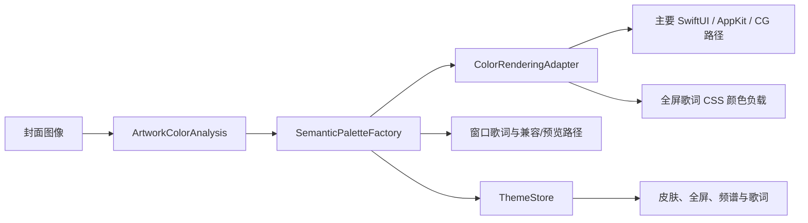

# 色彩系统

kmgccc_player 从封面提取颜色，但界面不直接消费采样结果。图像分析先生成稳定的统计模型，再由 `SemanticPaletteFactory` 映射为按用途命名的语义色。主要原生生产路径和全屏歌词颜色负载经 `ColorRenderingAdapter` 转换；窗口歌词、部分预览和少量兼容路径仍保留各自的出站形式。



## 为什么使用语义色

一张封面可以提供平均色、主色、强调色、亮部、暗部和多个候选色，但这些值不能直接回答“正文应该用什么颜色”或“频谱边缘应该多暗”。语义色把采样事实和界面用途分开，例如：

- 全局强调色；
- 封面上的可读前景色；
- 环境背景色；
- 全屏歌词活动色与非活动色；
- 频谱中心色、边缘色和电平阶梯。

消费者只读取角色，不重新执行封面分析。这样同一张封面在窗口、全屏和歌词中共享语义来源，主题状态由 `ThemeStore` 统一发布。

## OKLab 与 OKLCH

系统在 OKLab/OKLCH 中完成主要的颜色决策。OKLCH 把颜色表示为感知明度 `L`、彩度 `C` 和色相 `H`，比 HSL 更适合做跨色相的明度阶梯、彩度上限和插值。

迁移到 OKLCH 不等于把旧 HSL 数字机械替换成新的 `L` 与 `C`。两个空间的数值没有线性对应关系；黄色、蓝紫和绿色在相同数值下的视觉亮度与可用彩度差异很大。现行策略先定义角色的感知目标，再按色相风险和输出色域做约束。

## 图像分析

`ArtworkColorAnalysis` 保存封面的统计结果，包括显示调色板、显著高光候选、平均亮度、相对亮度、色彩丰富度、主色可信度，以及两个必须分开的判断：

- `isNearMonochrome` 回答封面是否缺少可信色相；
- `isUltraDark` 回答封面是否接近极暗场景。

近黑白封面未必很暗，极暗封面也可能有可信的鲜明色相。把两者合并，会让黑底小面积彩色封面被错误灰化，或让明亮灰阶封面得到并不存在的彩色强调色。

候选色不能只看像素占比。小面积但显著的颜色可能是封面的视觉重点；系统会结合面积、彩度、亮度分布和色相一致性判断候选是否可信。没有可信色相时，语义色进入中性路径，而不是从低彩噪声中放大一个随机色相。

## 语义色生成

`SemanticPaletteFactory` 从同一份分析模型生成各组角色。常见规则包括：

- 按浅色或深色外观把强调色限制在可读明度区间；
- 对高风险色相收紧彩度，避免映射到 sRGB 后发灰或偏色；
- 近黑白输入把彩度压到零，同时保留角色所需的明度层次；
- 调色板不足时优先生成同色相的明度变体，不用无依据的色相旋转补数；
- 歌词、频谱和艺术背景分别使用自己的 tone ladder，不共享一组任意缩放参数。

语义色一旦生成，视图层不再用 `Color(hue:saturation:brightness:)` 或临时 RGB 运算做第二次“修色”。局部装饰可以在最终渲染端微调，但不能回流为主题或可读性判断。

## Display P3 与 sRGB

`ColorRenderingAdapter` 是动态颜色迁移后的主要输出边界。它接收同一份感知颜色决策，为已接入的原生界面生成 Display P3 结果，并同时提供 sRGB 回退。部分 Metal、窗口歌词、预览和兼容路径尚不能据此视为已经完成统一的 P3 输出。

色域映射策略以保持角色顺序为目标。例如频谱中心色通常应比边缘色更亮、更有彩度，歌词活动色应保留对非活动色的层级。若某个高彩颜色先撞到色域边界再被简单裁剪，多个角色可能收敛；当前实现会在输出前按色相和目标色域收紧彩度，并由 SelfCheck、Golden baseline 和人工视觉检查共同验证这些不变量。

全屏歌词路径会接收同时包含 sRGB 与 Display P3 的 CSS 颜色负载。窗口歌词和部分预览仍使用兼容颜色字符串，不能概括为所有 Web 歌词都已完成 P3 迁移。Swift 负责决定角色颜色和透明度；Web 侧完成选择、混合、阴影和动画，不应从 RGB 值反推新的语义角色。

## 主题发布与切歌稳定性

`ThemeStore` 按封面 identity 和校验值去重分析结果。新封面尚未解码或分析完成时，系统暂时保留上一张封面的语义色，而不是立即回到默认强调色；封面图像、identity 和颜色快照准备完成后再原子切换。

这条规则避免切歌时出现短暂的默认色闪烁，也防止多个界面在不同时间看到不一致的主题。语义色发布本身不做隐式插值，具体动画由消费界面根据角色和场景决定。

## 局部可读性

整张封面的平均亮度不能代表文字下方的真实背景。Home Hero 和封面渐变模糊全屏会为最终渲染背景生成亮度图，再在文字或控件实际占用的矩形内评估深色前景和浅色前景。

区域评分使用稳健对比度：计算区域中每个采样点与候选前景色的 WCAG 对比度，再取低分位值，而不是平均值。平均值容易被大片安全区域掩盖；低分位值更能反映“有一部分文字已经看不清”的情况。

```text
候选前景：浅色 / 深色
  → 在每个真实内容区域采样
  → 计算逐点对比度
  → 取低分位稳健值
  → 取所有区域中的最差结果
  → 选择分数更高的前景极性
```

背景使用 aspect-fill 时，界面坐标必须先映射到实际图像坐标；过渡背景还要覆盖开始、中间和结束的代表状态。局部判断只服务对应区域，不能把底部控件的结果借给全屏队列等空间位置不同的内容。

## 缓存与失效

封面分析和局部亮度图都可以缓存，但缓存键必须包含输入图像 identity、算法版本和影响结果的渲染参数。阈值、采样区域、色域策略或语义角色发生变化时，要提升相应缓存版本，防止旧结果继续命中。

缓存命中只代表计算可复用，不代表视觉结果已经通过审美检查。合成样本适合验证不变量，真实封面仍需覆盖浅色、深色、近黑白、极暗、单一色相和小面积高显著色等类别。

## 设计要点

- `ThemeStore` 是颜色状态 owner，视图不自行分析封面。
- near-monochrome 与 ultra-dark 是两个正交信号。
- 主要动态颜色路径逐步经渲染适配器输出；尚未迁移的兼容路径仍使用同一语义来源。
- 局部可读性按实际内容区域评估，不能由整图平均色代替。
- 缓存版本属于算法契约，修改判断规则时必须同步失效旧结果。
