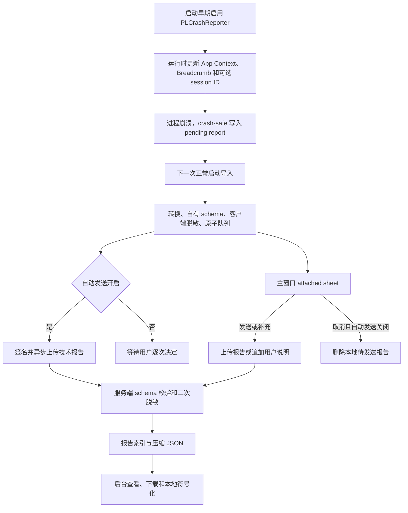

# 崩溃报告与分析

崩溃报告使用独立于匿名使用统计的诊断链路。PLCrashReporter 负责主 App 进程的即时捕获；崩溃现场只写入本地 pending report，不访问网络、SwiftUI、SwiftData 或普通日志系统。App 在下一次正常启动时导入报告，转换成版本化模型，完成客户端脱敏和原子持久化，再按“自动发送崩溃报告”设置异步上传。MetricKit 的 crash、hang 和 CPU exception 使用另一条队列和接口，作为系统侧补充。

这套设计不读取 macOS `.ips`，也不要求用户复制系统问题报告。产品自己的报告已经包含异常、线程、镜像 UUID、相对地址、崩溃前 App 状态和有限的操作记录；与发布构建对应的 dSYM 配合后，可以把 App 地址还原为函数名和源码位置。

## 数据流



客户端的主要组件位于 `kmgccc_player/Services/CrashReporting/`：

| 组件 | 职责 |
| --- | --- |
| `CrashReporterBootstrap` | 配置 PLCrashReporter，检测 debugger，读取和清理 pending report |
| `PLCrashReportConverter` | 把捕获器输出转换为 `CrashReportEnvelope` |
| `CrashReportSanitizer` | 清理路径、凭证、邮箱和 URL 等敏感内容 |
| `CrashReportStore` | 保存投递状态，隔离损坏文件，限制队列容量 |
| `CrashReportService` | 导入、重试、询问和用户选择的状态机 |
| `CrashReportUploader` | gzip、请求签名、技术报告 POST 和用户说明 PUT |
| `CrashBreadcrumbRecorder` | 保存崩溃前 App Context、session ID 和结构化操作记录 |
| `MetricKitDiagnosticService` | 接收并上传 MetricKit crash、hang 和 CPU diagnostic |

PLCrashReporter pending report 只有在自有队列保存成功后才会被清理。上传中断、App 重启和临时网络错误不会丢掉 record；技术报告、询问状态和用户说明全部完成后，本地 record 才会删除。

## 用户选择和投递状态

“自动发送崩溃报告”默认开启，与匿名使用统计分别控制。每份新报告在下次启动时都会显示一次主窗口附属 sheet，用户说明允许留空。

| 设置 | 用户操作 | 技术报告 | 用户说明 |
| --- | --- | --- | --- |
| 开启 | 发送 | 启动后自动上传 | 关联到同一 `reportID` 后追加 |
| 开启 | 取消 | 已上传或正在重试的报告不撤回 | 不上传 |
| 关闭 | 发送 | 用户确认后上传 | 可随首次报告上传 |
| 关闭 | 取消 | 不上传并删除本地 record | 不上传 |

网络错误、限流和服务端临时错误使用持久化退避重试。签名返回 401 时，客户端先尝试重新注册匿名安装公钥；schema、所有权或大小不合法等永久错误会留在本地供排查，避免形成无限请求循环。

崩溃报告和匿名 Telemetry 可以共享一个可选的 session ID。匿名 Telemetry 开启且存在活动会话时，后台能把崩溃时间、前台时长、播放状态和会话恢复摘要放在同一时间轴上；Telemetry 关闭后 session ID 为空，崩溃捕获与用户主动发送仍然工作。

## 报告包含什么

`CrashReportEnvelope` 保存以下诊断信息：

- App version、build、architecture 和主程序 UUID。
- OS version、设备型号、locale 和进程运行时长。
- signal、Mach exception、异常名称与经过过滤的 reason。
- crashed thread、其他线程、数值寄存器和 stack frame。
- binary image UUID、load address、size 和 image-relative address。
- 播放来源、播放状态、当前界面、全屏状态、皮肤和最后操作类别。
- 最近的 lifecycle、playback、presentation、library Breadcrumb。
- 可选 session ID、脱敏版本和替换计数。

Breadcrumb 只接受固定类别、动作和 metadata key，不接收任意日志字符串。它不会记录歌名、艺人、专辑、播放列表名、搜索词、歌词、用户编辑文本或完整文件路径。连续 seek、播放状态和界面状态变化会在短时间内合并，总量和编码字节数都有上限。

客户端和服务端各执行一次脱敏。音乐资料库内路径可以保留经过清理的相对结构，以便定位解析器或解码器问题；资料库外路径不保留 basename、用户名或目录名，只留下扩展名和目录深度等结构信息。Authorization、Cookie、token、secret、password、邮箱以及 URL query/fragment 会被删除或替换。

后台下载的“原始报告”指完整的服务端脱敏 JSON，不是 PLCrashReporter 未处理的二进制，也不是内存转储。

## 捕获范围

主捕获器使用 PLCrashReporter Mach exception handler。`EXC_BAD_ACCESS`、程序 trap、`fatalError`、未处理异常和部分导致进程异常终止的 signal 属于预期覆盖范围。实际行为仍要在无 debugger 的构建中验证，因为 LLDB 会改变异常转发方式；App 检测到 debugger 后会主动禁用 PLCrashReporter，让 Xcode Command-R 保持可调试。

下列故障不能保证由主链路捕获：

- Force Quit、`kill -9`、系统关机、断电和内核崩溃。
- PLCrashReporter 启用前发生的极早启动崩溃。
- 外部 helper、WKWebView WebContent 或其他系统进程的崩溃。
- 被业务代码捕获且没有终止进程的 error。
- 部分内存压力终止、watchdog 和长时间 hang；这些场景主要依赖 MetricKit 补充。
- 崩溃后用户从未再次启动 App，或磁盘无法写入。

## 阅读一份报告

分析时先看身份与异常，再看 crashed thread，最后结合 App Context、Breadcrumb 和 session 时间轴还原前提。下面的命令适用于从管理后台下载的脱敏 JSON：

```bash
REPORT='<下载的 report-id.crash-report.json>'

jq '{
  reportID,
  sessionID,
  occurredAt,
  app,
  system,
  process,
  exception,
  appContext,
  breadcrumbCount: (.breadcrumbs | length),
  breadcrumbs: .breadcrumbs[-20:]
}' "$REPORT"
```

查看 crashed thread：

```bash
jq '.threads[]
  | select(.isCrashed == true)
  | {
      index,
      name,
      queueName,
      frames,
      registers: $registers
    }' \
  --argjson registers "$(jq '.crashedThread.values // {}' "$REPORT")" \
  "$REPORT"
```

分析时重点核对：

1. `exception.signal`、Mach code 和 fault address 能否说明访问错误、abort 或 trap。
2. 是否恰好有一个 `isCrashed=true` 的线程，寄存器属于同一 thread index。
3. crashed thread 中最靠前的 App frame；系统 frame 通常只说明触发点落在内存、dispatch 或运行循环。
4. App frame 的 `imageUUID`、`imageBaseAddress`、`instructionAddress` 和 `imageRelativeAddress` 是否完整。
5. `appContext.lastOperationCategory` 与最后几条 Breadcrumb 是否一致；Breadcrumb 只提供复现前提，不能代替调用栈判断根因。
6. session 的开始、恢复结束时间和崩溃时间是否相邻；恢复摘要可能晚于报告到达。

同一问题的多份报告应优先按异常类型、crashed thread 前几个 App frame 和 image UUID 聚合，版本号、OS 和操作上下文用于判断影响范围。仅凭最后一个 Breadcrumb 给某项功能定责并不可靠，因为真正的崩溃可能发生在异步回调或稍晚执行的任务中。

## 保留 Release 符号

生产 dSYM 默认不上传服务器。Release 构建必须同时提供两个不同的私有归档目录：

```bash
CRASH_SYMBOL_ARCHIVE_DIR='<本地私有归档目录>' \
CRASH_SYMBOL_BACKUP_DIR='<另一份可靠备份目录>' \
./scripts/build_app.sh Release
```

构建会检查 App 主二进制与 dSYM 的 UUID 集合完全一致，生成 `kmgccc_player.symbols-manifest.json`，把 manifest 和完整 dSYM 压缩后分别写入主归档与备份，并验证两份 ZIP 的 SHA-256 一致。两个目录不能相同；同名归档已存在但 manifest 不一致时构建失败，防止覆盖另一个同 build 的符号文件。

已有 App/dSYM 可以单独归档：

```bash
./scripts/package-crash-symbols.sh \
  --app '<path>/kmgccc_player.app' \
  --dsym '<path>/kmgccc_player.app.dSYM' \
  --manifest '<path>/symbols-manifest.json' \
  --archive-dir '<主归档目录>' \
  --backup-dir '<备份目录>'
```

版本号和 build number 不能代替 UUID。重新编译相同源码也可能产生新的 Mach-O UUID；报告、App 和 dSYM 的目标架构与 UUID 必须完全一致。

## 用 dSYM 符号化

先比较报告与 dSYM UUID。报告中的 UUID 可能没有连字符，比较前统一移除连字符并转成大写：

```bash
REPORT='<下载的 report-id.crash-report.json>'
DSYM='<path>/kmgccc_player.app.dSYM'
DWARF="$DSYM/Contents/Resources/DWARF/kmgccc_player"

REPORT_UUID="$(jq -r '.app.executableUUID' "$REPORT" \
  | tr '[:lower:]' '[:upper:]' \
  | tr -d '-')"

echo "report: $REPORT_UUID"
/usr/bin/dwarfdump --uuid "$DWARF"
```

如果 arm64 UUID 不匹配，立即停止。`atos` 可能返回裸地址或错误符号，不能把这种输出写回服务器。

UUID 匹配后，从 crashed thread 取得 App image 的运行时 load address，再逐个解析 App frame：

```bash
LOAD_ADDRESS="$(jq -r '
  [.threads[]
   | select(.isCrashed == true)
   | .frames[]
   | select(.imageName == "kmgccc_player")
  ][0].imageBaseAddress
' "$REPORT")"

jq -r '
  .threads[]
  | select(.isCrashed == true)
  | .frames[]
  | select(.imageName == "kmgccc_player")
  | .instructionAddress
' "$REPORT" \
| while read -r address; do
    printf '%s\t' "$address"
    /usr/bin/atos \
      -fullPath \
      -o "$DWARF" \
      -arch arm64 \
      -l "$LOAD_ADDRESS" \
      "$address"
  done
```

有效输出通常包含 Swift/Objective-C 函数名、源文件和行号。Swift closure、thunk 或优化后的函数有时只显示 `<compiler-generated>:0`，但其相邻 App frame 仍能确定调用者；需要进一步确认时，可以用 `dwarfdump --lookup <unslid-address> "$DWARF"` 查看 compile unit、声明文件和起始行。

符号化结果应保留 thread index、frame index、image UUID、relative address、symbol name，以及可用的源文件 basename 和行号。上传小型结果前再次确认 UUID 和地址都来自原报告；dSYM、源码绝对路径和完整本地归档不应随结果上传。

## Debug 受控验证

普通 Debug 配置使用 `DEBUG_INFORMATION_FORMAT=dwarf`。若要同时验证捕获与独立 dSYM，可建立一个临时的 `dwarf-with-dsym` 构建：

```bash
DERIVED="/private/tmp/kmgccc-crash-e2e-$(date +%Y%m%d-%H%M%S)"

xcodebuild \
  -project kmgccc_player.xcodeproj \
  -scheme kmgccc_player \
  -configuration Debug \
  -destination 'platform=macOS,arch=arm64' \
  -derivedDataPath "$DERIVED" \
  CODE_SIGNING_ALLOWED=NO \
  DEBUG_INFORMATION_FORMAT=dwarf-with-dsym \
  build

APP="$DERIVED/Build/Products/Debug/kmgccc_player.app"
DSYM="$DERIVED/Build/Products/Debug/kmgccc_player.app.dSYM"
```

验证 UUID 后，用 `scripts/package-crash-symbols.sh` 归档这份测试 dSYM。随后从终端直接运行 App，不要使用 Xcode Command-R：

```bash
KMGCCC_CRASH_TEST_MODE=main-segv \
KMGCCC_CRASH_TEST_DELAY_SECONDS=45 \
  "$APP/Contents/MacOS/kmgccc_player"
```

`KMGCCC_CRASH_TEST_MODE` 还支持 `main-abort` 和 `background-abort`；delay 范围是 1–300 秒。前缀环境变量只对这次进程生效。崩溃后不带变量正常启动同一个 App，确认 pending report 被导入、主窗口显示询问、服务器收到报告，再下载 JSON 并使用刚才归档的 dSYM 符号化。

本地队列默认位于：

```text
~/Library/Application Support/<bundle-id>/CrashReports/
```

在用户处理询问之前，可以保存 `Pending/<report-id>.json` 作为客户端状态机样本。该文件外层是投递 record，技术报告位于 `.report`；后台下载文件则直接是技术报告本身，使用 `jq` 时不要混淆两种层级。

受控 `main-segv` 的预期结果是 `SIGSEGV / SEGV_MAPERR`，fault address 为 `0x1`，最靠前的 App frame 应解析到 `DebugCrashTrigger.triggerInvalidMemoryAccess()` 及其调度闭包。若 UUID 匹配却无法得到这些符号，应检查 report 的 load address、instruction address、归档内 DWARF 路径和目标架构。

## 回归要求

修改崩溃模型、App Context、Breadcrumb 枚举或服务端 schema 时，两端必须同时保留兼容测试。客户端已经落盘的旧 record 可能在升级后继续重试，服务端应先兼容旧值，再发布生成新值的 App。

发布前至少完成以下验证：

- 自动发送开启/关闭各自的发送、取消和空说明。
- `main-segv`、`main-abort`、`background-abort` 三种受控崩溃。
- 离线重启、恢复网络、签名重新注册和持久化重试。
- 多份 pending report、已有 attached sheet 和原生全屏切换。
- 报告下载、完整匿名安装关联、用户说明和 session 恢复时间轴。
- 一份真实报告与 Release dSYM 的 UUID 比对和本地符号化。
- 报告中没有资料库外文件名、用户名、凭证、URL query、媒体名称、搜索词或用户输入。

MetricKit 的真实系统投递由 macOS 决定，不能用 PLCrashReporter 受控入口代替。后台必须明确显示报告来源；跨来源精确归并没有足够证据时，应保留两份记录及其候选关联，避免错误合并。
