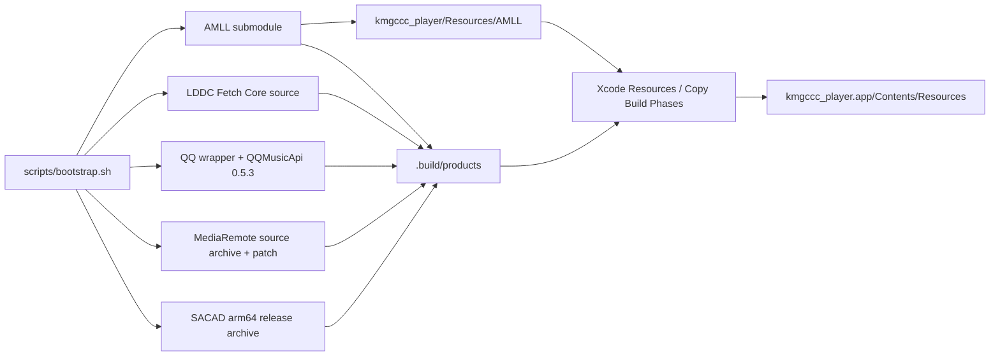

# 外部依赖与运行组件

本文记录 App 实际打包的五个外部运行组件。版本和路径以 `.gitmodules`、`scripts/components/`、各组件构建脚本及 `kmgccc_player.xcodeproj/project.pbxproj` 为准。

## 依赖总表

| 组件 | 用途 | 固定来源 | 管理方式 | 构建产物 | App bundle 位置 | 许可证 |
| --- | --- | --- | --- | --- | --- | --- |
| AMLL | TTML 解析和歌词渲染 | fork commit `91939107e9ec338c20c5a6a672e4d894868ecf2f` | Git submodule | `.build/products/amll/`，并同步四个生成文件到 `kmgccc_player/Resources/AMLL/` | `Contents/Resources/AMLL/` | AGPL-3.0-only |
| LDDC Fetch Core | 多来源歌词搜索、获取和格式处理 | LDDC commit `84631e8cd011fcc3f71ca0ae017e2c9758958ffc`，本地派生包 `0.1.0` | 主仓库版本化源码 | `.build/products/lddc/` | `Contents/Resources/Tools/lddc-server/` | GPL-3.0-only |
| QQ Music Helper | QQ 音乐元数据和封面候选 | QQMusicApi `v0.5.3` / commit `1f03867fafdb5481d4479e01d9f38aea9eccf15a` | 固定 PyPI 版本和主仓库包装层 | `.build/products/qqmusic-helper/` | `Contents/Resources/Tools/qqmusic-helper/` | GPL-3.0-or-later；包装层随主仓库 |
| MediaRemoteAdapter | 读取和控制系统外部播放 | commit `3ac3d4bdf862c7b5399b4fba4df5689f5c38609a` | 固定源码归档下载 | `.build/products/mediaremote/` | `Contents/Resources/mediaremote-adapter/` | BSD-3-Clause |
| SACAD | 搜索和下载专辑封面 | release `3.0.1` 的 macOS aarch64 归档 | 固定二进制归档下载 | `.build/products/sacad/` | `Contents/Resources/Tools/sacad/` | MPL-2.0 |

工程另用 Swift Package Manager 固定 WhatsNewKit `2.2.1`，revision 为 `6157c77e8be9b3d2310bc680681b61a8d9e290ac`。它由 Xcode 解析，不属于本文的外部可执行组件。

## 构建和打包流程



`.build/downloads/` 保存已校验的下载归档，`.build/sources/` 保存展开的第三方源码，`.build/work/` 保存虚拟环境、CMake 和 PyInstaller 中间文件，`.build/products/` 是 Xcode 复制外部可执行组件时使用的唯一产物根目录。AMLL 稍有不同：生成文件先进入 `.build/products/amll/`，再同步到版本化的 App 资源目录，Xcode 随整个 `AMLL` 文件夹复制。

## AMLL

- 用途：解析 TTML，并在 WKWebView 中用普通 DOM `LyricPlayer` 渲染窗口歌词、全屏歌词和预览歌词；独立 background bundle 供 Apple style Mesh Gradient 使用。
- 上游与 fork：[amll-dev/applemusic-like-lyrics](https://github.com/amll-dev/applemusic-like-lyrics) 是上游；App 使用 [kmgcc/applemusic-like-lyrics-kmgcccplayer-integration](https://github.com/kmgcc/applemusic-like-lyrics-kmgcccplayer-integration) fork，父仓库固定 commit `91939107e9ec338c20c5a6a672e4d894868ecf2f`。
- 本地修改：有。fork 包含 App 专用 browser bundle 入口和少量无法放在适配层的 renderer patch；App 主仓库还维护 `index.html`、`bridge.js`、样式和 timing 预处理。修改 fork core 前应先确认该改动无法放在适配层，并保留退化到上游默认行为的路径。
- 管理方式：`Dependencies/Submodules/AMLLIntegration/` 是 Git submodule；父仓库只记录 gitlink，不直接跟踪 fork 内源码。
- 源码位置：fork 源码在 `Dependencies/Submodules/AMLLIntegration/`；App 适配层在 `kmgccc_player/Resources/AMLL/`。
- 构建方式：`scripts/components/amll.sh` 要求 Node.js 22、Corepack 和 pnpm `11.1.0`，先按 lockfile 安装依赖，再调用 `scripts/sync-amll-from-fork.sh` 构建 core、parser、background 和 CSS bundle。
- 构建产物：`.build/products/amll/amll-core.js`、`amll-lyric.js`、`amll-background.js`、`style.css`；同样的四个文件会同步到 `kmgccc_player/Resources/AMLL/`。不要手工修改这些生成文件。
- App bundle：`Contents/Resources/AMLL/`。其中 `index.html`、`background.html` 和 `bridge.js` 来自主仓库，四个 `amll-*`/CSS 文件来自 fork 构建。
- 缺失时：submodule 缺失或 commit 不符时 bootstrap 失败；生成文件缺失或与产物不一致时 `bootstrap --check` 和 `verify.sh` 失败。若绕过验证生成了 App，歌词 WKWebView 无法完成模块加载。
- 单独验证：`./scripts/bootstrap.sh --check --component amll`。该检查同时验证 submodule commit、stamp、产物和版本化 runtime 文件的一致性。
- 许可证：AGPL-3.0-only；App bundle 中保留 `applemusic-like-lyrics.txt` 和 AGPL 文本。

## LDDC Fetch Core

- 用途：以本机回环 HTTP 服务提供歌词搜索、获取、解析和格式处理，Swift 侧由 `LDDCServerManager` 启动并等待 `/health`。
- 上游来源：[chenmozhijin/LDDC](https://github.com/chenmozhijin/LDDC) commit `84631e8cd011fcc3f71ca0ae017e2c9758958ffc`，该 commit 对应上游 `v0.9.2`。
- 本地修改：有。仓库从上游提取了无 GUI 的 fetch core，增加本地 HTTP 服务、播放器需要的数据模型和 PyInstaller 入口；本地 Python 包版本为 `0.1.0`。
- 管理方式：主仓库版本化派生源码，不是 submodule，也不会在 bootstrap 时重新下载上游源码。
- 源码位置：`Dependencies/Sources/LDDCFetchCore/`；服务入口是 `lddc_server_entry.py`，实现位于 `src/lddc_fetch_core/`。
- 构建方式：`scripts/components/lddc.sh` 调用 `Dependencies/Sources/LDDCFetchCore/build_pyinstaller.sh`，用 arm64 Python 3.12 和 PyInstaller `6.21.0` 生成 onedir 产物。
- 构建产物：`.build/products/lddc/lddc-server` 和 `.build/products/lddc/_internal/`。
- App bundle：Xcode 的 `Copy LDDC runtime` Build Phase 复制到 `Contents/Resources/Tools/lddc-server/`。
- 缺失时：Xcode Build Phase 发现可执行文件或 `_internal` 缺失会直接停止构建。运行时代码只接受 bundle 路径，不会调用系统 Python 或开发目录中的脚本。
- 单独验证：`./scripts/bootstrap.sh --check --component lddc`。该检查确认 stamp、onedir 结构和 arm64 Mach-O 主程序；完整功能验证由 `./scripts/verify.sh` 的构建和 bundle 检查覆盖。
- 许可证：提取代码标记为 GPL-3.0-only；App bundle 中保留 `LDDC.txt` 和 GPL 文本。

## QQ Music Helper

- 用途：按 stdio JSON 协议查询 QQ 音乐的曲目、专辑、歌手和封面候选，结果仍进入共享封面/元数据管线。
- 上游来源：[L-1124/QQMusicApi](https://github.com/L-1124/QQMusicApi) `v0.5.3`，tag 指向 commit `1f03867fafdb5481d4479e01d9f38aea9eccf15a`；构建通过 `qqmusic-api-python==0.5.3` 固定安装。
- 本地修改：不修改已安装的第三方包。`Tools/QQMusicHelper/main.py` 是本项目维护的包装层，负责逐行 JSON 请求、JSON-only stdout 和 stderr 诊断。
- 管理方式：固定 PyPI 版本加主仓库包装层，不是 submodule。
- 源码位置：包装层和构建脚本在 `Tools/QQMusicHelper/`；第三方包只安装进 `.build/work/qqmusic-helper/` 下的临时虚拟环境，不在主仓库长期保存源码副本。
- 构建方式：`scripts/components/qqmusic-helper.sh` 调用 `Tools/QQMusicHelper/build-universal.sh`，实际只构建当前支持的 arm64 产物；使用 arm64 Python 3.12 和 PyInstaller `6.21.0`，随后 ad-hoc 签名。脚本文件名保留了早期的 `universal` 名称，但当前结果不是 universal binary。
- 构建产物：`.build/products/qqmusic-helper/qqmusic-helper` 和 `_internal.bundle/`。
- App bundle：Xcode 的 `Copy QQMusic helper` Build Phase 复制到 `Contents/Resources/Tools/qqmusic-helper/`。
- 缺失时：Xcode Build Phase 直接停止构建。运行时只启动 bundle 中的 helper，没有 Python、venv、环境变量或仓库路径 fallback；helper 不可用时 QQ 音乐候选查询失败，其他封面来源仍由共享管线决定。
- 单独验证：先运行 `./scripts/bootstrap.sh --check --component qqmusic-helper`，再做不访问网络的协议 smoke：

  ```sh
  printf '%s\n' '{"id":"smoke","method":"unsupported","params":{}}' \
    | .build/products/qqmusic-helper/qqmusic-helper \
    | grep -q '"ok":false'
  ```

- 许可证：QQMusicApi 为 GPL-3.0-or-later；本项目包装层随主仓库许可证。App bundle 中保留 `QQMusicApi.txt` 和 GPL 文本。

## MediaRemoteAdapter

- 用途：读取系统正在播放的外部媒体状态，并提供可用的播放控制。运行时由 `SystemNowPlayingProvider` 使用 bundle 内 Perl launcher、framework 和 test client。
- 上游来源：[ungive/mediaremote-adapter](https://github.com/ungive/mediaremote-adapter) commit `3ac3d4bdf862c7b5399b4fba4df5689f5c38609a`。
- 本地修改：有一个版本化 patch，位于 `Tools/MediaRemoteAdapter/unbuffered-output.patch`，只为 Perl stdout 开启 autoflush，避免流式 JSON 被缓冲。
- 管理方式：bootstrap 下载固定 commit 的源码归档，并校验 SHA-256 `111e285e7a8acfb05b7339883e303a360f8a7a9b7acb4f0f5c01b647deb8ceb5`；不是 submodule。
- 源码位置：归档缓存为 `.build/downloads/mediaremote/<commit>.tar.gz`，展开源码为 `.build/sources/mediaremote/<commit>/`，本地 patch 在 `Tools/MediaRemoteAdapter/`。
- 构建方式：`scripts/components/mediaremote.sh` 精确应用 patch，用 CMake 生成 Xcode 工程，再以 Release、arm64、无签名方式构建 framework 和 test client。
- 构建产物：`.build/products/mediaremote/bin/mediaremote-adapter.pl`、`build/MediaRemoteAdapter.framework`、`build/MediaRemoteAdapterTestClient` 和 `LICENSE`。
- App bundle：Xcode 的 `Copy MediaRemoteAdapter runtime` Build Phase 复制到 `Contents/Resources/mediaremote-adapter/`，许可证另放在 `Contents/Resources/Licenses/MediaRemoteAdapter-BSD-3-Clause.txt`。
- 缺失时：Xcode Build Phase 直接停止构建。若运行时资源不完整，`SystemNowPlayingProvider` 会报告 adapter 不可用，系统外部播放入口无法建立连接；代码不会扫描开发目录寻找替代文件。
- 单独验证：`./scripts/bootstrap.sh --check --component mediaremote`。该检查确认固定 source/checksum/patch/toolchain stamp，以及 framework 和 test client 的 arm64 架构。
- 许可证：BSD-3-Clause，许可证来自固定源码归档并随 App 打包。

## SACAD

- 用途：按 artist、album 和尺寸参数搜索并下载专辑封面；下载结果由共享封面候选管线处理，SACAD 不直接写曲库。
- 上游来源：[desbma/sacad](https://github.com/desbma/sacad) release `3.0.1` 的 `sacad_3.0.1_macos_aarch64.tar.gz`。
- 本地修改：无。当前构建链直接使用上游发布的 arm64 可执行文件。
- 管理方式：固定 release 二进制下载，归档 SHA-256 为 `6d0fe6e1f3e494be88a7a3fcf6ae88c998c3c70194d2b4b3749c7fc150c162f7`；不是 submodule，也不在本地编译 SACAD 源码。
- 源码位置：主仓库没有 SACAD 源码目录；源码以同名上游仓库和 `3.0.1` tag 为准。本地只缓存 `.build/downloads/sacad/sacad_3.0.1_macos_aarch64.tar.gz`。
- 构建方式：`scripts/components/sacad.sh` 下载并校验归档，解出 `sacad`、设置可执行权限并写入 stamp，没有本地编译步骤。
- 构建产物：`.build/products/sacad/sacad`。
- App bundle：Xcode 的 `Copy SACAD helper` Build Phase 复制到 `Contents/Resources/Tools/sacad/sacad`。
- 缺失时：Xcode Build Phase 直接停止构建。运行时代码只接受 bundle 中的可执行文件；若文件损坏或不可执行，SACAD 封面搜索返回错误，其他候选来源不由它控制。
- 单独验证：`./scripts/bootstrap.sh --check --component sacad`。该检查确认固定版本/checksum stamp 和 arm64 Mach-O。
- 许可证：MPL-2.0；完整文本随 App 作为 `SACAD-MPL-2.0.txt` 打包。

## 统一检查

新环境和 CI 都从仓库根目录运行：

```sh
./scripts/bootstrap.sh
./scripts/bootstrap.sh --check
./scripts/verify.sh
```

`bootstrap --check` 不下载、不构建，也不做真实在线搜索；`verify.sh` 还会构建 App、运行测试，并用 `scripts/check-app-bundle.sh` 检查上述 bundle 路径和许可证。
