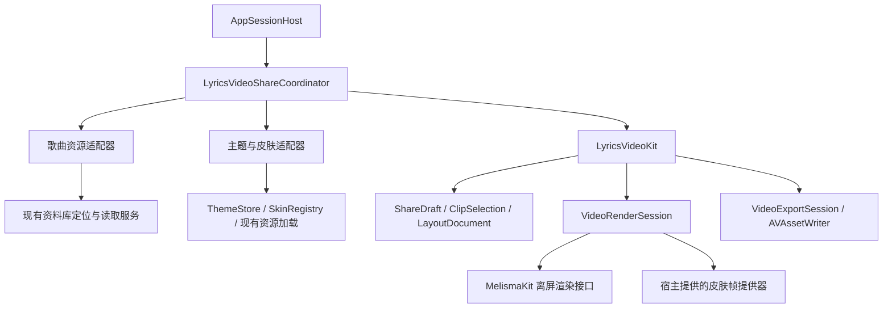

# 歌词视频分享：可行性与实施计划

评估日期：2026-10-05。状态：源码与平台能力评估；尚未实现 MP4 导出，也未测得导出耗时。

## 结论与交付范围

可以实现“选歌词行”和“拖动时间范围”同步，并导出包含音频、原生歌词动画、指定皮肤的视频。离线导出按视频时间计算画面，不必等歌曲实际播放，因此可以快于成片时长。15 秒视频在 3 秒完成属于有条件的性能目标，不能在完成端到端原型之前承诺。

推荐新增独立 Swift Package `LyricsVideoKit`，先放在 `Dependencies/LyricsVideoKit/`，具备独立产品、测试和最小示例，后续可单独分发。播放器提供资源与皮肤适配；歌词排版、时间处理和动画继续归 MelismaKit。初始平台为 macOS 26，不把当前依赖 AppKit 的渲染器包装成未经验证的跨平台承诺。

最终第一版交付应包含：连续片段选择、行/时间轴同步、试听、可调布局、至少一种经过验收的皮肤、H.264 + AAC MP4、保存/系统分享、进度与取消。不能把静态封面视频、没有声音的视频或只通过构建的界面视为完成。

## 当前源码提供了什么

| 当前入口 | 已确认能力 | 仍需完成的工作 |
| --- | --- | --- |
| MelismaKit `LyricsView.swift:243,253,291,434` | 装载、同步与渲染可接收明确时间；可停用自动显示刷新 | 正式离屏像素输出、导出环境、准备完成边界 |
| MelismaKit `LyricsFrame` | 歌词时间与部分几何状态 | 它没有完整文字绘制数据，不能直接作为视频图像 |
| MelismaKit `MelismaKitParity/main.swift:9-45` | 已有 `CARenderer + Metal` 离屏截图路径 | 当前每次捕获重建纹理/渲染器、等待 4 × 20ms、读回 CPU；不能照搬成视频循环 |
| `Skins/NowPlaying/NowPlayingSkin.swift:10` | 皮肤提供背景、封面、叠层的 SwiftUI 视图工厂 | 没有按指定时间渲染视频帧的契约 |
| `Services/Lyrics/NativeLyricsConfigurationMapper.swift:48` | 已有单曲偏移、整体提前量、字体和主题配置映射 | 分享要捕获配置快照；选行区间与导出使用同一份有效时间 |
| `Services/Audio/AudioFilePreparationActor.swift:117` | 已有媒体定位、文件准备和访问租约 | 为导出创建独立读取实例，不能借用正在播放的文件游标 |
| `Services/Audio/Renderer/AVFilePCMProvider.swift:19` | 分块读取 PCM、按采样帧定位 | 在播放器适配层转为模块可消费的音频流 |
| `ViewModels/AppSessionHost.swift` | 集中组合依赖并绑定当前资料库会话 | 在这里接入分享协调器及会话释放 |

当前主工程直接引用本地 NativeLyrics 包。现有业务源码中未找到正式歌词视频分享状态或 AVAssetWriter 导出管线。本次没有执行 App 或导出基准。

## 导出机制与速度

以 15 秒、30fps 为例，需要生成 450 帧。每一帧的输出时间戳为 `n / 30`，音乐采样也按原速写入；生成这 450 帧用了几秒，不会改变播放器按时间戳播放时的 15 秒时长。

```text
歌曲位置 t = clip.start + n / fps
歌词动画时间 = 导出会话的虚拟时钟
视频 PTS = CMTime(value: n, timescale: fps)
音频 PTS = 已裁剪片段内的采样位置 / sampleRate
```

三种时间分别用于定位歌曲、推进动画和安排输出。歌词单曲偏移与整体提前量通过现有 TimingPolicy 生效，不能再加一次。声卡、蓝牙或设备的 `audioOutputDelay` 用于现场播放，不能带入文件导出。

3 秒完成意味着全流程平均达到 150fps，平均每帧的总预算约为 6.7ms；资源准备、音频解码、初始化和收尾也要计入这 3 秒。1080p/30fps 的简单皮肤值得尝试这个目标；复杂模糊、频谱、多重合成、4K/60fps 和冷缓存都会改变结果。原生渲染本身不会自动带来某个固定倍数的提速。

优化按实测瓶颈进行：保持渲染会话、缓存字体与封面、复用像素池、使用 GPU 纹理合成、允许渲染/音频/编码适度并行。不要保存 450 张 PNG 再拼视频，不要在内存保存所有帧，也不要先导出无声视频再进行一次视频重编码。

## 模块边界



建议一个包、两个 library target，以及仅用于原型/基准的 executable target：

```text
Dependencies/LyricsVideoKit/
  Package.swift
  Sources/LyricsVideoKit/
    Selection/       连续片段、有效歌词索引与选区操作
    Layout/          画布、元素位置与布局解析
    Rendering/       会话、图层合成与帧提供器契约
    Export/          音视频写入、进度、取消与输出结果
  Sources/LyricsVideoKitUI/
    Editor/          通用歌词列表、时间范围控件、画布编辑
    Preview/         使用同一渲染会话的预览容器
  Sources/LyricsVideoExportProbe/
                     合成音频、固定歌词、文件检查与性能记录
  Tests/
  Examples/         合成音频与已知歌词的最小宿主
```

`LyricsVideoKitUI` 依赖 `LyricsVideoKit`；核心不依赖 UI target。核心可以依赖 MelismaKit 与 Apple 媒体/图形框架，不依赖播放器的 `Track`、SwiftData、`PlayerViewModel`、`AppSettings.shared`、`ThemeStore.shared`、资料库路径或 App 的 Log 实现。输入均为明确的值快照和资源提供器。

播放器新增 `Features/LyricsVideoShare/`，放协调器、界面宿主、资源适配、皮肤导出适配、预览音频策略。`AppSessionHost` 只组合服务和处理会话生命周期，不承载逐帧循环。导出不进入 `PlaybackCoordinator` 的播放实现，也不进入 `LyricsViewModel` 的实时同步链。通用编辑组件接收样式 token 与操作回调，播放器宿主复用现有面板、按钮和语义色；诊断事件由宿主接入现有 Log 分类。

新包与 App 使用同一个 MelismaKit 依赖身份。实现时检查 Xcode 依赖图和本地编译输入，防止直接依赖和传递依赖形成两套歌词组件；包的公开 manifest 不写开发者机器的绝对路径。

### 最小公共契约

以下是职责设计，名称可在实现时随现有约定调整：

| 类型/入口 | 职责 |
| --- | --- |
| `ShareDraft` | 捕获内容标识、`clipRange`、布局、皮肤标识、歌词配置和导出规格 |
| `LyricSelectionIndex` | 由 MelismaKit 准备后的有效行/组区间建立选择索引 |
| `ClipSelection` | 接收选行或时间范围操作；原子地返回新片段范围及派生行状态 |
| `LayoutDocument` | 保存画布比例和可编辑元素参数；不保存屏幕坐标 |
| `PreparedShareResources` | 不可变歌词、封面、主题、皮肤参数及有明确释放时机的资源句柄 |
| `AudioSampleSource` | 按片段采样范围提供音频；解码与文件游标由单一会话拥有 |
| `VideoSkinProvider` | 描述可导出的皮肤能力并准备按时间生成的图层/纹理 |
| `VideoRenderSession` | 持有独立歌词实例与合成资源，按指定时间渲染；预览与导出复用 |
| `VideoExportSession` | 管理写入、进度、取消、结束时间和文件结果 |

不把通用模块做成播放器服务的转发集合，也不预先建设插件框架、远程渲染服务或复杂持久化任务系统。

## 两种选择如何同步

`clipRange` 是导出范围的唯一权威状态。歌词选中状态从有效歌词时间与这个范围派生，不能用两个 `onChange` 相互修改，造成抖动或循环更新。

1. 选择连续歌词组：用这些组的有效时间区间取并集外包范围，覆盖主唱及关联背景唱词，写入 `clipRange`，时间轴立即更新。默认前后缓冲为 0，需要时由用户加。
2. 拖动时间轴起止手柄：保留用户的准确位置，派生与区间相交的歌词组；显示边界处是否只包含半句。不因为更新歌词选中状态而自动吸附回整句。
3. 提供明确的“按整句调整”操作，用户需要时再将边界扩到完整句。拖动整个选区保持片段长度。
4. 使用半开区间 `[start, end)`，处理歌曲起止、间奏、无歌词段、重叠合唱、相同起始时间和末行时间。空文本与没有有效时长的行不产生可导出的选段。
5. 首版只输出一个连续片段。跨越不相邻的两行时，包含中间时间与歌词；真正跳过中间音乐属于多片段剪辑，另建 edit list 后再做。

索引必须复用 MelismaKit 已准备的时间。新增只读的 prepared-timing API，提供稳定源行 ID、组关系和有效范围；不要在新包复制 TimingPolicy 的偏移、重叠清理和逐词规范化算法。完整原文档保留，显示所选歌词属于展示过滤，不能通过重写 TTML 时间制造截取文档。

初始选区由当前歌曲位置附近的歌词或可用的 15 秒时间段生成。打开分享后，歌曲、歌词、皮肤配置固定为该草稿内容，主播放器切歌不能让正在导出的片段跟着换歌。

## MelismaKit 的最小扩展

1. 增加独立离屏 surface/会话入口，复用现有排版、字形缓存、SpringTrack、逐词遮罩和图层构建。`LyricsFrame` 保留诊断用途。
2. 增加明确的渲染环境：逻辑画布大小、像素比例、色彩空间、交互关闭和准备策略。导出不能偷偷读取当前 `NSScreen` 的 scale/colorSpace，不能受窗口遮挡或鼠标位置影响。
3. 提供 `prepare` 完成边界：布局、字形和图片准备完成后才生成第一个编码帧，不把实时 resize 的分批重排混进导出。
4. 明确初始状态与预滚：片段从中间开始时，根据相关时间线边界和弹簧状态进行确定的预滚，不输出这些帧；导出首帧不意外播放载入/唤醒动画。预览任意定位也通过相同重建流程获得相同状态。
5. 每一帧按递增虚拟时间推进；不能每帧 `seek: true`，那会反复打断弹簧和退出动画。禁止让默认 `CACurrentMediaTime()` 混入影响成片的状态变化；用于测量耗时的真实时钟可保留。
6. 使用会话自己拥有的实例，不加入当前共享播放 snapshot 的广播。正式像素导出接口留在 MelismaKit，视频编解码留在 LyricsVideoKit。

第一技术选择是复用已有 `CARenderer` 路径，保持 renderer 和纹理池，通过 `setDestination` 切换目标纹理。用 `CVMetalTextureCache` 将 IOSurface-backed 像素缓冲转为 Metal 目标；显式处理 layer commit 与 GPU 完成，再交给编码器。可使用 SDK 提供的 `kCARendererMetalCommandQueue` 协調提交与资源同步，不能用固定 sleep 代替完成信号。

这条路径能否稳定高速刷新、正确保留遮罩/滤镜/混合、避免空白或落后一帧，必须先验证。若验证失败，替代方案是在 MelismaKit 内增加离屏绘制后端，共享已有布局与字形结果；不在视频模块复制歌词算法，也不立刻重写整个实时组件。

`LyricsView` 目前为 `@MainActor NSView`。第一实现尊重这一约束，主线程只进行必要的受控逐帧状态更新；文件读取、音频准备和编码移到独立 owner，GPU 同步采用异步完成。`async` 不会自动使 AppKit 工作变成后台工作。若实测显示导出明显阻塞界面，再决定抽取非 View 的共享场景状态或增加独立渲染进程，避免提前扩大架构。

## 皮肤复用与布局编辑

沿用 `SkinRegistry` 的皮肤 ID、名称、配置和资源加载，导出能力通过播放器侧的适配描述登记。每个皮肤声明它支持的画布比例、可调整元素和确定时间渲染能力；不能把实时 `AnyView` 工厂当作已支持导出，也不能默默换成别的外观。

可直接复用的内容包括封面/遮罩等已准备资源、主题语义色、字体、歌词配置及纯绘制/几何计算。必要时将皮肤内已经存在的纯计算拆为小组件，让实时显示与视频适配一起调用；不搬动整个全屏页面。

动态皮肤逐项处理：

- 旋转封面、磁带卷轴：由歌曲时间和固定初相位计算，不依赖 `TimelineView`、显示刷新或 SwiftUI 隐式动画。
- 频谱、LED、节拍背景：从片段及必要的前置 PCM 离线分析，复用现有分析算法，结果按时间索引；不读取当前播放的 `AudioAnalysisHub.shared` 输出，也不安装新 tap。
- 模糊、渐变、合成：使用已有绘制能力建立时间驱动适配，先做像素与速度验证。
- 系统玻璃：视频文件没有桌面采样语义；需实现皮肤内的明确背景合成效果，或把该效果列为当前不可导出。不能保证任意系统材质与窗口截图一致。

布局由视频画布自己的约束解析。首版支持拖动/缩放封面、歌词区域和标题信息，调整歌词字体、行距、对齐、翻译/音译可见性，以及背景参数。随后增加 9:16、1:1、16:9 模板、吸附和布局预设；已有固定几何皮肤先作为可整体移动/缩放的元素，再开放其内部部件。

位置和尺寸使用归一化坐标，字体等用统一的设计单位换算到输出像素。编辑预览与导出调用同一个布局解析器和渲染会话。预览可以降低分辨率，不应换一套排版公式；高分辨率输出需重新生成对应精度的字形，不能放大低清截图。

自由布局范围以声明的元素为准。要把磁带内部任意部件拆开、加入任意用户图层或编辑动画关键帧，是额外的编辑能力，不属于“增加布局参数”可以顺带完成的工作。

## 音频、写入与生命周期

1. 复用当前资料库的媒体定位与访问租约；受管文件与外部引用文件都检查，已经转换的来源复用可读取成果。没有可读取音频文件的外部播放来源，首版不提供有声视频导出。
2. 导出创建自己的音频读取会话和游标，以已有 PCM provider/采样格式处理适配模块输入，不能改变正在播放的 `AVAudioFile.framePosition`。
3. 按采样帧裁剪起止，音频 PTS 从片段 0 开始；写入 H.264 视频和 AAC 音频。保留音乐原速，首版输出源音乐，不自动套用当前设备音量或现场音效链。
4. macOS 26 优先使用 `AVAssetWriter` 的 PixelBufferReceiver / SampleBufferReceiver async append，按编码器背压供帧；先确认当前 SDK 可用性。音频与视频各有受控生产任务，避免一个输入等另一个输入时造成串行等待。
5. 使用有界在途帧数量和像素池；GPU 完成写入之后才提交像素缓冲，编码器使用完成之前不能复写同一缓冲。
6. 设置统一输出时长，处理不足整帧的片段末尾；检查 AAC 编码的 priming/padding，验证解码后的可听起点与音画同步。AAC 不承诺字节级无损，验收以解码后的实际播放为准。
7. `VideoExportSession` 负责 preparing/rendering/finalizing/completed/cancelled/failed 状态与进度。先用当前会话内任务，不建立磁盘任务恢复系统。
8. 导出完成后原子交付文件，再提供保存/系统分享。系统分享入口复用 App 的 UI 风格，失败保留可保存的已完成文件。
9. 取消关闭 writer、删除未完成临时文件、释放渲染资源和访问租约。资料库切换/关闭通过现有会话释放入口取消相关任务并等待释放；渲染循环不持有 SwiftData Track。
10. 试听使用独立、短生命周期的预览会话；发声策略由宿主经 PlaybackCoordinator 协调。离线导出不发声，不把预览时间传入共享歌词或 Now Playing 状态。

## 实施顺序与验收

### P0：真实技术原型，先回答速度和画面问题

预计 1–2 个开发工作日，遇到渲染同步问题需重新估时。

在独立包的最小宿主中，使用已知歌词、合成带定位脉冲的音频、封面和一种简单皮肤，导出 1080×1920、30fps、15 秒 MP4。先跑通整条管线，再消除测试工具中的固定等待与每帧重建。

交付一个可播放 MP4 和简短基准记录：目标机器/系统/构建配置、冷/暖缓存、准备/渲染/音频/收尾耗时、峰值内存、总耗时、正确帧数与时间戳。用 Release 优化构建测速；冷启动至少 3 次，暖缓存至少 5 次，报告中位数与最慢值。

验收必须包括歌词逐词动画、翻译、模糊、遮罩、合唱、间奏和边界换行的实际输出；对比虚拟时间相同的预览/导出关键帧。视频连续无黑帧、无一帧延迟，音频正常速度，解码后时长误差控制在一个视频帧内，定位脉冲音画误差控制在一个视频帧内。简单场景总导出时间需小于 15 秒；3 秒单列为目标并记录是否达到。

如果本阶段未证实稳定像素输出与快于实时，不进入大规模皮肤/编辑器开发。针对结果修复 MelismaKit 离屏边界，而不是用录屏临时替代正式导出。

### P1：稳定公共边界与最小播放器接入

预计 2–4 个工作日。

完成 MelismaKit 离屏入口与 prepared-timing API、包的核心模型与导出会话、播放器资源适配及 AppSessionHost 组合。支持本地可读取音频、连续选段、至少一种现有皮肤的导出适配、保存/分享、进度与取消。

验收：能够从播放器中选定歌曲生成真实有声视频；主播放器切歌、改主题或移动窗口不改变已提交草稿；取消可重新导出；外部引用音频租约全程有效；资料库释放后无悬挂读取。包的最小宿主不链接任何播放器模型。

### P2：同步选段与可调布局，完成首版用户流程

预计 3–5 个工作日。

接入歌词组选择、双手柄时间轴、边界提示、整句调整、试听和可编辑画布。完成 9:16、1:1、16:9 及基本布局预设；支持封面/歌词/标题移动缩放、字体和翻译配置。

验收：选行和时间拖动准确同步且无回弹；行内截断、空歌词段、重叠唱词、偏移和歌曲末尾都能导出；预览与导出的元素位置、折行与时间一致；界面可持续响应，不因导出发生明显长停顿。

### P3：逐个接入现有动态皮肤

每种皮肤分别估时，先从已有资源与纯绘制最多的皮肤开始。

旋转封面、磁带、频谱/LED、复杂背景各自交付时间驱动适配和画面证据。需要离线音频分析时，抽取当前算法的纯计算部分，让实时服务和离线分析复用；不复制整个 AudioAnalysisHub。每接入一个皮肤重新检查视觉与该皮肤的性能，不把简单场景的 3 秒结果扩展为全皮肤承诺。

### P4：集成收尾与真实分享验收

预计 1–2 个工作日，可与 P2 的收尾连续进行。

| 范围 | 必要证据 |
| --- | --- |
| 选择规则 | 有效时间、边界、偏移与重叠唱词的针对性单元测试 |
| 离屏渲染 | 关键帧视觉对比；按虚拟时间重复输出的一致性 |
| 导出文件 | 视频/音频轨、帧率、PTS、时长、正常速度与定位脉冲同步 |
| 性能 | 明确机器、规格和皮肤的全流程基准；冷/暖缓存分别记录 |
| 资源与取消 | 外部引用文件、取消重试、资料库切换/关闭与租约释放 |
| UI | 主 App 的完整选择、编辑、导出、保存和系统分享路径 |
| 现有行为 | 主窗口歌词、系统全屏、窗口模拟全屏、内嵌全屏与皮肤切换回归 |

只写能验证边界行为的测试，不复制 UI 实现来凑测试数量。常规改动不编译；符合仓库重大工程变更标准时，Agent 可在全部实现完成后做一次最终 Debug build-only 编译，并只为修复编译错误再次 build 确认。该例外不包含测试、启动 App 或完整 verify；其余测试与门禁由维护者运行，除非用户在当前任务明确要求。

维护者进行主 App 实测时先核对进程，再使用 `scripts/build_and_run.sh` 入口；重大改动的最终 build-only 许可不授权 Agent 启动 App。Agent 仅在用户于当前任务明确要求主 App 实测并授权构建后才可运行该入口。独立包原型不能替代主 App 分享验收。歌词组件改动保留在 NativeLyrics 仓库，播放器与包接入改动保留在主仓库，各自审查与提交。

P0、P1、P2、P4 合计粗估 7–13 个开发工作日；这是单人有效开发时间估算，不是固定交付日期。复杂皮肤、系统材质替代及不能快速解决的离屏同步问题另计。P0 的结果决定是否需要修正方案和估时。

实现后新增包的基本执行入口如下，当前尚不存在这些新 target，不能把命令写出视为验证通过：

```sh
swift test --package-path Dependencies/LyricsVideoKit
swift run -c release --package-path Dependencies/LyricsVideoKit LyricsVideoExportProbe \
  --duration 15 --width 1080 --height 1920 --fps 30 \
  --output /tmp/lyrics-video-probe.mp4
```

Probe 默认生成具有已知时间定位点的音频与歌词，并检查输出轨道、时间戳、时长和耗时；它服务于 P0 和后续皮肤基准，最终 UI/试听/系统分享仍在主 App 中验收。

## 平台依据

- Apple [CARenderer](https://developer.apple.com/documentation/quartzcore/carenderer) 提供 Metal 目标与按时间渲染 frame 的接口，适合验证现有歌词图层的离屏路径。
- Apple [AVAssetWriter](https://developer.apple.com/documentation/avfoundation/avassetwriter) 支持将媒体写入 MP4 等容器；成片播放由媒体时间戳决定。
- Apple [PixelBufferReceiver](https://developer.apple.com/documentation/avfoundation/avassetwriterinput/pixelbufferreceiver) 提供像素池与等待输入就绪的 async append；[SampleBufferReceiver](https://developer.apple.com/documentation/avfoundation/avassetwriterinput/samplebufferreceiver) 提供音频等样本的对应写入入口。
- Apple [ImageRenderer](https://developer.apple.com/documentation/swiftui/imagerenderer?changes=_2) 明确只涵盖由 SwiftUI 渲染的内容，不保证渲染 AppKit/UIKit 提供的视图。现有原生歌词 NSView 需要自己的像素渲染路径。
- Apple [CALayer.render(in:)](https://developer.apple.com/documentation/quartzcore/calayer/render(in:)) 说明了动画与历史组合模型的限制；不能把普通 CGContext 截图当作当前全部滤镜、遮罩和混合模式正确性的保证。

这些资料与当前源码支持可行性结论，不能替代实际 MP4、主 App 流程和性能测试。
