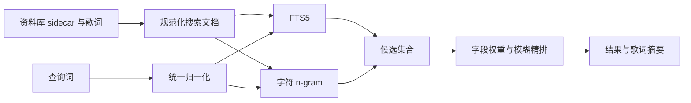

# 曲库搜索

曲库搜索使用持久化 SQLite 索引，同时覆盖曲名、歌手、专辑和歌词。系统以 FTS5 处理全文与前缀查询，以字符 n-gram 补足 CJK、子串和模糊召回，再对候选执行字段加权排序。

## 搜索文档

每首曲目的搜索文档包含原始与规范化后的曲名、歌手、专辑、合并元数据，以及从歌词中提取的可见纯文本。播放次数、最近播放时间和偏好分数只作为轻量同分排序依据，不取代文本相关性。

歌词文件指纹由位置、修改时间、大小和内容哈希组成。文件没有变化时，增量更新复用已经提取的纯文本，避免反复解析 TTML。

## TTML 文本提取

TTML 使用 `XMLParser` 解析。提取器只读取 `<body>` 中歌词 `
` 的可见内容，合并嵌套 ``，把 ` ` 转为换行，并忽略时间戳、属性和标签结构。

损坏文档可以退回保守的标签清理，但正常索引不搜索原始 XML。这样既避免时间属性污染搜索，也能为歌词匹配生成自然摘要。

## 文本归一化

元数据、歌词和查询词使用同一个归一化器：

- Unicode 兼容组合；
- 大小写、变音符号与全角半角折叠；
- 标点和特殊空格归一；
- 保留 CJK、假名、韩文和字母数字；
- 生成无空格紧凑形式，供子串与 n-gram 匹配。

统一归一化能保证写入索引与执行查询时使用相同语义，避免某类文本只在一端被折叠。

## 两阶段检索

第一阶段只负责召回候选。FTS5 执行前缀和 OR 查询，n-gram 负责 CJK、连续子串和有限拼写容错。单字符查询不搜索歌词 gram，防止常见字符召回大量无关曲目。

第二阶段执行精排。主要权重从高到低为：曲名完全匹配、规范化完全匹配、曲名前缀、曲名子串、歌手与专辑匹配、曲名加歌手的组合匹配。歌词匹配可以提供摘要，但不能压过可靠的曲名匹配。

编辑距离和 trigram 相似度只在已召回候选上计算，并且只比较元数据字段。对全库或长歌词逐项计算 Levenshtein 距离，成本高且结果容易受歌词长度干扰。

## 作用域

播放列表、歌手、专辑和全部歌曲页面先提供当前可见曲目 ID，搜索结果与这个集合取交集。作用域是查询条件的一部分，不由视图在结果返回后再次过滤；这样分页、排序和结果数量保持一致。

## 增量更新

索引维护附着在资料库仓库的写入路径上：导入、元数据编辑和歌词编辑在持久化成功后 upsert；删除曲目时移除索引行；资料库重载安排后台全量重建；清除索引缓存后从 sidecar 与歌词资产恢复。

视图只发起查询。把索引维护放回 SwiftUI 会造成多个页面各自维护一套过滤规则，也会迫使搜索期间读取歌词文件。

## 取舍

现行归一化不做简繁转换、假名罗马化或韩文分解，保持实现轻量并减少额外依赖。若增加这些能力，需要同时评估索引体积、增量更新兼容性和旧结果排序变化。

初次加载大型资料库时，首个查询可能等待后台索引 actor 完成重建，但不会阻塞主线程。
