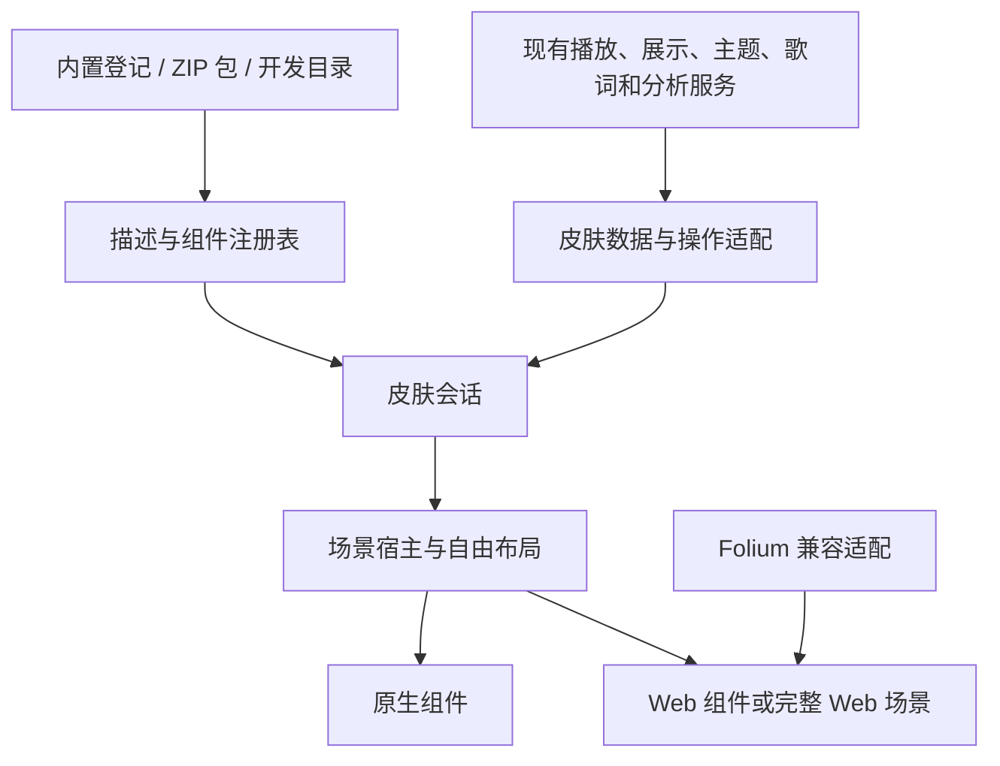

# 皮肤体系演进计划

制定日期为 2026-10-05，源码审查基线为 `f9e4e95b` 与当日工作树。本文覆盖皮肤职责整理、组件组合、自由排版、标准 ZIP 导入、设置内重载、开发工具、Web 效果和 Folium 兼容。P0–P2 的基础实现与 Debug 构建已完成，具体改动与尚未完成的运行验收见[基础重构记录](skin-system-p0-p2.md)。P3 原生组件、场景、自适应样例与原生 ZIP 子集已有代码实现；具体接入和运行边界见 [P3 记录](skin-system-p3.md)。本次审查补齐原生设置内重载、删除和升级参数兼容；Web、开发目录监听与市场继续在后续阶段推进。

本计划以可运行的用户流程推进，每阶段交付可独立使用或验收的结果。涉及效果、交互、默认值和可见行为的选择，由维护者决定；未答问题留在决策表中，进入相关阶段前集中询问，不以推荐项或等待时间代替答案。

## 已确定的方向

- 保留现有播放器特性、内置皮肤和状态 owner，以小范围迁移解除耦合。
- 皮肤以普通 `.zip` 分发，内部采用 JSON、HTML、CSS、JavaScript 和常用素材文件；格式公开说明，提供普通解压后的开发方式。
- 先跑通，再做完整安全评估和针对性加固。首版采用与安装、桥接和运行直接相关的少量防护。
- 现有封面、歌词、背景、mini player 和可视化应逐步成为可选组件，开发者可以选择、排列和组合。
- 支持原生与 Web 渲染，最终验证 Folia/Folium 皮肤与效果的兼容范围。
- 导入入口放在现有皮肤设置中，普通与全屏面板共用包服务。导入加入列表，由用户选择；内置原件保留，导回内置包生成副本；用户包同 ID 时选择替换或另存副本。
- 普通用户以导入、选择和使用为主，只展示少量重要且不涉及位置与排版的参数；允许一个控制联动多个效果，减少需要理解的选项。排版由开发者决定，自动适应窗口；不安排普通用户拖拽排版编辑器。
- Web 可以重绘播放控制栏和 mini player，App 保留独立的退出与恢复入口。
- 皮肤市场作为后续独立阶段，收录开发者皮肤；有新版时，用户可在 App 内点击更新并拉取。
- 内置皮肤同样使用包与组件登记，支持同类组件调用，内置导出按钮置灰，原件内嵌且不能删除；保留原自适应和高清资源机制，进一步开放作者布局。
- 设置保持简洁，作者新增的重要参数呈现在既有“{skinName} 选项”区；开发诊断、接口细节和兼容报告放到开发入口。

这里的自由排版面向皮肤作者。可以只显示歌词、只显示图形，也可以有多个装饰元素、跨区域背景或不同的播放页结构；宿主不再规定每套皮肤必须包含一个封面、一个背景、一个歌词列和一个固定 mini player。

## 当前代码与迁移边界

| 入口 | 已确认的情况 | 本计划处理方式 |
| --- | --- | --- |
| `Skins/NowPlaying/NowPlayingSkin.swift`、`SkinRegistry.swift` | 五个内置皮肤采用背景、封面、叠加层工厂，注册表为静态列表 | 保留旧适配，逐步接入组件和场景契约 |
| `Models/FullscreenPresentationCoordinator.swift` | 固定 `FullscreenSkinID` 枚举参与配置归一化和能力判断，未知 ID 回到 `coverLed` | 注册表提供可用身份和能力，历史枚举仅用于迁移 |
| `Views/Fullscreen/FullscreenPlayerView.swift` | 约 5,700 行，混有布局、皮肤分类、歌词主题、输入与资源生命周期 | 按职责迁移，维持三条全屏路径的行为 |
| `Skins/NowPlaying/SkinContext.swift` | 通用输入中混有磁带和网格背景专用字段 | 通用上下文收窄，专用参数归组件配置 |
| `Models/AudioVisualizationPreferences.swift`、`Models/AppSettings.swift` | 默认值、兼容键和能力分别列出皮肤身份 | 当前默认值由描述统一提供，旧键集中迁移 |
| `Services/Storage/CacheManager.swift` | 回收入口直接调用具体皮肤的缓存清理 | 接入会话资源登记，共享缓存仍由现有服务管理 |
| `Skins/NowPlaying/AppleStyleSkin.swift`、`AMLLMeshGradientBackgroundView.swift` | Apple 风格动态背景已有独立 `WKWebView` | 参考现有装载、可见性、时钟和清理经验，先保留原适配 |
| `Services/Lyrics/NativeLyricsSurface.swift` | 当前歌词通过 App 适配层接入 MelismaKit | 保留原生歌词实现，新增显式选择的渲染后端 |

以上路径均相对于 `kmgccc_player/`。行数只提示维护热点，实施前按当前源码重新确认调用链。

现有 WebView 只绘制 AMLL 背景，不能据此认为已经有可导入的 Web 皮肤平台。当前 [PITFALLS.md](PITFALLS.md) 也规定生产歌词使用原生引擎、背景 WebView 不承担歌词。维护者此次明确提出 Web 效果与 Folia 兼容，阶段 P5 应为用户选择的 Web 皮肤建立独立后端，并在实现落地时同步修订相关约束；现有原生歌词继续由原来的服务管理，不增加失败时偷偷切换的歌词后端。

播放命令继续进入 `PlaybackCoordinator`，展示继续由 `NowPlayingPresentation` 发布，主题继续经 `ThemeStore` / `SemanticPalette`，歌词激活继续经 `LyricsSurfaceManager`，音频分析继续共用 `AudioAnalysisHub` / `LEDMeterServiceProvider`。新服务在 `AppSessionHost.setupDependencies()` 组合；皮肤可请求这些能力的有限适配接口。

## 目标结构



以下名称为职责草案，可随现有命名约定调整。先放在 App 内建立边界，独立 SDK 的抽取留到样例能脱离 App 内部类型运行之后。

| 职责 | 拟议入口 | 约束 |
| --- | --- | --- |
| 身份与发现 | `SkinCatalog`、`SkinDescriptor` | 一处登记 ID、支持模式、入口、版本和默认配置；由实际定义产生选择项 |
| 包安装与版本 | `SkinPackageStore` | 保存安装内容、源位置和版本，处理安装、替换、删除与开发目录关联 |
| 静态数据 | `SkinSnapshot` | 歌曲、封面资源句柄、语义颜色、可访问性和视口；不放具体皮肤专用参数 |
| 实时能力 | `SkinClock`、`SkinAudioFeed` | 分离时钟与分析订阅，避免逐帧重建整个 SwiftUI 场景 |
| 用户操作 | `SkinActions` | 将获准的界面操作送入现有领域服务，不暴露任意对象调用 |
| 场景与排版 | `SkinScene`、`SceneLayout` | 组件树、绘制次序、几何、命中区域和开发者自适应规则 |
| 组件提供 | `SkinComponentProvider` | 通过类型和版本选择实现；组件仅获取自己需要的上下文 |
| 设置 | `SkinSettingsStore`、参数定义 | 按包 ID、皮肤 ID 和显示模式保存配置，声明普通用户可见范围 |
| 生命周期 | `SkinSession` | 准备、挂载、更新、暂停、卸载和资源回收；从属 App 会话与宿主 |
| 渲染 | 原生适配、`WebSkinRuntime`、歌词渲染适配 | 共用数据语义，分别保留各自渲染与资源规则 |

### 控制契约大小

新增字段应先确定消费者和归属。仅磁带使用的色板进入磁带配置，背景网格的流速进入该背景参数；公共快照不继续累加这些字段。组件获取封面、主题、时钟等小接口，开发者扩展通过组件类型登记完成。

能力声明按独立维度组织，例如支持的宿主、布局入口、可用操作和渲染后端。避免建立不断增长的 `isCassetteLike`、`usesAppleLyricsPath` 等皮肤分类，也避免用一个几十个布尔值的描述替换旧分类。必须表达复杂行为时，登记对应策略或组件实现。

包格式版本、宿主接口版本和皮肤作者版本分别记录。宿主明确查询可用能力；新字段应有已说明的兼容语义。未知必需组件或接口版本给出可定位的结果，不用另一种效果假装成功。

普通用户参数与内部渲染参数分开。作者可把若干组件的细项映射为一个有意义的控制，由配置解析或作者实现派生结果；保存用户的控制值，不把每个派生细项都变成一份可独立修改的设置。涉及联动后的效果范围与曲线由作者设计，内置皮肤的联动改造先提交维护者确认。

### 自由布局与组件复用

原生组件逐步提供统一的创建和销毁入口，接收配置、资源、视口、颜色和有限操作。背景、封面、歌词、文字信息、频谱/LED、mini player 和装饰都可选；组件的数量与排列不再由全屏页面写死。各内置皮肤先作为整体或少量组件接入，再按需要开放内部部件。

布局文件由作者编写。拟支持组件树、相对尺寸、锚点、间距、层级、最小/最大尺寸和断点；Web 场景内部使用 CSS 自适应。具体模型经 P3 样例验证后定稿，避免先发明大型布局语言。普通用户无需填写坐标、选断点或修复布局。

同一皮肤可提供不同宿主的场景入口，也可用一套布局响应视口。当前每种内置皮肤的几何先通过旧适配保持，未经维护者确认不统一改成新的比例或排版。原生与 Web 坐标统一说明原点、逻辑点、像素比例和裁剪语义，歌词清晰度与命中位置分别验收。

多个可见歌词组件不能把同一个 `NSView` 挂到不同父视图；需要不同渲染实例共享准备后的数据和同一时间语义。D07 已决定 P3 同一场景单个原生歌词，封面、装饰、频谱和 LED 可以多个。多个频谱组件仍共享已有分析结果，不安装额外 audio tap。

### 保留播放器特性

皮肤提供呈现和获准交互，歌曲来源、队列、资料库、快捷键、系统 Now Playing、Dock、遥测和音频播放继续由 App 管理。皮肤可以选择显示哪些组件，但相关操作的可达方式需由维护者确认。视图中不显示 mini player 与停止播放服务是不同操作。

原生组件共用 `SemanticPalette`，皮肤专用颜色和字体覆盖在局部适配中解析；D15 已允许组件覆盖，并要求遵守减少动态效果偏好。Web 接收可序列化颜色、显示配置和资源 URL，不接收 `ThemeStore` 或 SwiftData 对象。音频接口说明真实分析、外部播放模拟和不可用的状态，不能把模拟频谱宣称为外部播放器的真实频谱。

## ZIP 包草案

普通 ZIP 可用系统工具压缩和解压。P3 已实现根级 `manifest.json`、内联原生场景/参数与常见素材，三个包源文件见[原生开发说明](skin-authoring-native.md)。以下为后续完整格式的目录提案；Web、分文件场景和设置尚未冻结为已发布契约。

```text
example-skin.zip
├── manifest.json
├── preview.png
├── scenes/
│   ├── player.json
│   └── fullscreen.json
├── settings.json
├── web/
│   ├── index.html
│   ├── main.js
│   └── style.css
├── assets/
│   ├── images/
│   └── fonts/
├── vendor/
├── README.md
└── LICENSE
```

按使用方式选择文件。纯原生组合包无需 `web/`，完整 Web 场景也不必重复描述 Web 内部排版。第三方前端库可以随包提供，采用普通 ESM 和静态资源。素材保留常见格式，首版实际支持的图片、字体和视频格式由组件样例确认后列出。

`manifest.json` 的职责为包身份、名称、作者、版本、格式与接口要求、预览和场景入口。场景文件描述组件组合；`settings.json` 描述参数的类型、默认值、可见范围和显示方式。行为与样式采用常见源码文件，缓存和用户配置保存在 App 管理的位置，导出包不携带曲库数据。

第一版提供完整说明、JSON Schema 和可手工修改的样例；不使用加密、专用压缩算法或专有二进制容器。标准 JSON 中的布局与参数仍需要公开契约，常用文件格式不能自动消除接口版本维护。

Folium 包原有的 `mod.json` 和客户端入口由兼容适配识别；是否原包直接导入，或经透明转换后保存，需根据 P7 的兼容结果决定。不能要求作者把 Folium 模组重写成 Swift 才称为兼容。

## 执行阶段

| 阶段 | 可交付结果 | 主要依赖 | 当前状态 |
| --- | --- | --- | --- |
| P0 | 现有行为基线、优先决策、迁移任务 | 本计划与当前代码 | 源码基线、默认值与验收矩阵已记录；视觉基线未完成 |
| P1 | 单一登记入口、收窄契约、新增原生皮肤证明 | P0 | 实现与 Debug 构建完成，样例主 App 启动通过；实际选择待确认 |
| P2 | 职责明确的场景宿主与会话生命周期 | P1 | 拆分与会话实现完成，Debug 构建通过；四类宿主与重复切换待实测 |
| P3 | 可选组件、自由排版和自适应样例 | P2、布局决策 | 原生实现、内置包适配、参数区与 ZIP 子集已接入；Debug 构建及主 App 启动通过，界面交互与视觉待实测；见 P3 记录 |
| P4 | 新用户在设置中导入 ZIP、选择和重载 | P3、导入与更新决策 | 原生本地导入/导出、替换/副本、设置内重载、删除与参数兼容已实现；多版本回退、完整界面验收仍未完成 |
| P5 | 可运行的 Web 组件与原生组合 | P2/P3、Web 交互决策 | 未开始 |
| P6 | 开发目录热重载、预览、文档和打包样例 | P4/P5 | 未开始 |
| P7 | 有明确兼容范围的 Folium 导入与效果实测 | P5/P6 | 未开始 |
| P8 | 功能稳定、完整评估与按需加固 | P4–P7 的实际实现 | 未开始 |
| P9 | 开发者皮肤市场与 App 内点击更新 | P6/P8、市场产品与分发细节 | 后续独立阶段，方向已确认 |

P4 可以先用原生组件组合包跑通完整导入流程，P5 的 Web 包随后接入同一安装入口。P6 的最小预览工具可以随 P3/P5 的样例逐步提供，不必等所有后端完成才改善开发体验。完整 Folium 兼容与市场均不阻挡本地皮肤交付。

### P0 记录现有行为并确定决策

核对普通窗口、系统全屏、窗口模拟全屏和主窗口内嵌中的皮肤选择、配置、切歌、歌词显隐、频谱、背景和退出行为。记录哪些差异属于产品设计，哪些属于待处理缺陷；现有默认值和历史设置键另列迁移表。

按调用链确认全屏宿主、设置协调器、主题、歌词、缓存和输入边界。建立少量代表场景的截图/视频和操作记录；真实可用的曲库与目标 App 是基线前提，不用 Demo 代替。P0 不开展全仓库重构，也不把长时间性能采样加入每次构建。

**完成条件**为皮肤与宿主验收矩阵可执行，P1/P2 的迁移范围明确，实施前的产品问题已有答案或明确归属到后续阶段。可以自主进行调用链审查和不改变行为的准备；涉及未答问题的可见行为停在相应边界。

### P1 统一登记并收窄契约

建立描述与注册的唯一入口，迁移皮肤支持模式、显示名称、默认参数、可视化能力与当前顺序。全屏配置按可用描述解析身份，历史 `FullscreenSkinID` 和默认值映射集中保留为迁移适配，不再承担新皮肤发现。

拆开通用快照、皮肤配置与实时订阅。先在一个简单内置皮肤上验证，再逐个迁移其余皮肤。用户设置迁移保留实际值，不因新默认值覆盖旧选择；特殊皮肤配置留在对应定义中。

增加一个最小开发样例，用来验证扩展成本。允许增加组件/皮肤实现与登记，新增同类皮肤不应再修改 `AppSettings` 的皮肤名单、全屏协调器枚举、频谱默认名单和宿主 ID 分支。示例为开发验证用途，是否进入普通选择列表需另行确认。

**完成条件**为五个内置皮肤保持原有选择与设置，未知/移除身份的既定处理可观察，新样例在支持模式下可以运行。验证配置迁移和路由实际结果，不用源码行数或分支数量作为测试断言。

### P2 迁移宿主职责与资源生命周期

从 `FullscreenPlayerView` 逐项移出布局解析、皮肤内容合成、歌词呈现协调、输入适配和底部控制栏。宿主保留依赖接入、场景组合和当前窗口角色。每次迁移一个职责，配套迁移状态与副作用，避免仅分成多个 extension。

建立皮肤会话，明确准备完成、挂载、更新、可见性、暂停和卸载。皮肤专属任务、纹理、图片派生缓存和订阅经会话登记与回收，共享封面、主题和分析服务仍由原 owner 管理。热重载后来使用同一个生命周期。

保留稳定展示与实时播放时钟的隔离、封面图片和 identity 的原子提交、歌词 surface 接管与旧实例回收顺序。换皮肤只重建需要更新的内容，不顺带重启播放器或曲库。具体过渡、旧画面保留和失败后的呈现由 D09/D10 决定。

**完成条件**为现有皮肤在四类显示环境保持操作与视觉基线，重复切换和退出后没有持续增加的订阅、渲染实例与任务。系统全屏、窗口模拟全屏、主窗口内嵌分别验收；稳定窗口的截图不能代替进出过程。

### P3 开放组件和开发者自由排版

为封面、背景、原生歌词、文字信息、频谱/LED、mini player 与装饰建立组件适配。mini player 的弹窗、hover、快捷操作与播放控制先从全屏宿主解除依赖，歌词实例仍交给统一协调器登记。内置皮肤经 `registerBundled` 作为同类模块登记并开放封面、背景、装饰组件；保留旧视觉与设置适配，内部部件按需要继续拆分。

实现开发者场景描述和自适应布局，验证可选组件、绘制层级、尺寸变化、命中区域和输入路由。样例至少覆盖歌词为主、封面为主，以及与现有左右分栏不同的排版；维护者已批准歌词主导、封面主导与上下布局三个开发样例，单个原生歌词、多个其他组件；宽窄变化由作者布局负责。

普通设置只读取作者标出的少量重要外观参数，支持一个控制联动多个内部效果；不默认展开全部技术参数或增加“更多参数”区域。布局与断点由包内场景负责，用户改参数不会被要求重新调整位置。暂不新增用户布局编辑器。

**完成条件**为改变一套排版主要修改该皮肤场景/实现，宿主无需新增皮肤 ID 判断；可省略封面、歌词或 mini player 的场景能按批准方式使用播放器。宽窄窗口、不同显示比例、歌词字体变化与长文本实测自适应，避免整幅截图缩放造成的假适配。

### P4 跑通 ZIP 导入与设置内重载

新增包安装服务并复用现有设置样式。普通用户从现有皮肤设置选择 ZIP，包进入列表后由用户选择使用；不需要打开开发者工具、编辑 manifest 或手工复制目录。导入后的素材由 App 管理，源 ZIP 被移动后仍可使用。安装元数据为后续市场条目标识、来源和版本保留位置，本阶段不提前加入市场后台。

包经过暂存、解析和资源准备后进入可用登记。同 ID 用户包已决定替换或另存副本，内置包保留原件并导入副本。用户参数按 ID/类型兼容保留，数值限制到新范围，移除选项/类型变化使用新默认；删除正在使用的用户皮肤后相关模式切回默认内置皮肤，播放继续。原生解析/重载失败显示错误并保留已登记实例；多版本回退及 Web 运行错误呈现后续确认。新版本装载失败时保留旧安装内容；最终呈现遵从 D10，不擅自换成另一种皮肤。

设置中的重载作用于当前皮肤运行实例。播放服务、当前歌曲、时间、队列和资料库继续运行，替换准备与挂载采用 P2 生命周期。手动替换、开发文件刷新和市场下载更新分别登记能力；本阶段交付本地导入与重载，维护者要求的 App 内点击更新在 P9 交付。

**完成条件**为首次使用的新用户可完成导入、使用、重启后再使用、更新和删除，实际界面保持简洁。验证损坏 ZIP、同 ID 新版本、源文件移动、重载失败和运行中删除的已决定行为。

### P5 接入 Web 组件和场景

提供面向皮肤内容的 `WebSkinRuntime`。复用已有 WKWebView 使用经验与通用生命周期代码，AMLL 背景原适配继续工作。新运行时装载包内 HTML/CSS/ESM，提供歌曲/歌词数据、封面、主题、显示配置、时钟、音频能力和批准的操作。

静态歌曲和歌词数据按版本交付，播放时钟使用锚点和校正维持连续时间；seek、暂停和恢复有明确事件。频谱按消费者需要提供共享采样，避免逐帧发送完整上下文、逐帧更新 SwiftUI，或者为每个 WebView复制一套分析服务。

验证两种组合能力，具体首版开放范围由 D08 决定。一种在 App 场景中同时使用 Web 节点和原生节点，例如 Web 背景与原生歌词；另一种让 Web 场景自行排版内容，再与 App 的窗口和控制能力组合。Web 重绘 mini player 和控制栏已获准，App 的退出和恢复入口保持独立；具体样式、鼠标、滚轮和快捷键分配在实现前确认。

歌词渲染接入显式后端选择，复用统一输入和时间语义。现有 MelismaKit 保留原生渲染职责；新增 Web 效果自行绘制，App 不复制第二份歌词获取、匹配与来源管理。支持与 native 分层组合时记录透明度、裁剪、Retina 比例和局部交互结果，WebKit 与 Chromium 的效果相容性通过样例实测。

**完成条件**为本地包中的一个 Web 背景和一个 Web 歌词效果在主 App 正常运行，并至少完成一种批准的原生组合。覆盖切歌、暂停、seek、大小变化、隐藏、重载与退出。此时只声明已实测后端与效果，不宣称任意 JavaScript 或任意 Folia 皮肤均可运行。

### P6 形成可独立使用的开发流程

提供开发目录关联、文件变化刷新、手动重载和预览宿主。开发目录改动经合并/去抖后只更新对应皮肤；ESM 和资源版本一起失效，避免界面仍显示旧脚本。编辑中的半写入文件和错误采用 D10 的处理，不传播到播放服务。

预览与正式场景采用同一契约，提供实际歌曲或固定样例、合成音频指标、暂停、seek 和多种视口。作者可在开发入口查看文件位置、参数和错误；普通用户的皮肤选择列表不显示协议版本、性能采样或 bridge 状态。

交付原生组合、Web 背景、Web 歌词和批准的混合场景样例，说明常用组件、排版、自适应、操作与清理方法。包内依赖与打包结果可检查，输出普通 ZIP。文档说明如何从一个样例修改效果、在 App 预览、导出并交给新用户导入。

**完成条件**为一位未参与宿主开发的作者能够按文档完成新皮肤，修改过程中无需修改 App 公共宿主；另一位用户仅凭 ZIP 完成使用。开发文档与打包工具按这个流程修正，新增 SDK 模块以样例需要为依据。

### P7 验证 Folium 兼容

以已有源码审查的 Folia 提交 `1f2c32a5d91afd1446a9ca8e7d4305ca6f9f22ed` 作为初始参考，实施时重新确认目标接口版本。Folia 内置可视化和 Folium 外部分发模组分别评估；前者可能依赖应用内 React 组件和状态，后者有明确的注册与 `mount` 契约。

先实现纯客户端 UI 契约子集，包括 visualizer、background，以及必要的场景上下文、参数、订阅和 disposer。逐字时间、行索引、主题、封面、显示参数和 FFT 数组均列出映射语义；来源、时间单位、歌词可用性和模拟音频不能含糊转换。未实现的必需能力明确报告。

选一个简单 DOM 歌词模组和一个含第三方绘图库的模组做验证，例如官方虹光样例与 52Hz。按授权可用的原包进行导入和运行，记录布局、词级动画、暂停/seek、字体、设置、打包库、WebKit 特性和清理结果。示例的技术选择不决定产品默认外观。

Node/Electron 主进程入口、任意系统文件访问、ffmpeg 调用和 Folia 内部对象依赖不属于纯 Web 兼容；是否增加某项能力另开范围评估，不为追求“全部兼容”暴露整个 App 内部。Folia 代码的 AGPL 与各模组、素材许可分别核对，再决定复制实现、独立适配或单独获得授权；兼容接口不等于自动获得资源分发许可。

**完成条件**为维护一份按模组与能力分类的兼容矩阵，有至少两个不同实现方式的端到端运行证据，普通用户能在批准入口导入受支持的 Folium 包。Folia 内置效果移植另列任务，宣传范围与实际覆盖一致。

### P8 完成功能评估并按需加固

在导入、自由布局、Web、重载和兼容样例真实可用后，按实际接口做完整安全、稳定性和性能评估。检查安装路径、资源访问、网络、桥接参数、异常脚本、Web 内容进程恢复和运行成本；按已证明的风险补充控制。

同时覆盖各播放来源、窗口角色、用户参数、包版本迁移、无歌词/无封面和多次切换。性能比较固定歌曲、窗口、效果和机器，观察回收后的恢复情况；不以一次 RSS 读数认定泄漏，也不在缺少基准时给所有 Web 效果统一数值承诺。

签名、作者认证、远程更新信任、资源配额细化或独立隔离方案按这次评估与分发范围安排。具体权限提示和失败交互需维护者确认；安全工程不要求普通用户理解所有内部机制。

**完成条件**为功能验收证据、风险项与对应修复可追溯，未完成的兼容能力和运行限制明确。已交付的本地开发与导入功能可持续使用。

### P9 皮肤市场与 App 内更新

维护者已决定建立皮肤市场并收录开发者皮肤，作为后续独立阶段。用户在 App 中获取市场皮肤，有新版时点击更新并拉取，安装与替换复用 P4 的包服务和 P2 的会话切换。普通 ZIP 和本地导入始终保留。

拆为三个可验收步骤。P9a 交付最小目录、皮肤详情、ZIP 下载和 App 内安装；P9b 交付版本发现、点击更新、拉取、安装以及既定的参数保留和失败恢复；P9c 按实际运营需要增加作者提交、版本发布、管理与许可记录。目录可以先由维护者管理，是否需要开发者自助门户、账号或审核系统由 D21 决定，不在首个市场版本提前铺开。

包版本、市场条目和下载地址分开保存。目录记录支持的宿主接口与模组能力，App 不向用户推荐已知无法运行的版本；更新内容由同一安装服务处理，不另建一套绕过包检查的下载执行入口。更新检测频率、提示位置、作者直连更新是否开放和是否允许自动更新由 D22 决定，当前确认的是用户点击更新。

**完成条件**为新用户可在批准入口找到开发者皮肤、查看、安装、使用，在作者发布新版后点击更新成功，失败后仍可恢复可用版本；本地 ZIP 用户保持原有导入体验。市场界面、上架规则、收费和运营方式另写实施范围，交付前由维护者决定。

## 首版最低防护

皮肤脚本的风险也包括包自身的行为，例如耗尽资源、请求网络和滥用过宽的宿主桥接，并不限于框架漏洞。首版防护只处理已进入实现的边界，保持“能导入、能运行、能开发”的优先顺序。

| 边界 | 首版处理 | 完整评估后的扩展 |
| --- | --- | --- |
| ZIP 解压 | 验证条目最终位置在包目录内，处理绝对路径、`..` 与链接逃逸；设置可解释的展开大小和文件数上限 | 按实际素材调整配额与压缩异常检测 |
| 包准备 | 暂存解析后安装，失败保留可用内容，错误定位到文件或组件 | 更完整的版本恢复与安装审计 |
| 宿主桥接 | 只暴露已需要的展示与操作接口，校验消息类型和参数；不提供任意 Swift 调用、shell 或原始曲库写入 | 按实际使用扩展能力隔离 |
| 资源访问 | 包内资源限定在安装根目录，App 封面等通过明确资源接口提供 | 网络与跨包资源策略按 D13 及评估细化 |
| 运行生命周期 | 重载、隐藏和卸载可停止订阅并释放资源，保留 App 可执行的恢复入口 | 异常循环、内容进程故障和超额成本的恢复策略 |

首版不预设签名体系、加密包、逐项权限向导或复杂审核服务。校验散列若用于缓存或更新识别，应按用途说明，不称为作者可信认证。数值上限在样例资源完成后确定，不先用过小限制拦住正常皮肤。

现有 AMLL 背景针对 bundle 资源的配置不能直接照搬成外部包权限。新增能力涉及网络、文件或系统调用时，先说明实际需求和暴露范围，再按维护者决定实现。

## 产品决策记录

已答问题直接更新本表，后续 Agent 不重复询问。待答问题按阶段集中确认；不相关的技术工作继续推进。建议项不视为批准，产品行为不按“最省事”自动决定。

| 编号 | 问题与可选方向 | 状态 | 最晚确认阶段 |
| --- | --- | --- | --- |
| D01 | 导入入口放现有设置还是新增独立页面 | **已决定，现有皮肤设置增加导入**；普通/全屏复用包服务 | P3 子集 / P4 |
| D02 | 普通用户编辑布局，还是仅使用作者设计 | **已决定，仅导入与使用，少量不涉及位置的参数；作者负责排版与窗口自适应** | 已确认 |
| D03 | 导入后启用与同 ID 替换 | **已决定，加入列表，由用户选择；内置原件保留并导入副本，用户包选择替换或另存副本** | P3 子集 / P4 |
| D04 | 皮肤参数在普通设置中暴露到什么程度 | **已决定，只展示少量重要且不涉及位置的参数，可多合一联动；新增项放在既有“{skinName} 选项”区**；具体内置联动效果实施前确认 | P3/P4 |
| D05 | 第一版影响范围 | **已决定，P3 只覆盖播放页与各全屏宿主** | P3 |
| D06 | Web 是否可以重绘 mini player/控制栏；哪些 App 操作入口必须始终可达 | **已决定，允许 Web 重绘，保留 App 独立退出与恢复入口**；具体外观和交互待确认 | P3/P5 |
| D07 | 同一场景组件数量 | **已决定，多个封面、装饰、频谱/LED，单个原生歌词** | P3 |
| D08 | 原生与 Web 组合阶段 | **已决定，P3 先原生组件，Web 与完整 Web 场景放 P5**；P5 首版混合范围进入该阶段前确认 | P3/P5 |
| D09 | 换皮肤、切歌与热重载的过渡效果；装载期间保留旧画面、显示准备状态等行为 | 待答 | P2/P4 |
| D10 | 错误后保留上一次可用画面、退回内置皮肤或其他恢复方式；用户错误提示的程度 | 待答 | P2/P4 |
| D11 | 是否支持在线拉取新版 | **已决定，建立市场，支持 App 内点击更新并拉取**；本地重载在 P4，市场更新在 P9 | 已确认方向 |
| D12 | 皮肤市场安排在哪个阶段 | **已决定，长期计划的后续独立阶段** | 已确认 |
| D13 | Web 包可否联网；是否仅包内素材，允许远程素材还是更广泛请求；链接如何打开 | 待答 | P5 |
| D14 | 可请求的操作 | **P3 已决定，允许现有播放、切歌、进度、音量、喜欢、队列操作**；Web 接入细节在 P5 | P3/P5 |
| D15 | 样式覆盖与可访问性 | **已决定，允许组件颜色与字体，遵守减少动态效果；保留主题 owner** | P3 |
| D16 | 输入归属 | **已决定，局部拖拽/滚轮归组件，App 保留退出、恢复和全局快捷键**；Web bridge 在 P5 | P3/P5 |
| D17 | 显示模式的选择与参数共享 | 迁移期间沿用现有普通/全屏独立选择，新增参数暂按显示模式保存；最终共享策略待答 | P4 |
| D18 | 删除正在使用的皮肤、作者移除组件、包升级不兼容时的用户行为；是否保留可选旧版本 | **已决定：删除后相关模式切回默认内置皮肤，播放继续**；缺少组件/不支持版本拒绝替换，保留已登记定义；可选旧版本待答 | P4 |
| D19 | 重载后动画从头开始还是按歌曲时间恢复，作者脚本临时状态是否保留 | 待答；播放服务与当前歌曲继续运行 | P4/P5 |
| D20 | 新皮肤未来参与歌词视频分享到什么程度；是否要求作者另声明确定时间渲染/导出能力 | 待答，先记录可选能力 | P6，导出接入前 |
| D21 | 市场入口、列表/详情、作者提交、是否需要账号、管理与上架、收费及托管方式 | 待答 | P9 |
| D22 | 更新检测频率与提示位置、作者直连更新、自动更新偏好 | 待答；当前确认用户在 App 内点击更新 | P9 |
| D23 | 内置皮肤的包与组件形式 | **已更新：与开发者模块同类；内置导出按钮置灰，内置原件不可删除；用户包可导入/导出** | P3 |
| D24 | 自适应与清晰度 | **已决定，保留原缩放与高清机制，并优化实际视口、自适应定位与作者布局** | P3 起 |

问答可按编号回复。进入 P1/P2 前先确认范围与必要行为；导入、Web、市场等问题可以在各阶段开始前回答，不要求一次决定整个长期产品。

## 验收与执行记录

| 范围 | 必须区分的验收 |
| --- | --- |
| 内置皮肤 | 五套皮肤的可用宿主、旧参数、默认选择、背景、歌词、可视化与控制 |
| 窗口 | 普通 Now Playing、系统全屏、窗口模拟全屏、主窗口内嵌；宽窄窗口与 Retina |
| 播放来源 | 本地、Apple Music、系统 Now Playing；无歌词、无封面、长文本与切歌 |
| 自由布局 | 组件省略、层级、命中、原生/Web组合、作者自适应；普通用户无需定位参数 |
| 安装使用 | 新用户导入、选择、重启、同 ID 更新、失败、删除；源 ZIP 移动后仍可用 |
| 市场更新 | 目录发现、开发者版本发布、点击拉取、接口兼容、参数保留、失败与恢复 |
| 热重载 | 暂停、播放、seek、编辑中错误、重复刷新、隐藏与退出；播放和曲库继续运行 |
| 生命周期 | 歌词挂载、异步准备失效、资源回收、分析消费者与 Web 内容进程 |
| 开发体验 | 根据样例完成新效果、预览、打包；另一用户只凭 ZIP 使用 |
| Folium | 每个模组的接口、库、布局、时间、音频、字体、设置、清理和授权范围 |

常规改动不编译。只有符合仓库重大工程变更标准时，Agent 才可在实现全部完成后做一次最终 Debug build-only 编译，并只为修复编译错误再次 build 确认；不运行测试或启动 App。编译型测试和主 App 运行验收由维护者执行；Agent 可运行确认不触发编译的静态检查。

歌词组件直接受影响时检查本地 MelismaKit 依赖图；实际编译输入由维护者构建时确认。修改留在对应组件仓库；公开文档不写本机私有路径或资源来源。完整 `verify.sh` 由维护者在合并/PR/发布门禁阶段手动运行；重大工程变更编译例外不包含它，Agent 仅在用户于当前任务明确要求时执行。

每阶段先列用户能观察到的结果、必需决策和最小变更范围。交付记录包含已改文件、源码与构建证据、主 App 验收、未覆盖边界和下一步。功能通过后按结果扩大工作，不因发现其他维护热点扩展成全仓库审查。任意阶段都保留可以运行的内置皮肤，迁移失败可撤回本阶段变更而不重写无关工作。

阶段 checkpoint 使用以下字段，实际完成后填写；未运行的项目写“未验证”。

```text
阶段与日期
本次目标和范围
已确认的产品决策编号
实现入口、已改文件和迁移边界
构建与核心测试
主 App 操作、画面与生命周期证据
未完成事项、待答问题和下一步
```

不在 P0 固定完整交付日期。P1/P2 实测后估算组件迁移，P3/P5 样例结果再估算包、开发工具和兼容成本；跨阶段待答问题不计作已实现能力。

## 相关文档与外部参考

- [架构概览](architecture.md)、[实现约束与坑](PITFALLS.md)、[产品文案与界面规范](product-ui-guidelines.md)。
- App 维护备忘 中的全屏职责整理由本计划承接，其他维护工作独立推进。
- 歌词视频分享计划 可复用组件资源、布局与参数定义；实时皮肤可运行不自动代表可离线导出，不为两条计划各造一套互不相容的布局模型。
- [Folia 可视化注册表](https://github.com/chthollyphile/folia-major/blob/1f2c32a5d91afd1446a9ca8e7d4305ca6f9f22ed/src/components/visualizer/registry.tsx) 与 [Folium 契约](https://github.com/chthollyphile/folia-major/blob/1f2c32a5d91afd1446a9ca8e7d4305ca6f9f22ed/src/mods/folium/contract.ts)。
- [Folium 开发指南](https://github.com/chthollyphile/folia-major/blob/1f2c32a5d91afd1446a9ca8e7d4305ca6f9f22ed/docs/folium/contributing.md)、[虹光示例](https://github.com/chthollyphile/folia-major/tree/1f2c32a5d91afd1446a9ca8e7d4305ca6f9f22ed/mods/sample-aurora-visualizer) 和 [52Hz 示例](https://github.com/chthollyphile/folia-major/tree/1f2c32a5d91afd1446a9ca8e7d4305ca6f9f22ed/mods/visualizer52hz)。
- [Folia 许可证](https://github.com/chthollyphile/folia-major/blob/1f2c32a5d91afd1446a9ca8e7d4305ca6f9f22ed/LICENSE) 与 [项目说明](https://github.com/chthollyphile/folia-major/blob/1f2c32a5d91afd1446a9ca8e7d4305ca6f9f22ed/README.md)。实施时分别核对模组与素材许可。

## 当前 checkpoint

- P0–P2 已建立单一 catalog、描述与历史设置适配、收窄的 SkinContext、宿主会话与全屏职责拆分，保留原有设置键和默认值。
- P3 产品范围、三个样例、组件数量、操作/样式/输入边界和参数区已确认。内置模块同样使用包与部件登记，场景负责自由原生布局；歌词仍由唯一 manager 持有。
- P3 代码包括独立组件目录、Swift/JSON 场景、实际视口自适应、原生歌词容器、参数定义/存储与既有选项区接入。新增场景不增加宿主的皮肤 ID 判断。
- 已批准的原生 ZIP 导入、导出、加入列表和身份冲突子集提前实现，普通与全屏设置共用包服务；内置包导回为副本。审查已补齐设置内重载、删除和参数兼容；可选旧版本回退仍未实现。
- 增量 Debug 构建、本地 MelismaKit 前置、主 App 指定二进制启动通过。界面读取成功，点击操作后工具断连；导入面板、样例画面、三条全屏路径与反复缩放尚未完成实测。未运行自动化测试、安全评估、Release 或完整 smoke。
- 当前实作、待确认路径与接续入口见 [P3 记录](skin-system-p3.md) 和[原生开发说明](skin-authoring-native.md)。P5 接 Web，P9 接市场；过渡、错误回退、删除、Web 网络和最终模式共享等问题保持待定。


### 2026-10-05 组件开放补充

维护者要求完整 Mini Player 必须带左右胶囊，中间胶囊不独立调用；左右胶囊与播放顺序、播放按钮、音量、频谱等细分组件开放。三个官方样例都有歌词开关、歌词上下淡出，并分别展示完整播放器、独立胶囊与细分控件组合；左右胶囊在整组与独立调用时均默认收起、hover 动画展开。Quick Panel 是全屏必需入口；可见刷新按钮撤除，刷新放在空白处右键菜单。内置皮肤导出禁用，覆盖先前可导出的决定。

P3 同时补充原图、共享 PCM/FFT、歌词文档/时间和播放器操作的原生作者入口；ZIP 仍解释原生组合树，外部脚本、自绘 Web 与 Folia 适配按 P5 之后推进。

### 2026-10-05 P0–P4 审查修正

- 组件交互区域改为注册能力，去掉宿主固定类型名单；自绘操作可声明，宿主只补充缺失的恢复操作。必要操作、各自适应分支的可达性和左右胶囊配对写入作者约束。
- 同 ID 更新、重载通过运行 revision 使全部使用中的宿主会话失效；更新先验证，失败不发布。删除行为采用 D18 本次决定。
- 普通场景隐藏时不重挂歌词；作者配置按实例 owner 清除，旧实例不能清掉新配置；普通 inspector 的接管由稳定宿主管理，避免重载子树的出现/消失顺序影响侧栏。
- 参数升级按类型和新范围解析；空场景、重复参数/同级节点、无效设置范围在安装前报告。描述中的局部覆盖继承缺省字段，包格式、宿主 API、作者版本分别记录。
- 原生 v1 JSON Schema 与针对性回归加入交付。主 App 四宿主视觉、进出过程与长时间资源回收仍须实测，参见 [审查记录](skin-system-review.md)。

审查 checkpoint：最终 Debug/test build、本地歌词编译输入、9 项针对性回归、24 个 UI 文件检查和三个 Schema 样例校验均通过。指定主 App 单实例启动且读取到正常资料库和暂停歌曲；设置操作后 native pipe 断连，重连失败。四宿主的视觉/进出与长期回收仍未验收；多版本回退、开发目录监听、Web 与市场仍不属于当前交付。
